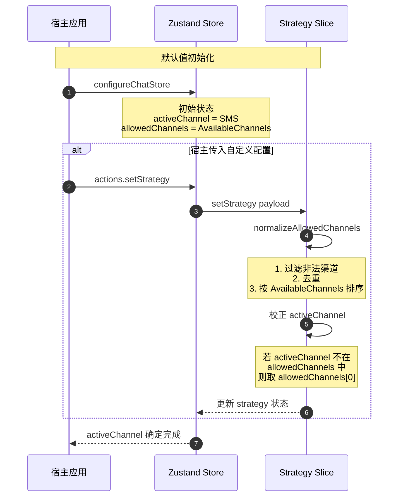
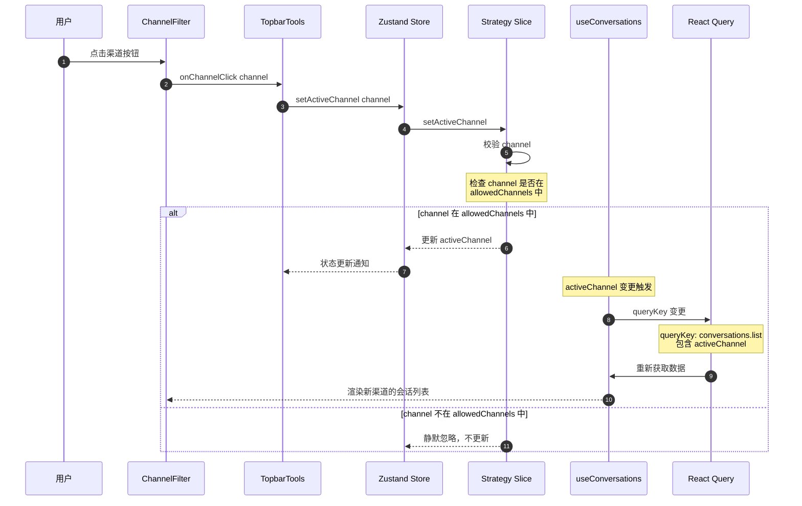
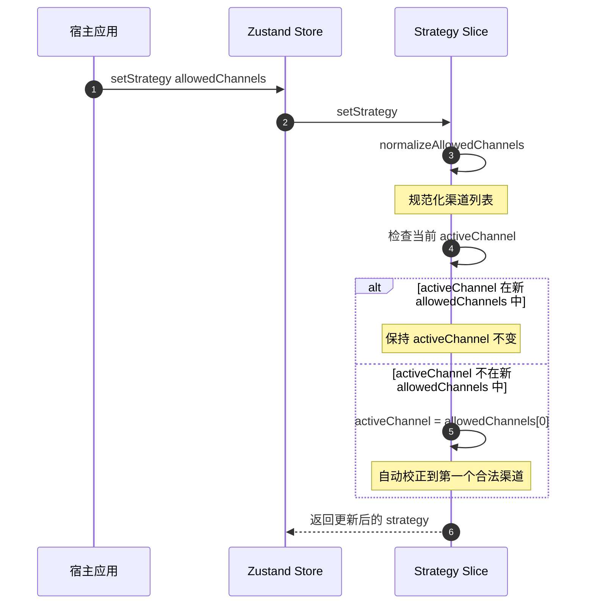
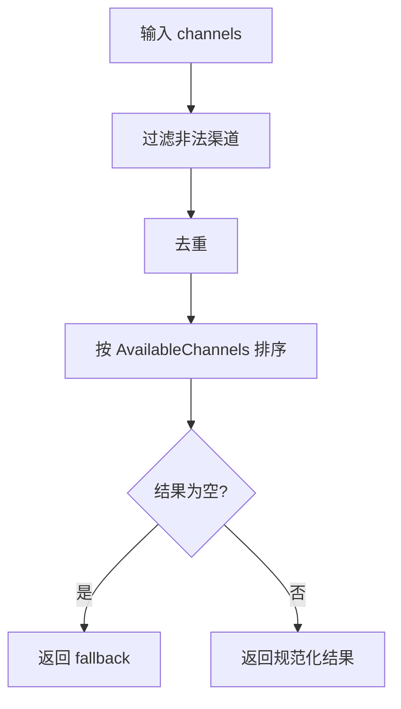
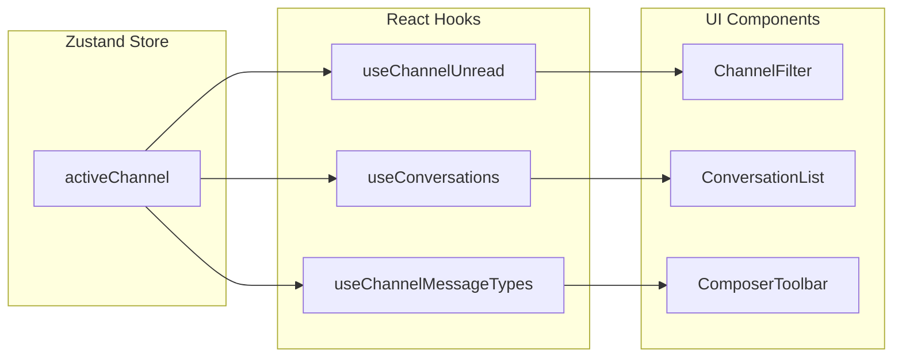

# activeChannel 确定流程时序图

## 概述

本文档描述 Bifrost-Chat SDK 中 `activeChannel`（当前激活渠道）的确定和切换流程。

## 时序图

### 1. 初始化阶段



### 2. 用户切换渠道



### 3. allowedChannels 变更联动



## 核心逻辑说明

### activeChannel 确定规则

| 场景 | 规则 | 代码位置 |
|------|------|----------|
| 初始化 | 默认值 `ChannelTypeEnum.SMS` | [`strategy.slice.ts:102`](src/store/slices/strategy.slice.ts:102) |
| setStrategy | 若 `activeChannel` 不在 `allowedChannels` 中，取 `allowedChannels[0]` | [`strategy.slice.ts:142-147`](src/store/slices/strategy.slice.ts:142) |
| setActiveChannel | 仅允许切换到 `allowedChannels` 中的渠道，否则静默忽略 | [`strategy.slice.ts:163-174`](src/store/slices/strategy.slice.ts:163) |

### normalizeAllowedChannels 流程



### activeChannel 影响范围



## 关键代码

### Strategy Slice 状态定义

```typescript
interface StrategyState {
  /** 允许的渠道列表 */
  allowedChannels: readonly ChannelTypeEnum[];
  /** 当前激活渠道 */
  activeChannel: ChannelTypeEnum;
  /** 会话列表请求是否按 activeChannel 过滤 */
  channelFilterEnabled: boolean;
}
```

### setActiveChannel Action

```typescript
setActiveChannel: (channel: ChannelTypeEnum) =>
  set((state) => {
    const { allowedChannels } = state.strategy;
    
    // 仅允许切换到 allowedChannels 中的渠道
    if (!allowedChannels.includes(channel)) {
      return state; // 静默忽略
    }
    
    return {
      strategy: { ...state.strategy, activeChannel: channel },
    };
  }),
```

### setStrategy 联动校正

```typescript
setStrategy: (payload: Partial<StrategyState>) =>
  set((state) => {
    // 规范化 allowedChannels
    const allowedChannels = payload.allowedChannels
      ? normalizeAllowedChannels(payload.allowedChannels, current.allowedChannels)
      : current.allowedChannels;

    // activeChannel 联动校正
    const rawActiveChannel = payload.activeChannel ?? current.activeChannel;
    const activeChannel = allowedChannels.includes(rawActiveChannel)
      ? rawActiveChannel
      : allowedChannels[0]; // 不在列表中则取首位

    return { strategy: { ...current, ...payload, allowedChannels, activeChannel } };
  }),
```

## 相关文件

- [`src/store/slices/strategy.slice.ts`](src/store/slices/strategy.slice.ts) - Strategy Slice 定义
- [`src/components/toolbar/ChannelFilter.tsx`](src/components/toolbar/ChannelFilter.tsx) - 渠道切换 UI 组件
- [`src/components/toolbar/TopbarTools.tsx`](src/components/toolbar/TopbarTools.tsx) - 顶部工具栏
- [`src/hooks/use-conversations.hook.ts`](src/hooks/use-conversations.hook.ts) - 会话列表 Hook（消费 activeChannel）
- [`src/hooks/use-channel-unread.hook.ts`](src/hooks/use-channel-unread.hook.ts) - 渠道未读数 Hook
