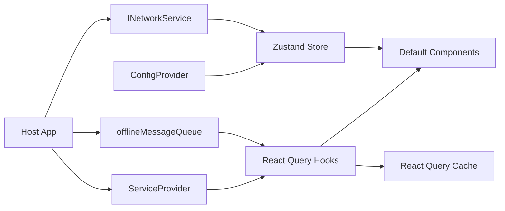

# 架构总览（v3.1）

> **状态**：当前实现（As-Is） | **更新日期**：2026-06-02

## 1. 目标

- 提供可嵌入的默认聊天组件。
- 通过接口注入适配不同宿主后端。
- 通过声明式状态管理降低维护成本。

## 2. 当前已实现（As-Is）

模块职责：

- `src/services/core/*`：接口契约层。
- `src/services/protocol/*`：Packet / ACK / Heartbeat 协议能力。
- `src/services/websocket/*`：WebSocket 管理与 packet handler。
- `src/services/messaging/*`：消息构建、队列、同步与离线失败消息能力。
- `src/providers/service.provider.tsx`：依赖注入容器。
- `src/providers/query.provider.tsx`：QueryClient 与 QueryKey。
- `src/providers/config.provider.tsx`：Store 初始化入口。
- `src/hooks/*`：声明式查询与 mutation。
- `src/components/*`：默认 UI 组件。
- `src/store/*`：客户端状态管理与 Composer 草稿持久化。

状态事实：

- React Query：会话列表/详情、消息列表、模板列表、未读基线与未读
  delta。
- Zustand：激活会话、搜索词、渠道策略、主题、语言、网络快照、
  Profile 上下文、Composer 配置。
- 草稿：`draft.store.ts` 按 `conversationId + channel` 分桶并兼容迁移旧
  localStorage key；持久化数据只保留必要字段，过滤空草稿并限制数量与总体
  积，localStorage 超配额时降级到内存草稿，避免异常冒泡到页面。
- 可选离线队列：通过 `ServiceProvider.offlineMessageQueue` 注入，供
  `useSendMessage`、`useMessages`、`useOfflineSync`、`useRetryMessage` 等使用。

## 3. 目标架构（To-Be）

- 模板发送链路进一步独立化。
- 实时消息回灌标准化并评估公开 API 方案。
- 渠道能力矩阵配置化（输入区策略完整化）。
- 明确离线队列类与错误类是否从包入口公开导出。

## 4. 边界声明

- SDK 不约束调用方协议适配实现。
- SDK 不要求调用方固定 DataLayer 分层。
- SDK 只对“组件行为 + 接口契约 + 状态边界”负责。

## 5. 术语红线

- 公开 API 使用 `Conversation`，禁止 `Session`。
- Provider 命名统一 `QueryProvider`。
- 模板统一 `Template`，不与 Profile 耦合。
