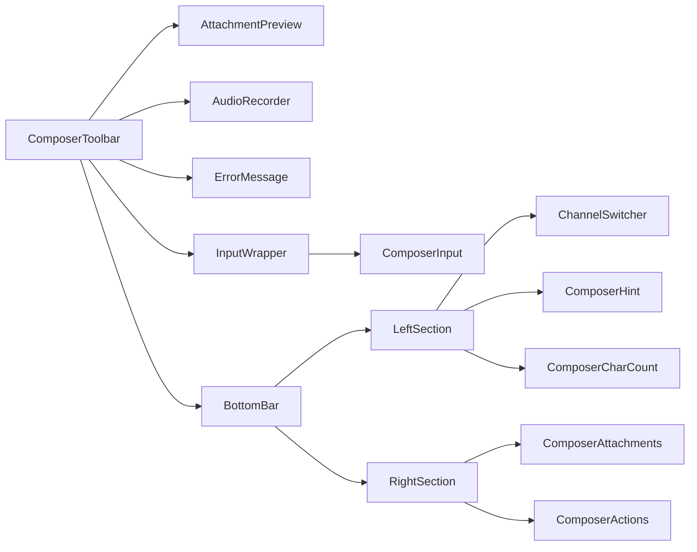
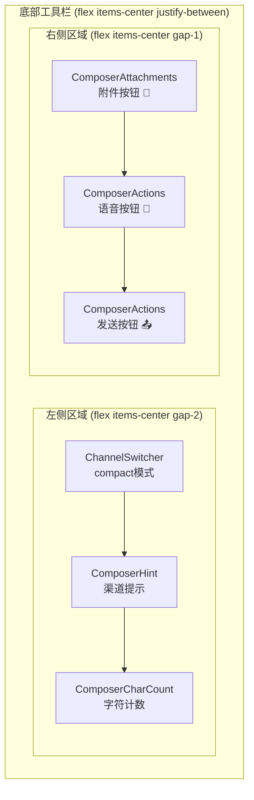
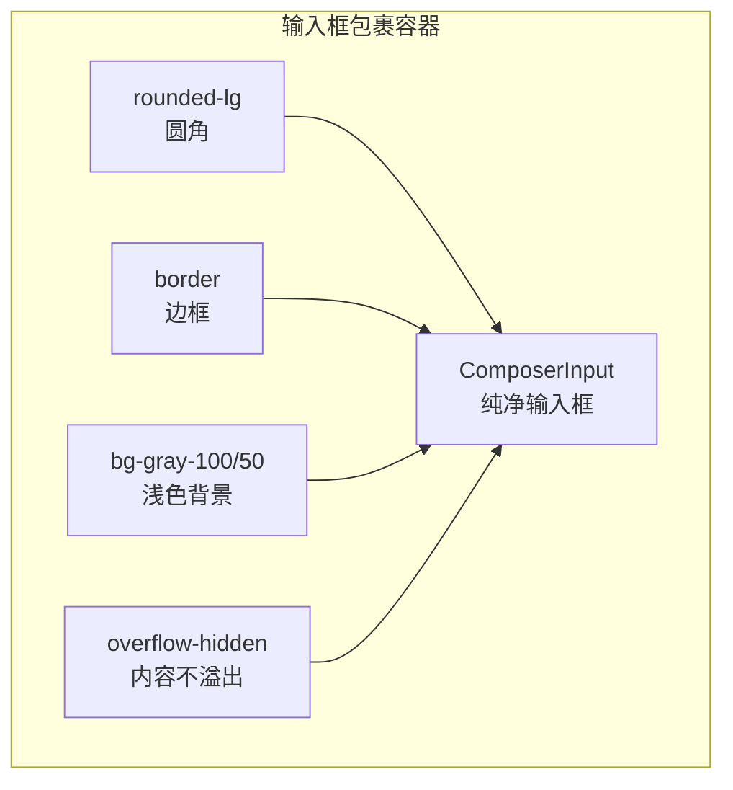
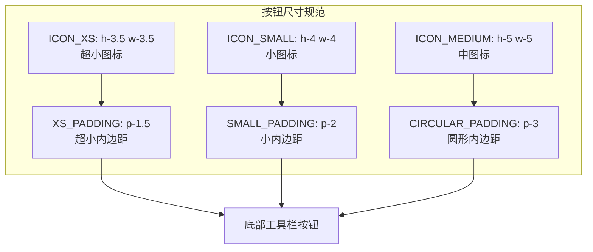
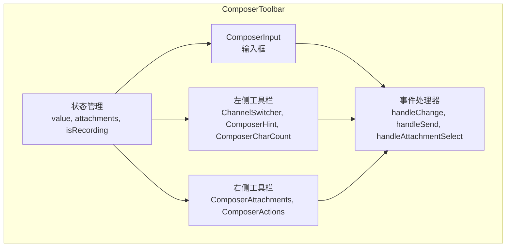
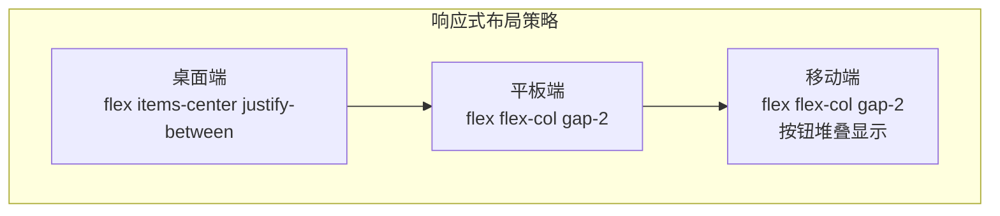
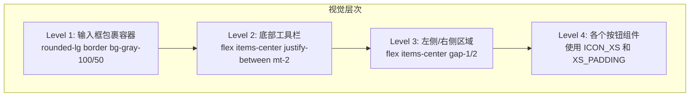

# Composer Toolbar 布局设计

## 整体布局结构

```mermaid
graph TB
    subgraph ComposerToolbar["ComposerToolbar 容器"]
        subgraph Form["表单容器"]
            AP[AttachmentPreview<br/>附件预览]
            AR[AudioRecorder<br/>音频录音器]
            ERR[ErrorMessage<br/>错误提示]
            
            subgraph InputWrapper["输入框包裹容器"]
                CI[ComposerInput<br/>纯输入框]
            end
            
            subgraph BottomBar["底部工具栏"]
                subgraph LeftSection["左侧：渠道相关"]
                    CS[ChannelSwitcher<br/>渠道切换器]
                    CH[ComposerHint<br/>渠道提示]
                    CC[ComposerCharCount<br/>字符计数]
                end
                
                subgraph RightSection["右侧：操作按钮"]
                    CA[ComposerAttachments<br/>附件按钮]
                    ACT[ComposerActions<br/>操作按钮组]
                end
            end
        end
    end
    
    AP --> InputWrapper
    AR --> InputWrapper
    ERR --> InputWrapper
    InputWrapper --> BottomBar
    LeftSection --> RightSection
```

## 组件层级关系



## 底部工具栏详细布局



## 输入框包裹样式



## 按钮尺寸规范



## 数据流向



## 响应式布局



## 视觉层次


