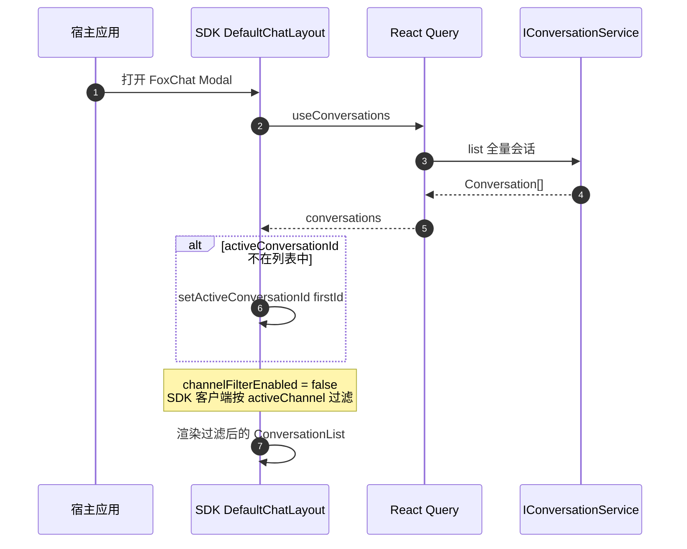
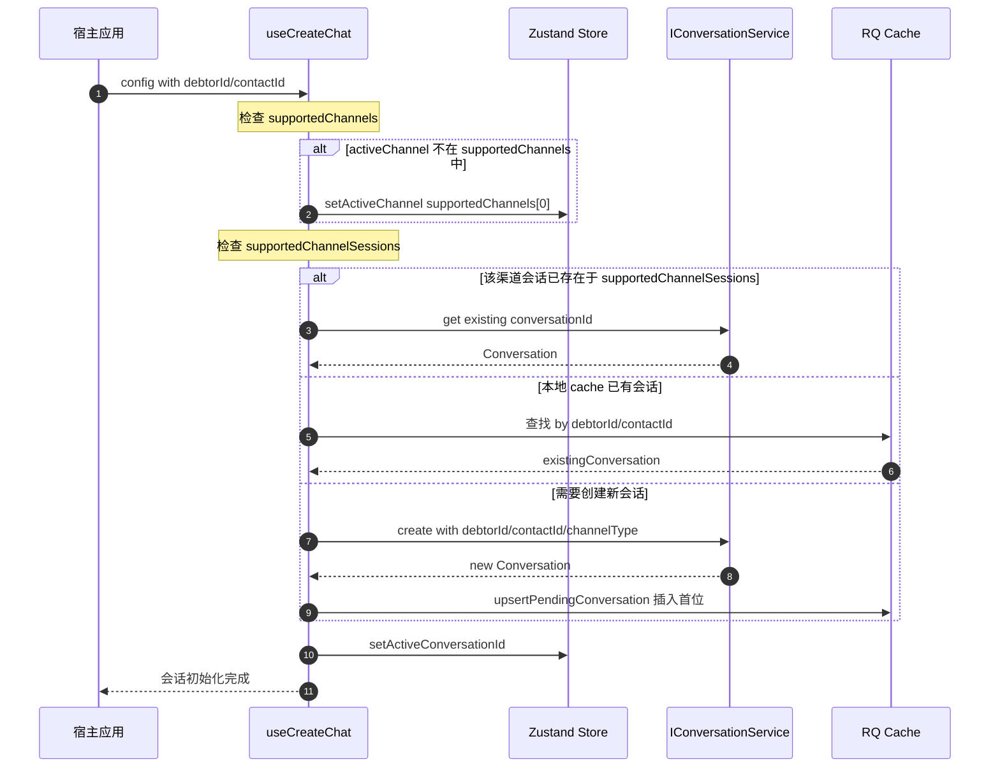

# Conversation 数据流 Review 报告

## 概述

本文档对比分析 `specs/Conversation 数据流.md` 设计文档与宿主实际实现之间的差异，并识别需要修复的问题。

---

## 一、需要修复的问题

### 问题 1: customer 模式下 setActiveChannel 调整逻辑缺失 [🔴 高优先级]

**文档描述**:
> 判断 conversationMetadata.supportedChannels 是否支持 activeChannel，若不支持则需要 setActiveChannel 更新到 conversationMetadata.supportedChannels[0] 调整

**实际实现** ([`create-chat.hook.ts:99-101`](../../fox/fox-admin-ui/packages/components/src/hooks/create-chat.hook.ts:99)):
```typescript
const channelType = config.supportedChannels?.includes(activeChannel)
  ? activeChannel
  : (config.supportedChannels?.[0] as ChannelTypeEnum);
```
- 只选择了创建会话用的 channelType
- **没有调用 `setActiveChannel` 更新 store 状态**
- 导致 UI 显示的 activeChannel 与实际创建的渠道不一致

**影响**: 
- 如果当前 activeChannel 是 SMS，但客户只支持 WhatsApp
- 会话会创建在 WhatsApp 渠道，但 UI 仍显示 SMS 渠道过滤器
- 用户看到的会话列表为空（因为按 SMS 过滤）

**建议修复**:
```typescript
// 在 create-chat.hook.ts 中添加
import { useActions } from '@feoe/bifrost-chat';

// 在 hook 内部
const { setActiveChannel } = useActions();

// 在选择 channelType 后
if (!config.supportedChannels?.includes(activeChannel)) {
  const fallbackChannel = config.supportedChannels?.[0];
  if (fallbackChannel) {
    setActiveChannel(fallbackChannel); // 添加这行
  }
}
```

---

### 问题 2: supportedChannelSessions 判断逻辑缺失 [🟡 中优先级]

**文档描述**:
> 判断 conversationMetadata.supportedChannelSessions 中在该渠道下 activeChannel 是否已存在该会话，若存在则直接走 get 查询会话信息。若不存在则需要执行 create 创建新会话

**实际实现**:
- [`create-chat.hook.ts`](../../fox/fox-admin-ui/packages/components/src/hooks/create-chat.hook.ts) 只检查本地 cache
- 没有利用 `config.supportedChannelSessions` 元数据判断是否已存在该渠道的会话
- 可能导致重复创建会话

**影响**:
- 如果客户已有 WhatsApp 会话（在 config.supportedChannelSessions 中）
- 但本地 cache 还没有同步，会错误地创建新会话

**建议修复**:
```typescript
// 在创建前检查 supportedChannelSessions
const existingSession = config.supportedChannelSessions?.find(
  session => session.channelType === channelType
);

if (existingSession) {
  // 使用 get 获取现有会话，而不是 create
  const conversation = await conversationService.get(existingSession.conversationId);
  if (conversation) {
    setActiveConversationId(conversation.id);
    return;
  }
}
```

---

## 二、数据流文档问题

### 问题 3: 术语不一致

**文档使用**:
- `conversationListByChannel` - 按渠道分离的会话列表
- `conversationMetadata` - 会话元数据

**实际实现**:
- 使用 React Query cache，按 `queryKeys.conversations.list(activeChannel)` 组织
- 没有 `conversationListByChannel` 这个概念

**建议**: 更新文档术语，与代码实现保持一致：
- `conversationListByChannel` → `React Query cache for activeChannel`
- `conversationMetadata` → `Conversation` 对象的 `metadata` 字段

---

## 三、已确认正确实现的部分

### ✅ system 模式 firstConversation 自动激活

**实现位置**: [`DefaultChatLayout.tsx:499-504`](src/components/layout/DefaultChatLayout.tsx:499)
```typescript
if (!exists) {
  const firstId = conversations[0].id;
  if (firstId !== activeConversationId) {
    actions.setActiveConversationId(firstId);
  }
}
```

### ✅ 新会话插入列表第一位

**实现**: `ConversationCacheHelper.upsertPendingConversation` 会将会话插入到列表首位。

### ✅ channelFilterEnabled 配置

**实现位置**: [`chat.util.ts:42-43`](../../fox/fox-admin-ui/packages/components/src/utils/chat.util.ts:42)
```typescript
channelFilterEnabled: mode !== 'system',
```
- system 模式：客户端过滤（拉取全量，SDK 过滤）
- customer 模式：服务端过滤（传 channelType 参数）

---

## 四、数据流流程图

### System 模式



### Customer 模式



---

## 五、修复优先级

| 优先级 | 问题 | 影响 | 修复位置 |
|--------|------|------|----------|
| 🔴 高 | customer 模式 setActiveChannel 缺失 | UI 与数据不一致 | `create-chat.hook.ts` |
| 🟡 中 | supportedChannelSessions 判断缺失 | 可能重复创建会话 | `create-chat.hook.ts` |
| 🟢 低 | 文档术语不一致 | 文档可读性 | `specs/Conversation 数据流.md` |

---

## 六、相关文件索引

| 文件 | 职责 | 路径 |
|------|------|------|
| AuthLayout.tsx | UI 层入口 | [`apps/shell/src/routes/__auth/AuthLayout.tsx`](../../fox/fox-admin-ui/apps/shell/src/routes/__auth/AuthLayout.tsx) |
| FoxChatShell.tsx | Provider 树搭建 | [`packages/components/src/components/FoxChat/FoxChatShell.tsx`](../../fox/fox-admin-ui/packages/components/src/components/FoxChat/FoxChatShell.tsx) |
| FoxChatLayout.tsx | UI 渲染 + hook 调用 | [`packages/components/src/components/FoxChat/FoxChatLayout.tsx`](../../fox/fox-admin-ui/packages/components/src/components/FoxChat/FoxChatLayout.tsx) |
| create-chat.hook.ts | customer 模式会话初始化 | [`packages/components/src/hooks/create-chat.hook.ts`](../../fox/fox-admin-ui/packages/components/src/hooks/create-chat.hook.ts) |
| DefaultChatLayout.tsx | system 模式自动激活 | [`src/components/layout/DefaultChatLayout.tsx`](src/components/layout/DefaultChatLayout.tsx) |
| chat.util.ts | SDK 配置生成 | [`packages/components/src/utils/chat.util.ts`](../../fox/fox-admin-ui/packages/components/src/utils/chat.util.ts) |

---

## 七、下一步行动

1. **修复问题 1** - 在 `create-chat.hook.ts` 中添加 `setActiveChannel` 调用
2. **修复问题 2** - 添加 `supportedChannelSessions` 检查逻辑
3. **更新文档** - 同步更新 `specs/Conversation 数据流.md` 术语和补充流程图
