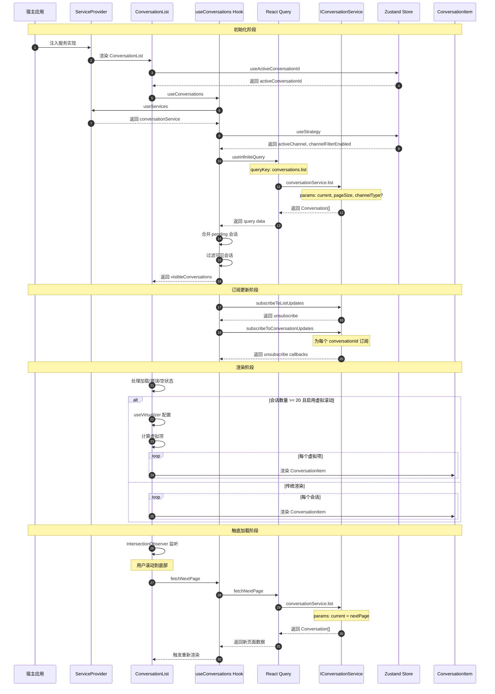
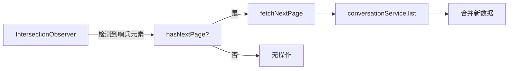

# 会话列表渲染时序图

## 概述

本文档描述 Bifrost-Chat SDK 中会话列表（ConversationList）的渲染流程时序。

## 时序图



## 核心流程说明

### 1. 数据获取流程

| 步骤 | 组件 | 职责 |
|------|------|------|
| 1 | [`ConversationList`](src/components/conversation/ConversationList.tsx) | 决定是否自动获取数据 |
| 2 | [`useConversations`](src/hooks/use-conversations.hook.ts) | 调用 React Query infinite query |
| 3 | [`IConversationService.list`](src/services/core/conversation.service.ts) | 宿主实现，返回会话列表 |
| 4 | React Query | 缓存数据，管理分页状态 |

### 2. 状态管理

| 状态类型 | 管理方式 | 用途 |
|----------|----------|------|
| 服务端状态 | React Query | 会话列表、分页信息 |
| 客户端状态 | Zustand | activeConversationId、activeChannel |

### 3. 虚拟滚动

当会话数量 >= 20 且 `enableVirtualization = true` 时：

- 使用 `@tanstack/react-virtual` 的 `useVirtualizer`
- 只渲染可视区域内的会话项
- 动态测量并缓存会话项高度

### 4. 触底加载



## 关键接口

### IConversationService

```typescript
interface IConversationService<TListParams = any> {
  list(params?: TListParams): Promise<Conversation[]>;
  subscribeToListUpdates?(callback: (conversations: Conversation[]) => void): () => void;
  subscribeToConversationUpdates?(
    conversationId: string,
    callback: (conversation: Conversation) => void
  ): () => void;
}
```

### Conversation 数据结构

```typescript
interface Conversation {
  id: string;
  user: User;
  lastMessage: string;
  lastMessageTime: string;
  unreadCount: number;
  channel: ChannelTypeEnum;
  isActive?: boolean;
  status?: ConversationStatusEnum;
}
```

## 相关文件

- [`src/components/conversation/ConversationList.tsx`](src/components/conversation/ConversationList.tsx) - 会话列表组件
- [`src/hooks/use-conversations.hook.ts`](src/hooks/use-conversations.hook.ts) - 会话数据获取 Hook
- [`src/services/core/conversation.service.ts`](src/services/core/conversation.service.ts) - 会话服务接口
- [`src/interfaces/conversation.interface.ts`](src/interfaces/conversation.interface.ts) - 会话类型定义
- [`src/providers/service.provider.tsx`](src/providers/service.provider.tsx) - 服务依赖注入
