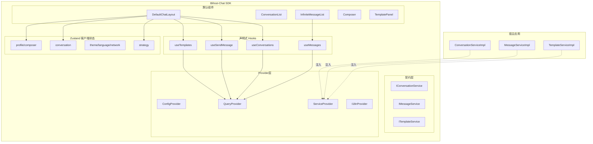

# Bifrost-Chat JS SDK 最终架构基线（v3.1）

> 本文档是 SDK 架构的单一事实源（SSOT）。

## 版本信息

- 版本：3.1.0
- 状态：生效中
- 更新日期：2026-06-02

## 1. 不可变决策

1. 公开 API 禁用 `Session`，统一使用 `Conversation`。
2. SDK 形态固定为：接口契约 + DI Provider + 默认组件。
3. 服务端状态归 React Query；客户端交互状态归 Zustand。
4. Template 与 Profile 职责分离，不做类型耦合。
5. 对外文档以公开导出为准，不暴露未导出能力为官方 API。

## 2. 当前已实现（As-Is）

### 2.1 公开导出边界

以 `src/index.ts` 与 `src/components/index.ts` 为准。

- 对外公开组件：
  `ChatContainer`、`ChatLayout`、`DefaultChatLayout`、`MobileLayout`、
  `ConversationList`、`InfiniteMessageList`、`MessageList`、`Composer`、
  `ComposerToolbar`、`TemplatePanel`、`Profile`、`Topbar`、
  `TopbarTools`、`NetworkStatus`、`ChannelFilter`、`ChannelIcon` 及各渠道
  icon 等。
- 对外公开 Hooks：
  `useConversations`、`useCreateConversation`、`useConversationDetail`、
  `useConversationMetadata`、`useActiveConversationMetadata`、
  `useSetActiveConversation`、`useChannelIcon`、`useChannelLabel`、
  `useChannelUnread`、`useConversationUnread`、`useInViewport`、
  `useMarkAsRead`、`useMessageStatusSync`、`useMessageTypeConfig`、
  `useMessages`、`useOfflineSync`、`useRetryMessage`、
  `useDeleteFailedMessage`、`useSendMessage`、`useTemplatePreview`、
  `useTemplateSelect`、`useTemplates`、`useTotalUnread`、
  `useUnreadCount`、`useUnreadSync`、`useAudioRecorder`、
  `useComposerDraft`、`useComposerFocus`、`useComposerLogic`。
- 对外公开 Providers：
  `ConfigProvider`、`useConfig`、`I18nProvider`、`useTranslation`、
  `QueryProvider`、`ServiceProvider`。
- 对外公开服务接口：
  `IConversationService`、`IMessageService`、`ITemplateService`、
  `INetworkService`。
- 对外公开兼容清理入口：
  `clearSDK`（兼容 API，推荐新代码改用 `resetChatStore` +
  `clearQueryCache` 组合）。
- 对外公开兼容协议/实时能力：
  `MessageBuilder`、`PacketConverter`、`PacketValidator`、`AckHandler`、
  `HeartbeatManager`、`WebSocketManager`、`WebSocketEventTypeEnum` 及相关
  WebSocket 类型。
- 对外公开缓存/工具：
  `ConversationCacheHelper`、`BrowserNetworkService`、
  `createBrowserNetworkService`、`useChatStore`、`resetChatStore`、
  `useComposerDraftStore`、`resetComposerDraftStore`、`queryKeys`、
  `createQueryClient`、`clearQueryCache`。

未从包入口公开（仅仓库内部能力）：

- `TemplatePicker`
- `Tooltip`
- `ChatSDK`
- `MessageCacheHelper`
- `MessageSyncService`
- `OfflineMessageQueueService`
- `useRetryOfflineMessage`
- `useWebSocket`
- `createWebSocketMessageHandler`
- `SDKError` / `HTTPError` / `ValidationError` 等错误类

### 2.2 状态边界事实表

| 范畴 | 当前实现 | 说明 |
|---|---|---|
| 会话/消息/模板列表 | React Query | 由 `useConversations/useMessages/useTemplates` 管理 |
| 会话详情/元数据 | React Query | `useConversationDetail/useConversationMetadata` 写入详情与列表缓存 |
| 会话选择与搜索 | Zustand | `conversation.slice.ts` |
| 渠道策略与激活渠道 | Zustand | `strategy.slice.ts` |
| 主题/语言/网络 | Zustand | `theme/language/network` slices |
| Composer 功能配置 | Zustand | `composer.slice.ts` |
| Composer 草稿 | Zustand persist | `draft.store.ts` 按 `conversationId + channel` 分桶 |
| 客户画像上下文 | Zustand | `profile.slice.ts` |
| 会话/渠道未读展示数 | React Query | 服务端基线 + `unreadDeltas` 增量映射 |

### 2.3 未读数量路径

当前默认布局与公开 Hook 中：

- 会话级未读展示值为 `max(0, Conversation.unreadCount + delta)`。
- 渠道级/总未读展示值为
  `max(0, conversationService.getUnreadCount()[channel] + delta)`。
- `useUnreadSync` 订阅实时消息与状态事件，维护 React Query 中的
  `queryKeys.conversations.unreadDeltas.channel()` 与
  `queryKeys.conversations.unreadDeltas.conversation()`。
- `Conversation.unreadCount` 和 `getUnreadCount()` 结果视为服务端基线；
  delta 只用于前端临时补偿，不进入 Zustand。
- 若宿主实现 `subscribeToListUpdates` / `subscribeToConversationUpdates`，
  SDK 会将其作为权威回灌源覆盖会话缓存，并根据服务端新基线保留或清理
  delta，避免未读数回跳。

说明：

- 这是当前已实现（As-Is）。
- 未读不由 Zustand 维护；所有基线与增量均放在 React Query 缓存中。

### 2.4 模板发送路径

当前默认布局与移动端布局中：

- `TemplatePanel` / 移动端模板 ActionSheet 使用 `useTemplatePreview`
  调用 `templateService.preview` 取得预览内容与模板参数。
- `useTemplateSelect` 根据 `composer.templateMode` 决定直接发送或回填
  Composer。
- 直接发送仍复用 `useSendMessage().mutateAsync`。
- 回填模式将 `templateCode`、`templateMetadata` 等写入 Composer 草稿。

说明：

- 这是当前可运行实现。
- 独立的 template send mutation 是目标演进项，不是当前公开 API。

### 2.5 QueryKey 事实

当前统一通过 `queryKeys` 生成：

- `conversations.*`
- `messages.*`
- `templates.*`
- `conversations.unread()`
- `conversations.unreadDeltas.channel()`
- `conversations.unreadDeltas.conversation()`

禁止公开出现 `sessions` 键前缀。

### 2.6 错误模型事实

当前错误类型定义在 `src/errors/`，当前未从包入口公开导出：

- `SDKError`
- `HTTPError`
- `ValidationError`
- `AuthorizationError`
- `ConfigurationError`
- `NotImplementedError`
- `MapperError`
- `OfflineQueueError`
- `NetworkError`
- WebSocket 专用错误类型

## 3. 目标架构（To-Be）

以下为目标方向，均需按阶段落地：

1. 模板发送链路独立 mutation（`useSendTemplateMessage`）。
2. 更完善的实时回灌标准（统一事件入缓存策略）。
3. 渠道策略矩阵（不同渠道输入能力差异）完整化。
4. 未读的权威来源进一步标准化，优先由宿主会话实时订阅统一提供。
5. 明确是否将 `OfflineMessageQueueService` 与错误类作为包入口公共 API。

落地约束：

- 不破坏现有公开 API。
- 优先通过新增能力演进，避免破坏性重命名。

## 4. 分层结构



## 5. 接口与 DI 基线

### 5.1 会话接口

```ts
interface IConversationService<
  TListParams = IConversationParams,
  TCreateParams = unknown,
  TQueryParams = unknown,
> {
  list(params?: TListParams): Promise<Conversation[]>;
  get(conversationId: string): Promise<Conversation | null>;
  create(params: TCreateParams): Promise<Conversation>;
  query(params: TQueryParams): Promise<Conversation | null>;
  subscribeToListUpdates?(
    callback: (conversations: Conversation[]) => void,
  ): () => void;
  subscribeToConversationUpdates?(
    conversationId: string,
    callback: (conversation: Conversation) => void,
  ): () => void;
  getUnreadCount?(params?: UnreadCountParams): Promise<UnreadCountResult>;
}
```

### 5.2 消息接口

```ts
interface IMessageService<
  TListParams = IMessageListParams,
  TSendParams = SendMessageOptions,
  TReadParams = AckPacketBody,
  TAttachmentParams = SendAttachmentParams,
  TAudioParams = SendAudioParams,
> {
  list(conversationId: string, params: TListParams): Promise<StandardMessage[]>;
  send(conversationId: string, params: TSendParams): Promise<MessageSendResult>;
  markAsRead(
    params: TReadParams,
    meta?: MarkAsReadMeta,
  ): Promise<undefined | MarkAsReadResult>;
  subscribeToMessages(callback: (event: MessageReceivedEvent) => void): () => void;
  subscribeToMessageStatus(callback: (event: MessageStatusUpdatedEvent) => void): () => void;
  sendAttachment(params: TAttachmentParams): Promise<SendAttachmentResult>;
  sendAudio(params: TAudioParams): Promise<SendAudioResult>;
}
```

### 5.3 模板接口

```ts
interface ITemplateService<
  TListParams = ITemplateListParams,
  TPreviewParams = TemplatePreviewParams,
> {
  list(params: TListParams): Promise<Template[]>;
  preview(params: TPreviewParams): Promise<TemplatePreviewResult>;
}
```

### 5.4 注入方式

```tsx
<QueryProvider>
  <ServiceProvider
    conversationService={conversationServiceImpl}
    messageService={messageServiceImpl}
    templateService={templateServiceImpl}
    networkService={networkServiceImpl}
    offlineMessageQueue={offlineMessageQueueImpl}
  >
    <ChatContainer>
      <DefaultChatLayout />
    </ChatContainer>
  </ServiceProvider>
</QueryProvider>
```

## 6. 对调用方的边界声明

调用方负责：

- API 请求与鉴权。
- 协议适配、DTO 转换。
- 实时订阅实现细节。
- 业务重试、审计、限流。

SDK 不负责：

- 绑定特定后端协议。
- 规定调用方适配层目录结构。
- 宿主业务规则实现。

## 7. 迁移优先级

1. 公开文档口径全面对齐当前导出。
2. 模板发送链路独立 mutation 化（向后兼容）。
3. 实时能力标准化并决定是否公开导出。
4. 渠道能力矩阵与 Composer 策略闭环。
5. 离线队列与错误类公共导出边界决策。
