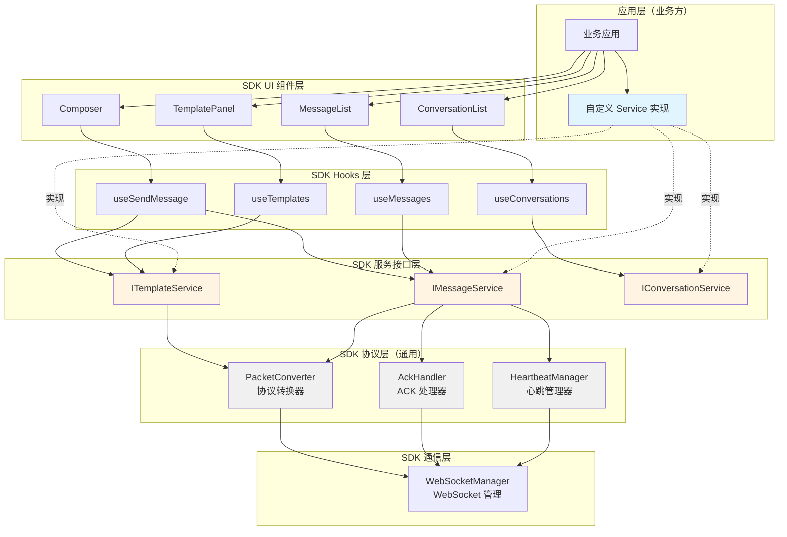
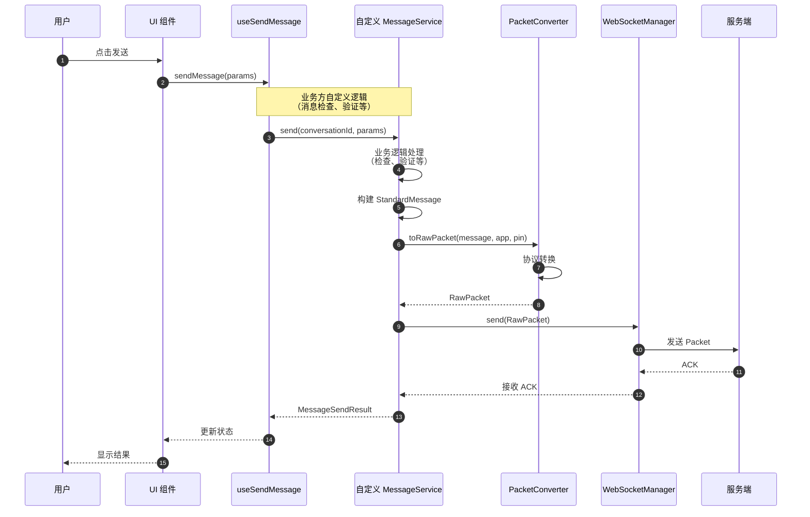
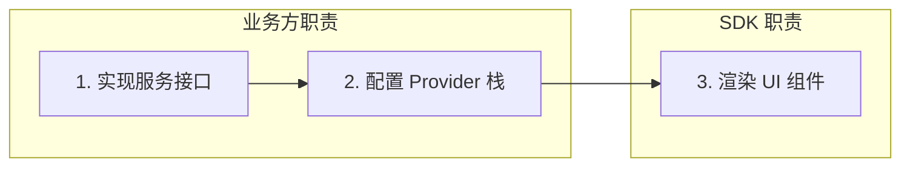
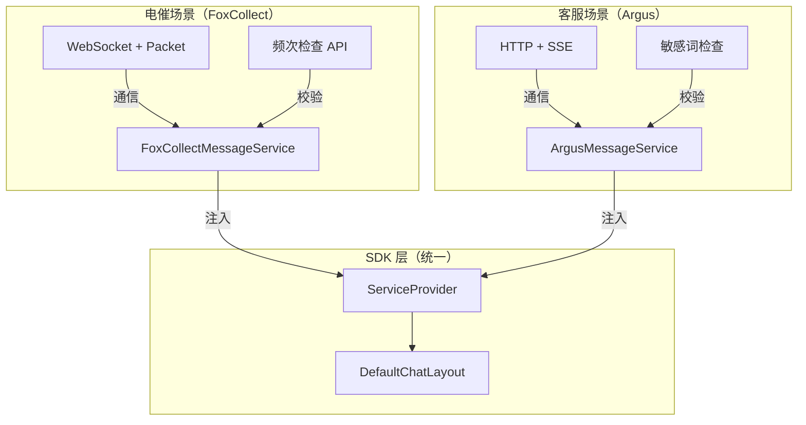

# 通用型架构设计

## 概述

本文档描述了 Bifrost-Chat SDK 的通用型架构设计。SDK 只提供通用的核心功能，业务特定的场景由业务方自行注入 service 实现。

## 设计原则

1. **通用性优先**：SDK 只提供通用的核心功能，不包含任何业务特定逻辑
2. **接口驱动**：通过接口定义服务契约，业务方自行实现
3. **协议转换**：SDK 提供通用的协议转换能力，支持 Packet/ACK/心跳等标准协议
4. **类型安全**：通过 TypeScript 泛型确保类型安全
5. **轻量级**：使用原生 fetch API，不引入额外的 HTTP 客户端

## 核心架构



## 通用模块

### 1. 协议层（Protocol Layer）

协议层提供通用的协议转换能力，不包含任何业务逻辑。

#### PacketConverter

```typescript
/**
 * Packet 协议转换器
 * 
 * 职责：
 * - 将 StandardMessage 转换为 RawPacket（发送）
 * - 将 RawPacket 转换为 StandardMessage（接收）
 * - 提供消息类型映射
 * - 提供渠道类型映射
 */
export class PacketConverter {
  static toRawPacket(
    message: StandardMessage,
    fromApp: string,
    fromPin: string,
  ): RawPacket;
  
  static toStandardMessage(
    packet: RawPacket,
    direction?: MessageDirectionEnum,
    currentPin?: string,
  ): StandardMessage;
}
```

#### AckHandler

```typescript
/**
 * ACK 处理器
 * 
 * 职责：
 * - 创建已读 ACK 消息
 * - 解析下行 ACK 消息
 * - 验证 ACK 类型
 * - 映射 ACK 类型到消息状态
 */
export class AckHandler {
  static createReadAck(params: {
    sender: string;
    app: string;
    messageId: string;
    sessionId: string;
    datetime: number;
  }): RawPacket;
  
  static parseDownstream(data: unknown): {
    id: string;
    body: { type: string };
    timestamp?: number;
  } | null;
  
  static isValidAckType(type: string): boolean;
  
  static ackTypeToMessageStatus(type: string): MessageStatusEnum;
}
```

#### HeartbeatManager

```typescript
/**
 * 心跳管理器
 * 
 * 职责：
 * - 创建心跳消息
 * - 验证心跳响应
 * - 管理心跳计时器
 */
export class HeartbeatManager {
  static createHeartbeat(): RawPacket;
  
  static isHeartbeatResponse(data: unknown): boolean;
}
```

### 2. 服务接口层（Service Interface Layer）

服务接口层定义了服务的契约，业务方需要实现这些接口。

#### ITemplateService

```typescript
export interface ITemplateService<TListParams = unknown, TSendParams = unknown> {
  list(params?: TListParams): Promise<Template[]>;
  send(params: TSendParams): Promise<MessageSendResult>;
  preview?(templateId: string, variables: Record<string, string>): Promise<string>;
}
```

#### IMessageService

```typescript
export interface IMessageService<
  TListParams = unknown,
  TSendParams = unknown,
  TMarkAsReadParams = unknown,
  TSendAttachmentParams = unknown,
  TSendAudioParams = unknown
> {
  list(conversationId: string, params?: TListParams): Promise<StandardMessage[]>;
  send(conversationId: string, params: TSendParams): Promise<MessageSendResult>;
  markAsRead(params: TMarkAsReadParams): Promise<void>;
  sendAttachment(params: TSendAttachmentParams): Promise<SendAttachmentResult>;
  sendAudio(params: TSendAudioParams): Promise<SendAudioResult>;
  subscribeToMessages(callback: (event: MessageReceivedEvent) => void): () => void;
  subscribeToMessageStatus(callback: (event: MessageStatusUpdatedEvent) => void): () => void;
}
```

#### IConversationService

```typescript
export interface IConversationService<
  TListParams = unknown,
  TCreateParams = unknown,
  TQueryParams = unknown
> {
  list(params?: TListParams): Promise<Conversation[]>;
  get(conversationId: string): Promise<Conversation | null>;
  create(params: TCreateParams): Promise<Conversation>;
  query(params: TQueryParams): Promise<Conversation | null>;
}
```

### 3. 通信层（Communication Layer）

通信层提供通用的通信能力。

#### WebSocketManager

```typescript
export class WebSocketManager {
  send(data: unknown): void;
  onMessage(handler: (data: unknown) => void): () => void;
  onStatusChange(handler: (status: string) => void): () => void;
  connect(): void;
  disconnect(): void;
  getStatus(): 'connecting' | 'connected' | 'disconnected' | 'error';
}
```

## 通用消息发送流程



## 业务方接入方式

SDK 采用 **接口驱动 + 依赖注入** 的标准架构，业务方通过实现服务接口并注入 `ServiceProvider` 来完成接入。

### 标准接入流程



**三步曲**：

1. **实现服务接口**：业务方根据自身场景实现 `IConversationService`、`IMessageService`、`ITemplateService`
2. **配置 Provider 栈**：通过 `ConfigProvider` → `QueryProvider` → `ServiceProvider` → `I18nProvider` 注入服务
3. **渲染 UI 组件**：使用 SDK 提供的默认组件或自定义组件

### 标准 Provider 栈

SDK 提供四个 Provider，按顺序嵌套使用：

```tsx
import {
  ConfigProvider,
  QueryProvider,
  ServiceProvider,
  I18nProvider,
  DefaultChatLayout,
} from '@bifrost-chat/sdk';
import { FoxCollectConversationService } from './services/conversation.service';
import { FoxCollectMessageService } from './services/message.service';
import { FoxCollectTemplateService } from './services/template.service';
import { WebSocketManager } from '@bifrost-chat/sdk';

function App() {
  // 1. 创建通信管理器（业务方选择 WebSocket / SSE / HTTP）
  const wsManager = new WebSocketManager('wss://api.fox-collect.com/ws');
  
  // 2. 创建服务实例（业务方自行实现）
  const conversationService = new FoxCollectConversationService({
    endpoint: 'https://api.fox-collect.com',
    token: 'your-token',
  });
  
  const messageService = new FoxCollectMessageService({
    endpoint: 'https://api.fox-collect.com',
    token: 'your-token',
    agentPin: 'agent-123',
  }, wsManager);
  
  const templateService = new FoxCollectTemplateService({
    endpoint: 'https://api.fox-collect.com',
    token: 'your-token',
  });
  
  // 3. 配置 Provider 栈
  return (
    <ConfigProvider config={{ theme: { defaultMode: 'light' } }}>
      <QueryProvider>
        <ServiceProvider
          conversationService={conversationService}
          messageService={messageService}
          templateService={templateService}
        >
          <I18nProvider locale="zh-CN">
            <DefaultChatLayout />
          </I18nProvider>
        </ServiceProvider>
      </QueryProvider>
    </ConfigProvider>
  );
}
```

### 业务方接入差异对比

不同业务场景的核心差异体现在以下维度：

| 维度 | 电催场景（FoxCollect） | 客服场景（Argus） | 通用场景 |
|------|----------------------|------------------|----------|
| **通信协议** | WebSocket + Packet 协议 | HTTP + SSE | HTTP / WebSocket |
| **鉴权方式** | JWT Token + agentPin | OAuth2 + Cookie | 自定义 |
| **发送前校验** | 频次检查（后端接口） | 敏感词检查（本地+后端） | 可选 |
| **实时订阅** | WebSocket onMessage | SSE EventSource | 自定义 |
| **渠道策略** | SMS / WhatsApp / VoIP | Web Chat / Email / 电话 | 自定义 |
| **DTO 映射** | Packet ↔ StandardMessage | REST DTO ↔ StandardMessage | 自定义 |
| **from.app** | `fox_collect.waiter` | `fox_argus.waiter` | 自定义 |
| **to.app** | `im.waiter` | `fox_argus.customer` | 自定义 |
| **Session ID** | 债务 ID | 用户 ID（身份证+包） | 会话 ID |

### 接入差异架构图



## 场景接入示例

### 电催场景（FoxCollect）

**业务特点**：
- 坐席向客户发送催收消息
- 需要频次检查，防止过度骚扰
- Session ID 使用债务 ID
- 支持多种渠道（WhatsApp、SMS、Email）

**接口差异**：

| 接口 | 路径 | 特点 |
|------|------|------|
| 会话查询 | `POST /chat/v2/session/query` | 使用 chatId/customerPin |
| 会话创建 | `POST /chat/v2/session/create` | 使用 debtorId/contactId |
| 消息检查 | `POST /chat/v2/message/check` | 频次检查 |
| 消息发送 | `POST /chat/v2/message/send` | 模板消息 |
| 模板查询 | `POST /chat/v2/template/query` | 按渠道类型 |

### 客服场景（Argus）

**业务特点**：
- 客服与客户之间的沟通
- 需要敏感词检查，确保合规
- Session ID 使用用户 ID（身份证+包）
- 支持多种渠道（金银花 App、微信、电话）

**接口差异**：

| 接口 | 路径 | 特点 |
|------|------|------|
| 会话查询 | `POST /conversations/query` | 使用 customerId |
| 会话创建 | `POST /conversations` | 创建新会话 |
| 消息检查 | `POST /messages/check` | 敏感词检查 |
| 消息发送 | `POST /conversations/{id}/messages` | RESTful |
| 模板查询 | `POST /templates` | 按分类查询 |

## SDK 提供的通用功能

### 1. 协议转换

- `PacketConverter.toRawPacket()` - 将 StandardMessage 转换为 RawPacket
- `PacketConverter.toStandardMessage()` - 将 RawPacket 转换为 StandardMessage

### 2. ACK 处理

- `AckHandler.createReadAck()` - 创建已读 ACK 消息
- `AckHandler.parseDownstream()` - 解析下行 ACK 消息
- `AckHandler.isValidAckType()` - 验证 ACK 类型
- `AckHandler.ackTypeToMessageStatus()` - 映射 ACK 类型到消息状态

### 3. 心跳管理

- `HeartbeatManager.createHeartbeat()` - 创建心跳消息
- `HeartbeatManager.isHeartbeatResponse()` - 验证心跳响应

### 4. WebSocket 管理

- `WebSocketManager.send()` - 发送消息
- `WebSocketManager.onMessage()` - 订阅消息
- `WebSocketManager.onStatusChange()` - 订阅连接状态变化
- `WebSocketManager.connect()` - 连接
- `WebSocketManager.disconnect()` - 断开连接

## 总结

通过通用型架构设计，SDK 实现了：

1. **职责分离**：SDK 只提供通用功能，业务逻辑由业务方自行实现
2. **接口驱动**：通过接口定义服务契约，业务方自行实现
3. **轻量级**：使用原生 fetch API，不引入额外的 HTTP 客户端
4. **协议转换**：SDK 提供通用的协议转换能力，支持 Packet/ACK/心跳等标准协议
5. **类型安全**：通过 TypeScript 泛型确保类型安全
6. **易于扩展**：业务方可以灵活地实现自己的服务逻辑
7. **统一注入**：通过 ServiceProvider 统一注入服务，保持架构一致性

这种架构设计使得 SDK 更加通用和灵活，适用于各种不同的业务场景。