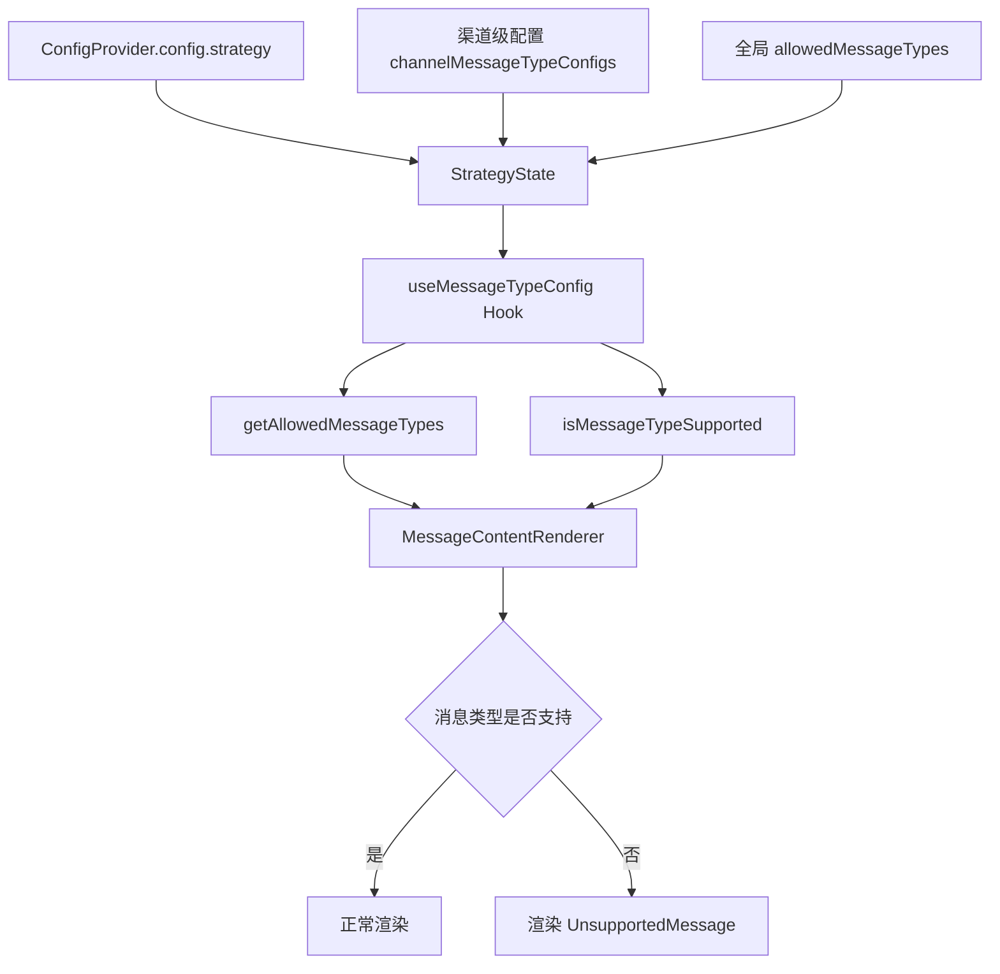

# 消息类型可配置化设计文档

## 文档信息

- **创建时间**: 2025-02-09
- **状态**: 当前已实现（As-Is）+ 后续目标（To-Be）
- **版本**: v1.1
- **作者**: Bifrost-Chat SDK Team

## 1. 概述

### 1.1 背景

根据业务需求，不同国家/地区对消息类型的支持存在差异。例如：
- 某些国家可能不支持富媒体消息
- 某些渠道可能仅支持文本消息
- 不同渠道的消息类型能力各不相同

因此需要实现一个可配置的消息类型过滤系统，允许使用方根据业务需求配置哪些消息类型可以展示，哪些不能。

### 1.2 目标

- ✅ 支持全局和渠道级消息类型配置
- ✅ 渠道级配置优先于全局配置
- ✅ 不支持的消息类型显示为提示信息
- ✅ 为每个渠道预设默认的消息类型支持列表
- ✅ 通过 SDK 初始化配置传入
- ✅ 保持向后兼容性

### 1.3 设计原则

1. **向后兼容**: 现有代码无需修改即可继续工作
2. **类型安全**: 使用 TypeScript 确保配置的类型安全
3. **可扩展**: 易于添加新的消息类型和配置选项
4. **性能优化**: 配置读取和过滤逻辑高效执行

## 2. 当前已实现（As-Is）

### 2.1 消息类型定义

```typescript
// src/interfaces/message.interface.ts
export enum MessageTypeEnum {
  Text = 'text',
  Image = 'image',
  Audio = 'audio',
  Video = 'video',
  File = 'file',
  Template = 'template',
  Location = 'location',
  RichMedia = 'rich_media',
  Other = 'other',
}
```

### 2.2 消息渲染流程

```
MessageRendererFactory
  ↓
MessageBubble
  ↓
MessageContentRenderer
  ↓
MESSAGE_COMPONENT_MAP (根据消息类型选择组件)
  ↓
具体消息组件 (TextMessage, ImageMessage, etc.)
```

### 2.3 不支持消息的处理

当前 `MessageContentRenderer` 对未知消息类型使用 `UnsupportedMessage` 组件：

```typescript
const Component = useMemo(() => {
  const component = MESSAGE_COMPONENT_MAP[message.type];
  if (!component) {
    console.warn(`Unknown message type: ${message.type}`);
    return UnsupportedMessage;
  }
  return component;
}, [message.type]);
```

## 3. 当前配置链路（As-Is）

### 3.1 配置层级

```
ConfigProvider.config.strategy (初始化全局配置)
  ↓
StrategyState (运行时状态，渠道级配置)
  ↓
useMessageTypeConfig (Hook 读取配置)
  ↓
MessageContentRenderer (应用过滤逻辑)
```

### 3.2 数据流图



### 3.3 配置优先级

```
渠道级配置 > 全局默认配置 > 预设默认值
```

说明：当前没有 `ChatSDK` 初始化类；运行时入口是 `ConfigProvider`。

## 4. 接口设计

### 4.1 消息类型配置接口

```typescript
// src/interfaces/message-type-config.interface.ts

import type { ChannelTypeEnum } from './channel.interface';
import { MessageTypeEnum } from './message.interface';

/**
 * 消息类型显示策略
 */
export enum MessageTypeDisplayStrategy {
  /** 显示为"不支持的消息类型"提示 */
  ShowUnsupported = 'show_unsupported',
  /** 完全隐藏（不在消息列表中显示） */
  Hide = 'hide',
  /** 降级显示（如富媒体消息显示为文本链接） */
  Fallback = 'fallback',
}

/**
 * 单个渠道的消息类型配置
 */
export interface ChannelMessageTypeConfig {
  /** 允许的消息类型列表 */
  allowedTypes: MessageTypeEnum[];
  /** 不支持消息的显示策略（可选，默认 show_unsupported） */
  displayStrategy?: MessageTypeDisplayStrategy;
  /** 自定义不支持提示文案（可选） */
  unsupportedMessage?: string;
}

/**
 * 消息类型配置
 */
export interface MessageTypeConfig {
  /** 全局默认允许的消息类型列表 */
  defaultAllowedTypes?: MessageTypeEnum[];
  /** 全局默认显示策略 */
  defaultDisplayStrategy?: MessageTypeDisplayStrategy;
  /** 按渠道配置的消息类型支持 */
  channelConfigs?: Partial<Record<ChannelTypeEnum, ChannelMessageTypeConfig>>;
}
```

### 4.2 渠道默认配置

```typescript
/**
 * 各渠道的默认消息类型支持列表
 */
export const DEFAULT_CHANNEL_MESSAGE_TYPES: Record<
  ChannelTypeEnum,
  MessageTypeEnum[]
> = {
  // SMS: 仅支持文本消息
  [ChannelTypeEnum.SMS]: [MessageTypeEnum.Text],

  // WhatsApp: 支持多种消息类型
  [ChannelTypeEnum.WhatsApp]: [
    MessageTypeEnum.Text,
    MessageTypeEnum.Image,
    MessageTypeEnum.Video,
    MessageTypeEnum.Audio,
    MessageTypeEnum.File,
    MessageTypeEnum.Location,
    MessageTypeEnum.Template,
  ],

  // Email: 支持文本和附件
  [ChannelTypeEnum.Email]: [
    MessageTypeEnum.Text,
    MessageTypeEnum.Image,
    MessageTypeEnum.File,
  ],

  // RCS: 支持富媒体与模板消息
  [ChannelTypeEnum.RCS]: [
    MessageTypeEnum.Text,
    MessageTypeEnum.Image,
    MessageTypeEnum.Video,
    MessageTypeEnum.Audio,
    MessageTypeEnum.File,
    MessageTypeEnum.Location,
    MessageTypeEnum.Template,
    MessageTypeEnum.RichMedia,
  ],
};
```

### 4.3 ConfigProvider 初始化配置（As-Is）

```tsx
import {
  ChannelTypeEnum,
  ConfigProvider,
  MessageTypeDisplayStrategy,
  MessageTypeEnum,
} from '@feoe/bifrost-chat';

<ConfigProvider
  config={{
    strategy: {
      allowedMessageTypes: [
        MessageTypeEnum.Text,
        MessageTypeEnum.Image,
      ],
      messageDisplayStrategy: MessageTypeDisplayStrategy.ShowUnsupported,
      channelMessageTypeConfigs: {
        [ChannelTypeEnum.SMS]: {
          allowedTypes: [MessageTypeEnum.Text],
          unsupportedMessage: 'SMS 仅支持文本消息',
        },
        [ChannelTypeEnum.RCS]: {
          allowedTypes: [
            MessageTypeEnum.Text,
            MessageTypeEnum.Image,
            MessageTypeEnum.RichMedia,
          ],
        },
      },
    },
  }}
>
  {/* ... */}
</ConfigProvider>
```

### 4.4 扩展策略状态

```typescript
// src/store/slices/strategy.slice.ts

export interface StrategyState {
  // ... 现有字段

  /** 允许的消息类型列表（当前激活渠道） */
  allowedMessageTypes: MessageTypeEnum[];
  /** 不支持消息的显示策略 */
  messageDisplayStrategy: MessageTypeDisplayStrategy;
  /** 自定义不支持提示文案 */
  unsupportedMessage?: string;
}
```

## 5. 状态管理

### 5.1 更新策略 Slice

```typescript
// src/store/slices/strategy.slice.ts

export interface StrategySlice {
  strategy: StrategyState;
  actions: {
    // ... 现有 actions
    setAllowedMessageTypes: (types: MessageTypeEnum[]) => void;
    setMessageDisplayStrategy: (strategy: MessageTypeDisplayStrategy) => void;
    updateChannelMessageTypeConfig: (
      channel: ChannelTypeEnum,
      config: ChannelMessageTypeConfig,
    ) => void;
  };
}
```

### 5.2 消息类型配置 Hook

```typescript
// src/hooks/use-message-type-config.hook.ts

export interface UseMessageTypeConfigResult {
  /** 当前允许的消息类型列表 */
  allowedTypes: MessageTypeEnum[];
  /** 检查消息类型是否支持 */
  isMessageTypeSupported: (type: MessageTypeEnum) => boolean;
  /** 获取不支持消息的显示策略 */
  getDisplayStrategy: () => MessageTypeDisplayStrategy;
  /** 获取自定义不支持提示文案 */
  getUnsupportedMessage: () => string | undefined;
}

export const useMessageTypeConfig = (): UseMessageTypeConfigResult => {
  // 实现逻辑
};
```

## 6. 渲染层实现

### 6.1 更新 MessageContentRenderer

```typescript
// src/components/messages/MessageContentRenderer.tsx

export const MessageContentRenderer = memo(
  ({ message }: MessageContentRendererProps) => {
    const { isMessageTypeSupported, getDisplayStrategy } =
      useMessageTypeConfig();

    // 检查消息类型是否支持
    const isSupported = isMessageTypeSupported(message.type);

    if (!isSupported) {
      const strategy = getDisplayStrategy();

      switch (strategy) {
        case MessageTypeDisplayStrategy.Hide:
          // 完全隐藏，返回 null
          return null;

        case MessageTypeDisplayStrategy.Fallback:
          // 降级显示（如富媒体消息显示为文本链接）
          return <FallbackMessage message={message} />;

        case MessageTypeDisplayStrategy.ShowUnsupported:
        default:
          // 显示为不支持的消息类型
          return <UnsupportedMessage message={message} />;
      }
    }

    // 原有的渲染逻辑
    const Component = useMemo(() => {
      const component = MESSAGE_COMPONENT_MAP[message.type];
      if (!component) {
        return UnsupportedMessage;
      }
      return component;
    }, [message.type]);

    // ... 其余代码
  },
);
```

### 6.2 增强 UnsupportedMessage 组件

```typescript
// src/components/messages/UnsupportedMessage.tsx

export interface UnsupportedMessageProps {
  /** 标准消息 */
  message?: StandardMessage;
  /** 消息类型 */
  messageType?: MessageTypeEnum;
  /** 自定义提示文案 */
  customMessage?: string;
}

export const UnsupportedMessage = memo(
  ({ message, messageType, customMessage }: UnsupportedMessageProps) => {
    const type = messageType ?? message?.type;
    const displayMessage =
      customMessage ?? t('unsupported_message', { type });

    return (
      <div className="flex items-center gap-2 text-muted-foreground">
        <WarningIcon />
        <span className="text-sm">{displayMessage}</span>
      </div>
    );
  },
);
```

## 7. 使用示例

### 7.1 初始化配置

```tsx
import {
  ChannelTypeEnum,
  ConfigProvider,
  MessageTypeDisplayStrategy,
  MessageTypeEnum,
} from '@feoe/bifrost-chat';

<ConfigProvider
  config={{
    strategy: {
      allowedMessageTypes: [
        MessageTypeEnum.Text,
        MessageTypeEnum.Image,
        MessageTypeEnum.Video,
      ],
      messageDisplayStrategy: MessageTypeDisplayStrategy.ShowUnsupported,
      channelMessageTypeConfigs: {
        [ChannelTypeEnum.SMS]: {
          allowedTypes: [MessageTypeEnum.Text],
          unsupportedMessage: 'SMS 仅支持文本消息',
        },
        [ChannelTypeEnum.WhatsApp]: {
          allowedTypes: [
            MessageTypeEnum.Text,
            MessageTypeEnum.Image,
            MessageTypeEnum.Video,
            MessageTypeEnum.Audio,
            MessageTypeEnum.Template,
          ],
        },
      },
    },
  }}
>
  {/* ... */}
</ConfigProvider>
```

### 7.2 运行时更新配置

```typescript
import {
  MessageTypeDisplayStrategy,
  MessageTypeEnum,
  useActions,
} from '@feoe/bifrost-chat';

const actions = useActions();

// 更新当前渠道的消息类型配置
actions.setAllowedMessageTypes([
  MessageTypeEnum.Text,
  MessageTypeEnum.Image,
]);

// 更新显示策略
actions.setMessageDisplayStrategy(
  MessageTypeDisplayStrategy.ShowUnsupported,
);
```

### 7.3 在组件中使用

```typescript
import { useMessageTypeConfig } from '@feoe/bifrost-chat';

const MyComponent = () => {
  const { isMessageTypeSupported } = useMessageTypeConfig();

  const handleSendMessage = (type: MessageTypeEnum) => {
    if (!isMessageTypeSupported(type)) {
      console.warn('当前渠道不支持此消息类型');
      return;
    }
    // 发送消息
  };

  return <div>...</div>;
};
```

## 8. 测试策略

### 8.1 单元测试

- 测试 `useMessageTypeConfig` hook 的各种场景
- 测试消息类型过滤逻辑
- 测试不同显示策略的行为
- 测试配置优先级

### 8.2 集成测试

- 测试 SDK 初始化配置的加载
- 测试渠道切换时消息类型的更新
- 测试消息渲染的正确性

### 8.3 视觉测试

- 使用 Storybook 展示不同配置下的消息渲染效果
- 测试不同显示策略的视觉效果

## 9. 迁移指南

### 9.1 向后兼容性

- 现有代码无需修改即可继续工作
- 如果未配置 `strategy.allowedMessageTypes` 或
  `strategy.channelMessageTypeConfigs`，将使用按渠道预设的默认值
- 所有消息类型默认支持（保持旧行为）

### 9.2 逐步迁移

1. **第一阶段**: 通过 `ConfigProvider.config.strategy` 增加全局默认配置
2. **第二阶段**: 为差异明显的渠道补充 `channelMessageTypeConfigs`
3. **第三阶段**: 在业务侧按国家/渠道注入配置，并用 Storybook 覆盖关键组合

## 10. 性能考虑

- 配置读取使用 Zustand，性能高效
- 消息类型检查使用 Set 数据结构，O(1) 复杂度
- 渲染层使用 memo 优化，避免不必要的重渲染

## 11. 安全性考虑

- 配置验证：确保传入的消息类型有效
- 类型安全：使用 TypeScript 确保编译时类型检查
- 默认值：未配置时使用安全的默认值

## 12. 未来扩展

### 12.1 可能的增强功能

- 支持消息类型的条件显示（基于用户角色、权限等）
- 支持消息类型的动态加载（按需加载渲染组件）
- 支持消息类型的版本控制（不同版本使用不同配置）

### 12.2 可配置的其他维度

- 消息大小限制
- 消息格式要求
- 消息发送频率限制

## 13. 相关文档

- [最终架构文档](./final-architecture.md)
- [消息接口定义](../src/interfaces/message.interface.ts)
- [渠道接口定义](../src/interfaces/channel.interface.ts)
- [命名约定](./naming-conventions.md)

## 14. 变更日志

| 版本 | 日期 | 变更内容 | 作者 |
|------|------|----------|------|
| v1.0 | 2025-02-09 | 初始设计 | Bifrost-Chat SDK Team |
| v1.1 | 2026-06-02 | 对齐当前 ConfigProvider/StrategyState 实现 | Codex |
