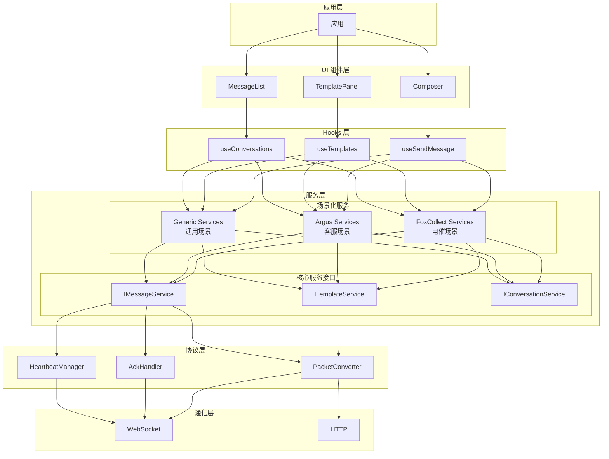
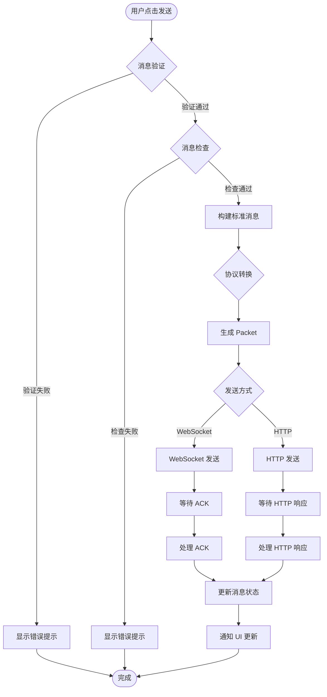

# 协议集成架构设计总结

## 概述

本文档总结了 Bifrost-Chat SDK 的协议集成架构，包括协议文档分析、场景化服务设计、消息发送流程等关键内容。

## 当前已实现（As-Is）

### 核心协议

SDK 已实现以下核心协议：

| 协议 | 文档路径 | 状态 |
|------|----------|------|
| Packet 包协议 | [`specs/Packet包协议.md`](../specs/Packet包协议.md) | ✅ 已实现 |
| ACK 协议 | [`specs/ACK协议.md`](../specs/ACK协议.md) | ✅ 已实现 |
| 心跳协议 | [`specs/心跳协议.md`](../specs/心跳协议.md) | ✅ 已实现 |
| 聊天消息协议 | [`specs/聊天消息协议.md`](../specs/聊天消息协议.md) | ✅ 已实现 |
| 状态切换协议 | [`specs/status_switch协议.md`](../specs/status_switch协议.md) | ⚠️ 部分实现 |
| 会话列表接口 | [`specs/会话列表接口.md`](../specs/会话列表接口.md) | ✅ 已实现 |
| 电催接口 | [`specs/电催接口.md`](../specs/电催接口.md) | ❌ 待实现 |

### 核心服务接口

```typescript
// src/services/core/template.service.ts
interface ITemplateService<TListParams, TPreviewParams> {
  list(params: TListParams): Promise<Template[]>;
  preview(params: TPreviewParams): Promise<TemplatePreviewResult>;
}

// src/services/core/message.service.ts
interface IMessageService<TListParams, TSendParams, TReadParams, TSendAttachmentParams, TSendAudioParams> {
  list(conversationId: string, params: TListParams): Promise<StandardMessage[]>;
  send(conversationId: string, params: TSendParams): Promise<MessageSendResult>;
  markAsRead(
    params: TReadParams,
    meta?: MarkAsReadMeta,
  ): Promise<undefined | MarkAsReadResult>;
  sendAttachment(params: TSendAttachmentParams): Promise<SendAttachmentResult>;
  sendAudio(params: TSendAudioParams): Promise<SendAudioResult>;
  subscribeToMessages(callback: (event: MessageReceivedEvent) => void): () => void;
  subscribeToMessageStatus(callback: (event: MessageStatusUpdatedEvent) => void): () => void;
}
```

### 协议转换器

```typescript
// src/services/protocol/packet.converter.ts
class PacketConverter {
  static toStandardMessage(packet: RawPacket, direction?: MessageDirectionEnum, currentPin?: string): StandardMessage;
  static toRawPacket(message: StandardMessage, fromApp: string, fromPin: string): RawPacket;
}

// src/services/protocol/ack.handler.ts
class AckHandler {
  static createReadAck(ackFrom: AckFromParticipant, params: AckPacketBody): AckRawPacket;
  static parseDownstream(data: unknown): AckData | null;
  static isValidAckType(type: string): boolean;
  static ackTypeToMessageStatus(type: AckType): MessageStatusEnum;
}

// src/services/protocol/heartbeat.manager.ts
class HeartbeatManager {
  static createHeartbeat(params: HeartbeatParams): RawPacket;
  static isHeartbeatResponse(data: unknown): boolean;
}
```

## 目标架构（To-Be）

### 场景化服务架构



### 消息发送完整流程



### 场景差异对比表

| 特性 | 电催场景 | 客服场景 | 通用场景 |
|------|----------|----------|----------|
| **Session ID** | `chatId`（由 `session/info/query` 返回） | 用户 ID（身份证+包） | 会话 ID |
| **from.app** | `fox_collect.waiter` | `fox_argus.waiter` | 自定义 |
| **to.app** | `im.waiter` | `fox_argus.customer` | 自定义 |
| **entry** | `fox.collect.detail` | `fox.system` | 自定义 |
| **模板查询** | `/chat/v2/template/query` | 待定义 | `/templates` |
| **消息检查** | `/chat/v2/message/check`<br/>（频次检查） | 待定义<br/>（敏感词检查） | 可选 |
| **消息发送** | `/chat/v2/message/send` | 待定义 | `/conversations/{id}/messages` |
| **会话查询** | `/chat/v2/session/query` | 待定义 | `/conversations` |
| **会话创建** | `/chat/v2/session/info` | 待定义 | `/conversations` |

### 关键接口定义

#### 1. 消息检查接口

```typescript
/**
 * 消息检查参数（通用）
 */
export interface MessageCheckParams {
  /** 消息唯一 ID */
  id: string;
  /** 会话 ID */
  chatId: string;
  /** 渠道类型 */
  channelType: ChannelTypeEnum;
  /** 消息类型 */
  type: 'template' | 'custom';
  /** 客户端类型 */
  clientType?: string;
  /** 模板 code（type=template 时必填） */
  template?: string;
}

/**
 * 消息检查结果
 */
export interface MessageCheckResult {
  /** 是否允许发送 */
  allowed: boolean;
  /** 错误码（不允许时） */
  code?: number;
  /** 错误消息（不允许时） */
  message?: string;
}
```

#### 2. 模板服务接口

```typescript
/**
 * 电催场景模板服务
 */
export interface FoxCollectTemplateService {
  /**
   * 查询模板列表
   * 接口: POST /chat/v2/template/query
   */
  list(params: {
    chatId: string;
    channelType: ChannelTypeEnum;
  }): Promise<Template[]>;
  
  /**
   * 预览模板
   * 接口: POST /chat/v2/template/render
   */
  preview(params: {
    chatId: string;
    channelType: ChannelTypeEnum;
    template: string;
  }): Promise<{
    previewContent: string;
    params: Record<string, string>;
  }>;
}

/**
 * 客服场景模板服务
 */
export interface ArgusTemplateService {
  /**
   * 查询模板列表
   * 接口: 待定义
   */
  list(params: {
    conversationId: string;
    category?: string;
  }): Promise<Template[]>;
  
  /**
   * 发送模板消息
   * 接口: 待定义
   */
  send(params: {
    conversationId: string;
    templateId: string;
    variables: Record<string, string>;
  }): Promise<MessageSendResult>;
  
  preview(params: {
    conversationId: string;
    templateCode: string;
  }): Promise<{
    previewContent: string;
    params: Record<string, string>;
  }>;
}
```

#### 3. 消息服务接口

```typescript
/**
 * 电催场景消息服务
 */
export interface FoxCollectMessageService {
  /**
   * 消息检查（频次检查）
   * 接口: POST /chat/v2/message/check
   */
  checkMessage(params: {
    id: string;
    chatId: string;
    channelType: ChannelTypeEnum;
    type: 'template' | 'custom';
    clientType?: string;
    template?: string;
  }): Promise<MessageCheckResult>;
  
  /**
   * 发送消息
   * 接口: POST /chat/v2/message/send
   */
  send(conversationId: string, params: {
    id?: string;
    channelType: ChannelTypeEnum;
    clientType?: string;
    type: 'template' | 'custom';
    template?: string;
    content?: StandardMessage['content'];
    receiverPin: string;
  }): Promise<MessageSendResult>;
  
  /**
   * 查询消息列表
   */
  list(conversationId: string, params?: {
    pageSize?: number;
    cursor?: string;
    direction?: 'forward' | 'backward';
  }): Promise<StandardMessage[]>;
  
  /**
   * 标记已读
   */
  markAsRead(params: {
    sender: string;
    app: string;
    messageId: string;
    chatId: string;
    datetime: number;
  }): Promise<void>;
  
  /**
   * 订阅消息
   */
  subscribeToMessages(callback: (event: MessageReceivedEvent) => void): () => void;
  
  /**
   * 订阅消息状态
   */
  subscribeToMessageStatus(callback: (event: MessageStatusUpdatedEvent) => void): () => void;
}

/**
 * 客服场景消息服务
 */
export interface ArgusMessageService {
  /**
   * 消息检查（敏感词检查）
   * 接口: 待定义
   */
  checkMessage(params: {
    conversationId: string;
    content: Record<string, unknown>;
  }): Promise<MessageCheckResult>;
  
  /**
   * 发送消息
   * 接口: 待定义
   */
  send(conversationId: string, params: {
    id?: string;
    channelType: ChannelTypeEnum;
    content: StandardMessage['content'];
    customerId: string;
  }): Promise<MessageSendResult>;
  
  /**
   * 查询消息列表
   */
  list(conversationId: string, params?: {
    pageSize?: number;
    cursor?: string;
    direction?: 'forward' | 'backward';
  }): Promise<StandardMessage[]>;
  
  /**
   * 标记已读
   */
  markAsRead(params: {
    sender: string;
    app: string;
    messageId: string;
    chatId: string;
    datetime: number;
  }): Promise<void>;
  
  /**
   * 订阅消息
   */
  subscribeToMessages(callback: (event: MessageReceivedEvent) => void): () => void;
  
  /**
   * 订阅消息状态
   */
  subscribeToMessageStatus(callback: (event: MessageStatusUpdatedEvent) => void): () => void;
}
```

### 服务工厂模式

```typescript
/**
 * 场景化服务工厂
 */
export class ScenarioServiceFactory {
  /**
   * 创建电催场景服务
   */
  static createFoxCollectServices(config: FoxCollectConfig): {
    templateService: FoxCollectTemplateService;
    messageService: FoxCollectMessageService;
  };
  
  /**
   * 创建客服场景服务
   */
  static createArgusServices(config: ArgusConfig): {
    templateService: ArgusTemplateService;
    messageService: ArgusMessageService;
  };
  
  /**
   * 创建通用场景服务
   */
  static createGenericServices(config: DefaultServiceConfig): {
    templateService: DefaultTemplateService;
    messageService: DefaultMessageService;
  };
}
```

## 实现计划

### Phase 1: 核心协议增强

- [ ] 完善 PacketConverter 支持所有消息类型
- [ ] 增强 AckHandler 支持所有 ACK 类型
- [ ] 优化 HeartbeatManager 的重连机制

### Phase 2: 通用场景实现

- [ ] 实现 TemplateService
- [ ] 实现 MessageService
- [ ] 实现消息检查逻辑（频次检查）
- [ ] 编写单元测试

### Phase 3: 文档与示例

- [ ] 更新 API 文档
- [ ] 编写使用示例
- [ ] 编写迁移指南

## 参考文档

- [协议时序图](./protocol-sequence-diagram.md) - 详细的协议交互时序图
- [最终架构](./final-architecture.md) - SDK 的最终架构设计
- [命名规范](./naming-conventions.md) - 代码命名规范

## 总结

通过本次协议集成架构设计，我们实现了：

1. **协议统一**：所有外部协议通过 PacketConverter 统一转换为内部 StandardMessage
2. **场景化服务**：支持电催、客服等不同业务场景的定制化实现
3. **消息检查**：在发送前进行消息检查（频次、敏感词等）
4. **ACK 机制**：确保消息的可靠送达和状态同步
5. **心跳保活**：维护 WebSocket 连接的稳定性
6. **类型安全**：通过 TypeScript 泛型确保类型安全
7. **易于扩展**：新增场景只需实现对应的服务类

这个架构设计为 SDK 的后续发展提供了坚实的基础。
