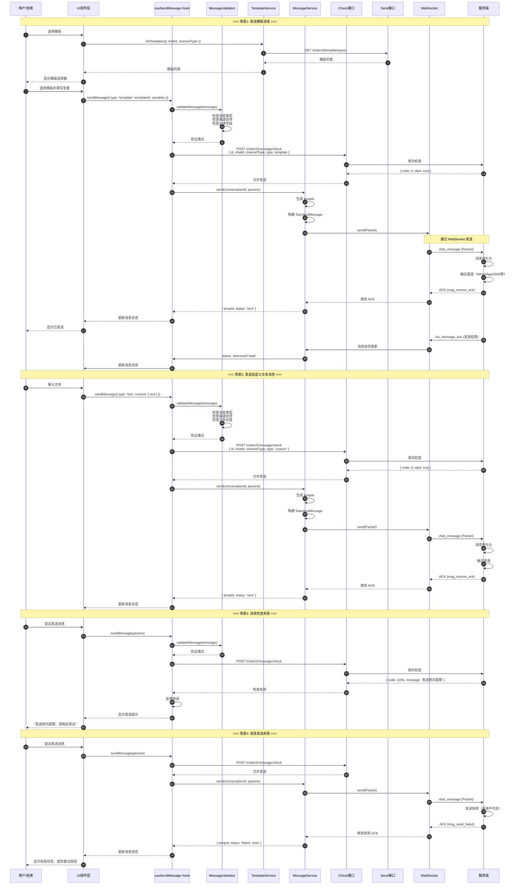
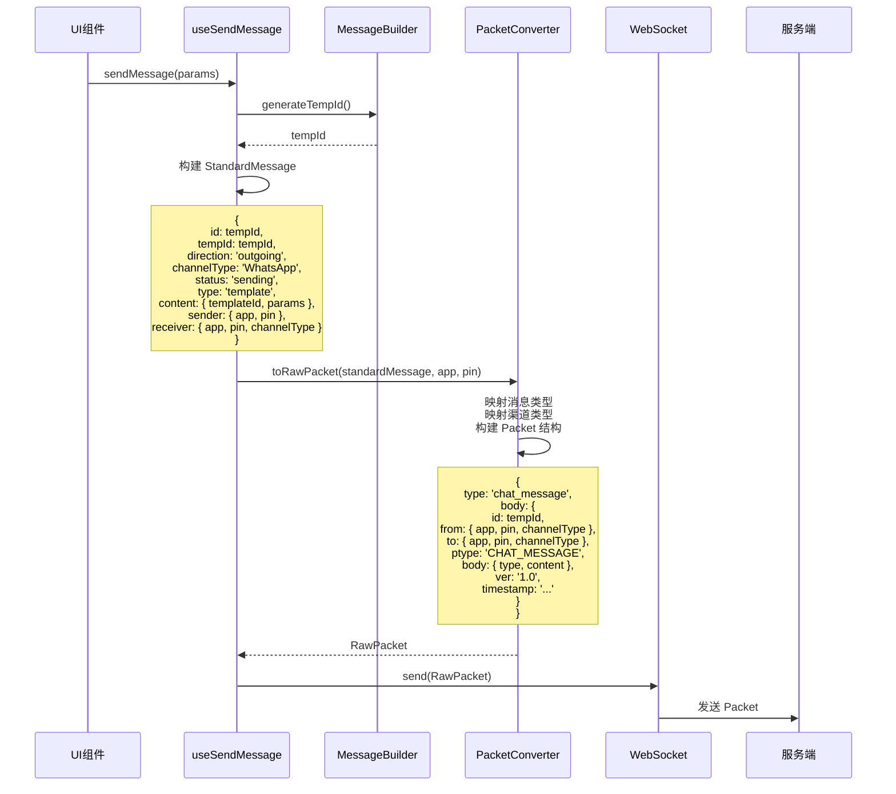
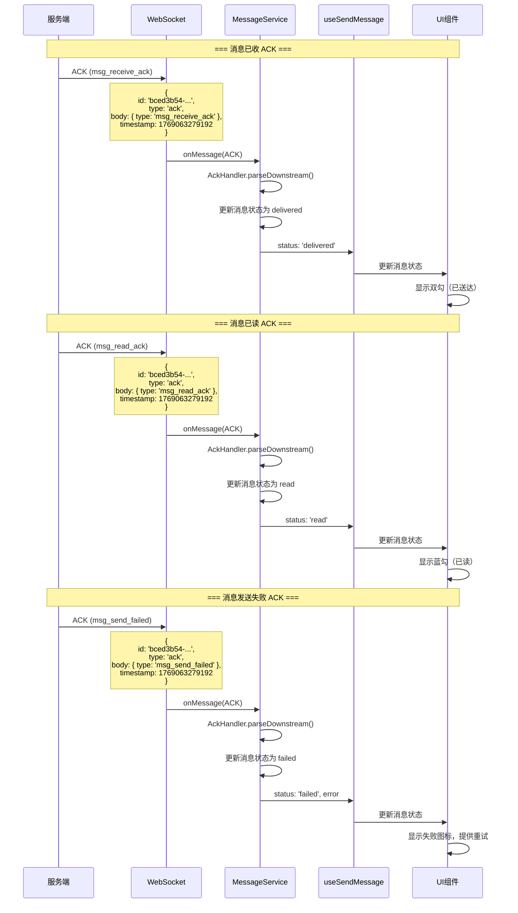
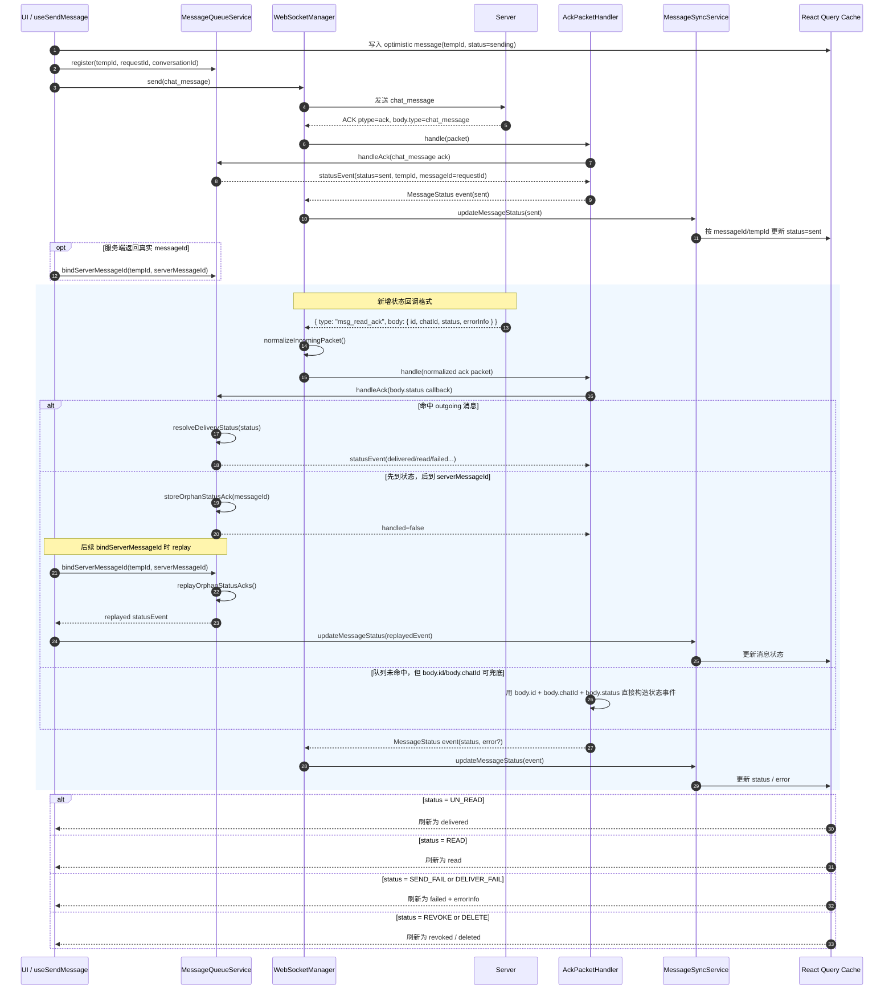
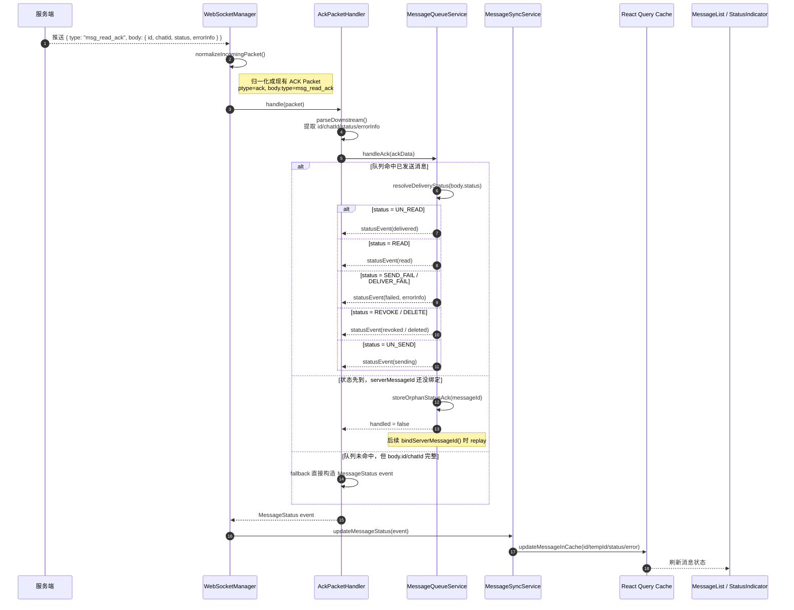
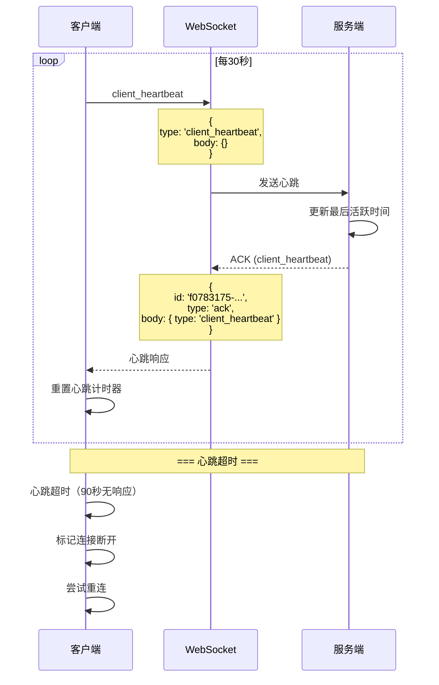
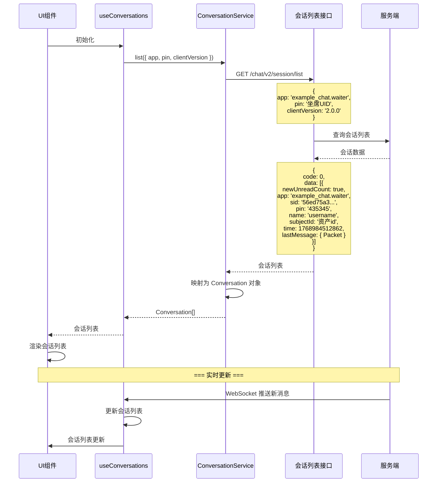
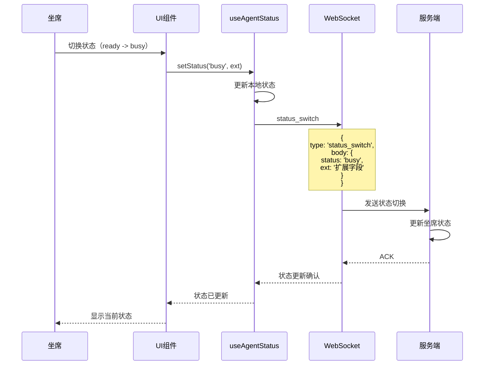
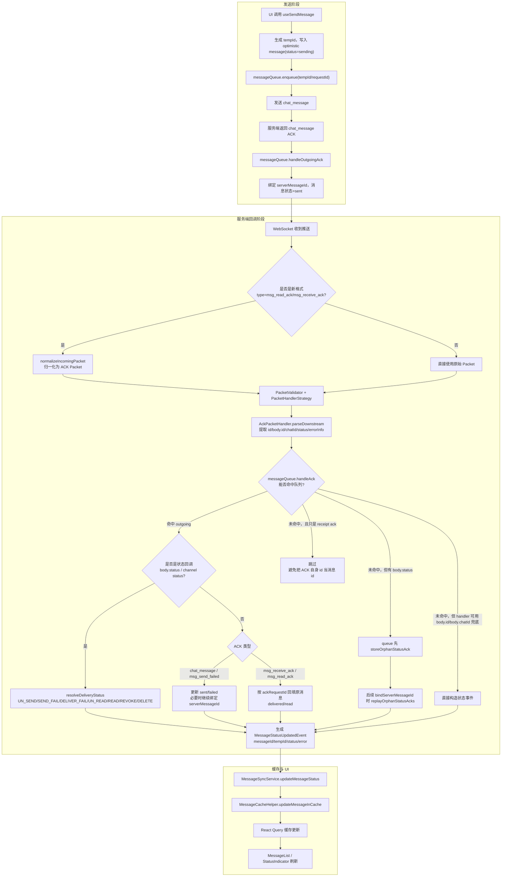

# 消息发送完整流程时序图

## 概述

本文档描述了 Bifrost-Chat SDK 中消息发送的完整流程，包括不同场景（电催、客服）下的差异处理。

## 场景差异对比

### 电催场景（示例业务）

| 字段 | 值 | 说明 |
|------|-----|------|
| SESSION ID | `chatId` | 由 `session/info/query` 返回的会话标识 |
| from.app | `example_chat.waiter` | 催收坐席 |
| to.app | `im.waiter` | 用户 |
| entry | `example.chat.detail` | 电催详情入口 |
| 模板查询 | `/chat/v2/template/query` | 基于渠道类型查询 |
| 消息检查 | `/chat/v2/message/check` | 频次检查 |
| 消息发送 | `/chat/v2/message/send` | 模板/自定义消息 |

### 客服场景（示例客服 Customer Service）

| 字段 | 值 | 说明 |
|------|-----|------|
| SESSION ID | 用户 ID | 用户 ID = 客户身份证+包 |
| from.app | `support_chat.customer` | 客户端用户 |
| to.app | `support_chat.waiter` | 示例客服 客服客诉坐席 |
| entry | `example.system` | 系统入口 |
| 模板查询 | 待定义 | 客服场景模板查询接口 |
| 消息检查 | 待定义 | 客服场景消息检查接口 |
| 消息发送 | 待定义 | 客服场景消息发送接口 |

## 完整消息发送时序图



## Packet 协议转换流程



## ACK 确认流程



## MessageStatus 流转时序图



## ACK <-> MessageStatus 双轨时序图



## 心跳保活流程



## 会话列表查询流程



## 状态切换流程



## 整体流程



## 关键接口定义

### 1. 消息检查接口

```typescript
interface MessageCheckParams {
  /** 消息唯一 ID */
  id: string;
  /** 会话 ID */
  chatId: string;
  /** 渠道类型 */
  channelType: ChannelTypeEnum;
  /** 消息类型 */
  type: 'template' | 'custom';
  /** 客户端类型 */
  clientType?: string;
  /** 模板 code（type=template 时必填） */
  template?: string;
}

interface MessageCheckResult {
  /** 是否允许发送 */
  allowed: boolean;
  /** 错误码（不允许时） */
  code?: number;
  /** 错误消息（不允许时） */
  message?: string;
}
```

### 2. 模板查询接口

```typescript
interface TemplateQueryParams {
  /** 会话 ID */
  chatId: string;
  /** 渠道类型 */
  channelType: ChannelTypeEnum;
}

interface Template {
  /** 模板 ID */
  id: number;
  /** 模板名称 */
  name: string;
  /** 模板 code */
  code: string;
  /** 模板内容 */
  content: string;
  /** 消息预览 */
  previewContent: string;
  /** 模板语言 */
  language: string;
}
```

### 3. 消息发送接口

```typescript
interface MessageSendParams {
  /** 消息唯一 ID */
  id: string;
  /** 会话 ID */
  chatId: string;
  /** 渠道类型 */
  channelType: ChannelTypeEnum;
  /** 消息类型 */
  type: 'template' | 'custom';
  /** 客户端类型 */
  clientType?: string;
  /** 模板 code（type=template 时必填） */
  template?: string;
  /** 自定义消息内容（type=custom 时） */
  content?: Record<string, unknown>;
}
```

## 场景化服务接口

### 电催场景（示例业务）

```typescript
interface ExampleTemplateService extends ITemplateService {
  /** 查询模板（电催场景） */
  list(params: { chatId: string; channelType: ChannelTypeEnum }): Promise<Template[]>;
  
  /** 发送模板消息（电催场景） */
  send(params: {
    chatId: string;
    channelType: ChannelTypeEnum;
    templateId: string;
    variables: Record<string, string>;
  }): Promise<MessageSendResult>;
}

interface ExampleMessageService extends IMessageService {
  /** 消息检查（电催场景 - 频次检查） */
  checkMessage(params: MessageCheckParams): Promise<MessageCheckResult>;
  
  /** 发送消息（电催场景） */
  sendMessage(params: MessageSendParams): Promise<MessageSendResult>;
}
```

### 客服场景（示例客服 Customer Service）

```typescript
interface 示例客服TemplateService extends ITemplateService {
  /** 查询模板（客服场景） */
  list(params: { conversationId: string; category?: string }): Promise<Template[]>;
  
  /** 发送模板消息（客服场景） */
  send(params: {
    conversationId: string;
    templateId: string;
    variables: Record<string, string>;
  }): Promise<MessageSendResult>;
}

interface 示例客服MessageService extends IMessageService {
  /** 消息检查（客服场景 - 敏感词检查等） */
  checkMessage(params: {
    conversationId: string;
    content: Record<string, unknown>;
  }): Promise<MessageCheckResult>;
  
  /** 发送消息（客服场景） */
  sendMessage(params: {
    conversationId: string;
    content: Record<string, unknown>;
  }): Promise<MessageSendResult>;
}
```

## 总结

通过以上时序图和接口定义，我们可以看到：

1. **不同场景的差异**主要体现在：
   - Session ID 的生成规则不同
   - 租户（app）标识不同
   - 模板查询接口不同
   - 消息检查逻辑不同（频次 vs 敏感词）
   - 消息发送接口不同

2. **消息发送完整流程**包括：
   - 模板选择和查询
   - 消息验证
   - 消息检查（check 接口）
   - 消息发送（send 接口）
   - ACK 确认
   - 状态更新

3. **协议转换**由 PacketConverter 负责，实现 StandardMessage 和 RawPacket 之间的双向转换。

4. **ACK 机制**确保消息的可靠送达和状态同步。
