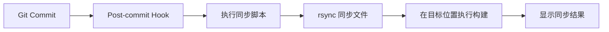

# 自动同步到 fox-admin-ui 快速开始指南

## 概述

本指南帮助您快速设置 Bifrost Chat 到 fox-admin-ui 的自动同步功能。

**当前已实现（As-Is）**：
- 手动复制文件进行同步

**目标架构（To-Be）**：
- Git commit 后自动同步
- 自动执行构建
- 支持手动触发

## 一键安装

```bash
# 运行安装脚本
pnpm sync:install
```

安装脚本会自动：
1. 复制 Git Hook 到 `.git/hooks/post-commit`
2. 设置执行权限
3. 验证安装成功

## 使用方式

### 1. 自动同步（推荐）

正常提交代码，自动触发同步：

```bash
git add .
git commit -m "feat: 添加新功能"
# ✅ 同步自动在后台执行
```

### 2. 手动同步

```bash
# 使用 npm/pnpm 命令手动触发
pnpm sync:fox
```

### 3. 查看同步日志

```bash
# 实时查看同步日志
tail -f /tmp/bifrost-sync.log

# 查看最近的同步日志
tail -n 50 /tmp/bifrost-sync.log
```

## 工作原理



## 配置文件

| 文件 | 说明 |
|------|------|
| [`scripts/sync-to-fox-admin.sh`](../scripts/sync-to-fox-admin.sh) | 同步脚本 |
| [`scripts/git-hooks/post-commit`](../scripts/git-hooks/post-commit) | Git Hook 模板 |
| [`scripts/install-sync-hook.sh`](../scripts/install-sync-hook.sh) | 安装脚本 |
| [`package.json`](../package.json) | 添加了 `sync:fox` 和 `sync:install` 命令 |

## 故障排除

### Hook 不执行

**检查 hook 权限**：
```bash
ls -la .git/hooks/post-commit
# 应该显示 -rwxr-xr-x
```

**重新安装**：
```bash
pnpm sync:install
```

### 同步失败

**检查目标目录权限**：
```bash
ls -la /Users/cheng/Development/WorkSpace/fox/fox-admin-ui/packages/
```

**检查 rsync 是否安装**：
```bash
which rsync
# macOS 默认已安装
```

### 构建失败

**手动在目标位置构建**：
```bash
cd /Users/cheng/Development/WorkSpace/fox/fox-admin-ui/packages/bifrost-chat
pnpm install
pnpm build
```

## 卸载

```bash
# 删除 Git Hook
rm .git/hooks/post-commit

# 验证已删除
ls .git/hooks/post-commit
# 应该显示: No such file or directory
```

## 高级配置

### 修改同步目标

编辑 [`scripts/sync-to-fox-admin.sh`](../scripts/sync-to-fox-admin.sh)：

```bash
# 修改这两个变量
SOURCE_DIR="/Users/cheng/Development/WorkSpace/feoe/bifrost-chat"
TARGET_DIR="/Users/cheng/Development/WorkSpace/fox/fox-admin-ui/packages/bifrost-chat"
```

### 排除更多文件

在 [`scripts/sync-to-fox-admin.sh`](../scripts/sync-to-fox-admin.sh) 中添加更多 `--exclude` 参数：

```bash
rsync -av --delete \
    --exclude 'node_modules/' \
    --exclude '.git/' \
    --exclude 'your-directory/' \  # 添加这一行
    "$SOURCE_DIR/" "$TARGET_DIR/"
```

### 禁用自动构建

如果不需要在同步后自动构建，可以注释掉构建部分：

```bash
# 在 sync_files() 函数后注释掉 build_target 调用
# build_target
```

## 相关文档

- [Git Hook 文档](https://git-scm.com/docs/githooks)
- [rsync 文档](https://linux.die.net/man/1/rsync)

## 支持

如有问题，请查看：
1. 同步日志：`/tmp/bifrost-sync.log`
2. 项目 Issues：[https://git.kuainiujinke.com/feoe/bifrost-chat/issues](https://git.kuainiujinke.com/feoe/bifrost-chat/issues)
