# Bifrost-Chat JS SDK 架构流程图

> 本文档包含 Bifrost-Chat JS SDK 的关键架构流程图，用于可视化系统设计和数据流。

## 目录

1. [系统架构图](#1-系统架构图)
2. [数据流图](#2-数据流图)
3. [关键流程图](#3-关键流程图)
4. [状态机图](#4-状态机图)
5. [组件关系图](#5-组件关系图)

---

## 1. 系统架构图

### 1.1 整体架构层次

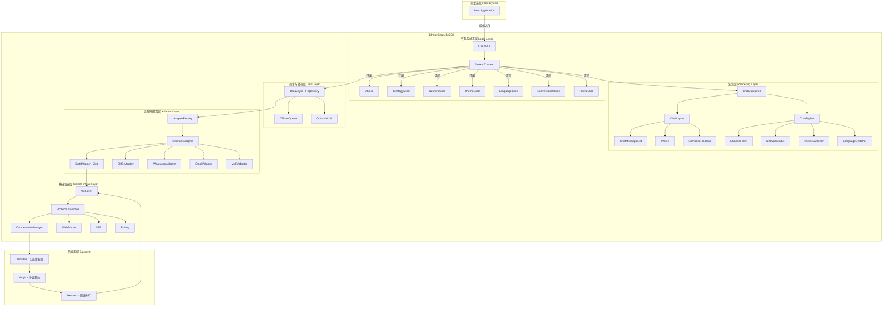

### 1.2 分层架构详细视图

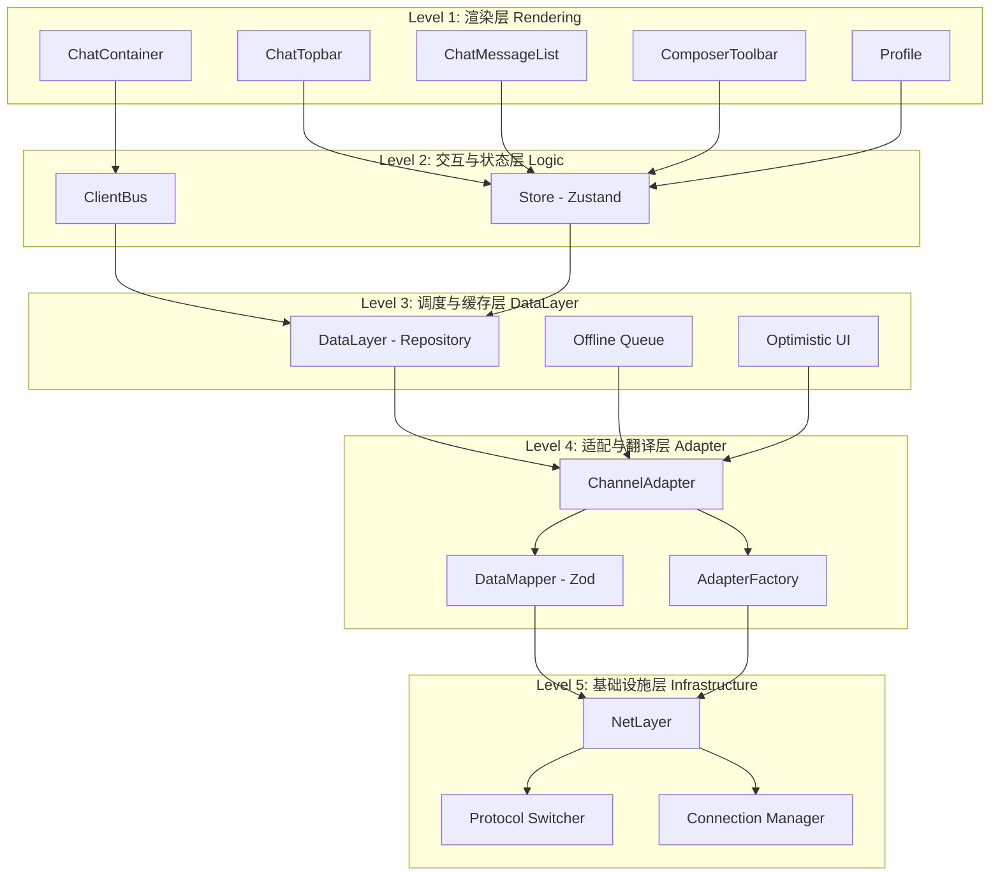

---

## 2. 数据流图

### 2.1 发送消息数据流（Outbound）

```mermaid
graph LR
    A[用户输入] --> B[ComposerToolbar]
    B --> C[Store - 生成 tempId]
    C --> D[Optimistic UI - 更新 UI]
    C --> E[DataLayer]
    E --> F[AdapterFactory - 选择渠道]
    F --> G[ChannelAdapter]
    G --> H[DataMapper - 转换 DTO]
    H --> I[Zod 校验]
    I --> J[NetLayer]
    J --> K[Protocol Switcher]
    K --> L[Connection Manager]
    L --> M[后端服务]

    M -->|返回 mid| N[NetLayer]
    N --> O[DataMapper - 解析响应]
    O --> P[DataLayer]
    P --> Q[Store - 更新 id/status]
    Q --> R[UI - 刷新状态]

    style D fill:#e1f5e1
    style Q fill:#e1f5e1
    style R fill:#e1f5e1
```

### 2.2 接收消息数据流（Inbound）

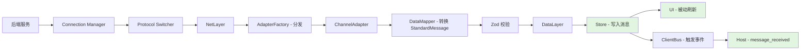

### 2.3 状态同步数据流

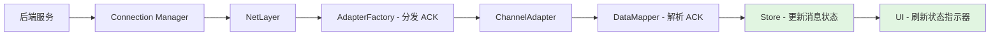

### 2.4 网络重连数据流

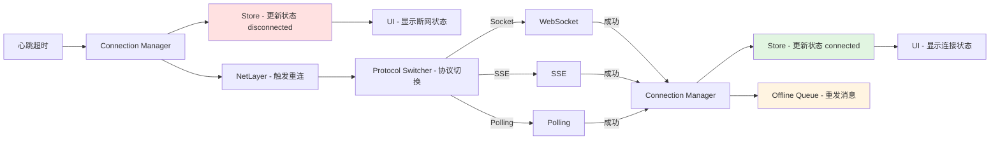

---

## 3. 关键流程图

### 3.1 发送消息完整流程

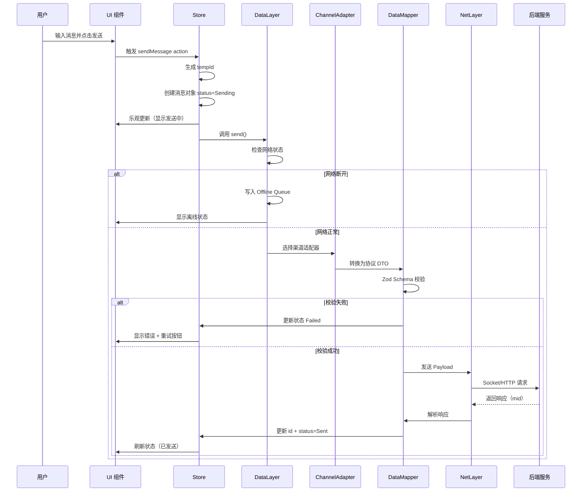

### 3.2 接收消息完整流程

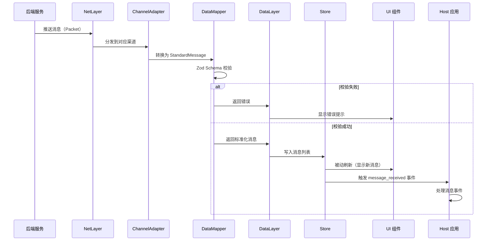

### 3.3 消息状态更新流程

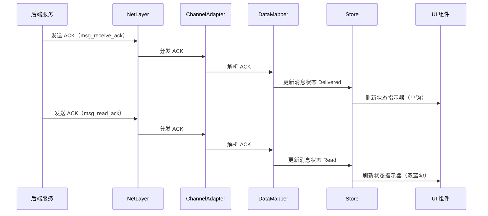

### 3.4 网络重连流程

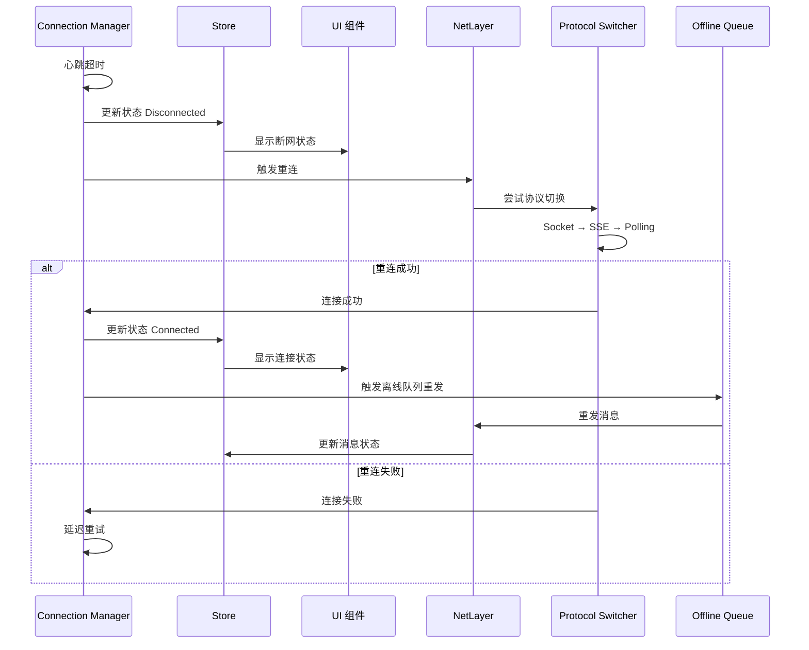

### 3.5 渠道切换流程

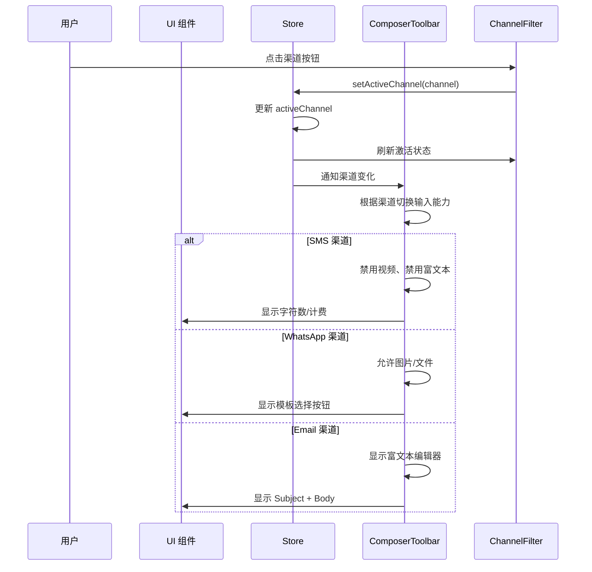

---

## 4. 状态机图

### 4.1 消息状态机

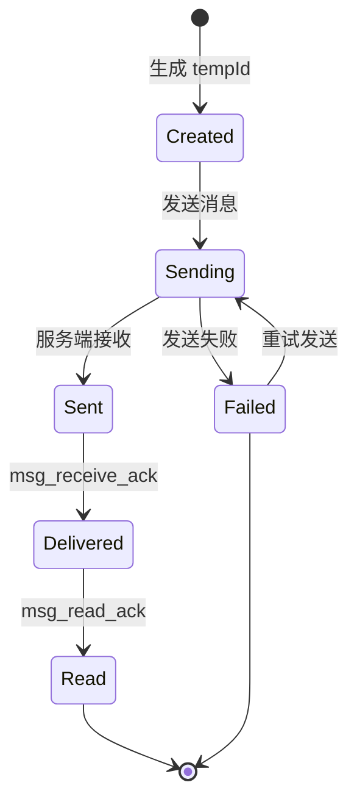

### 4.2 网络状态机

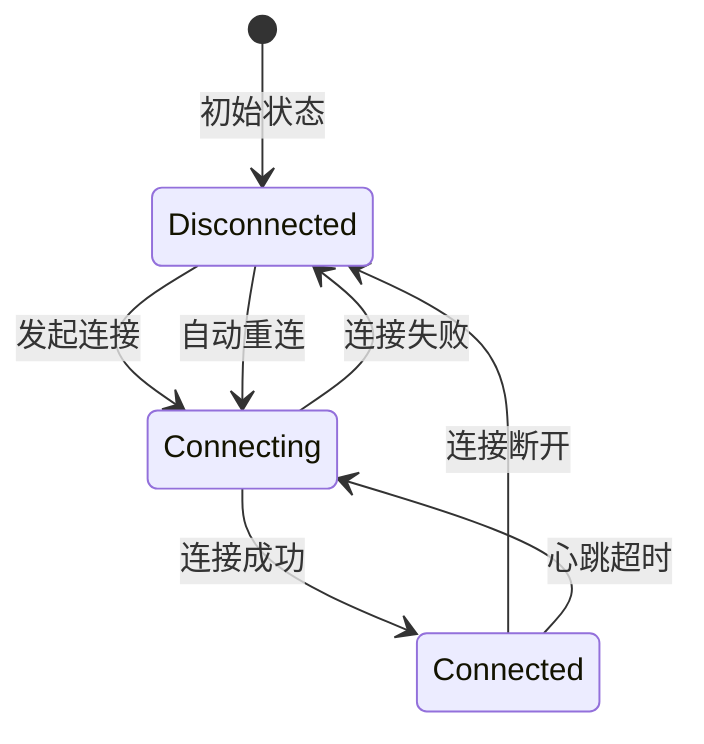

### 4.3 坐席状态机

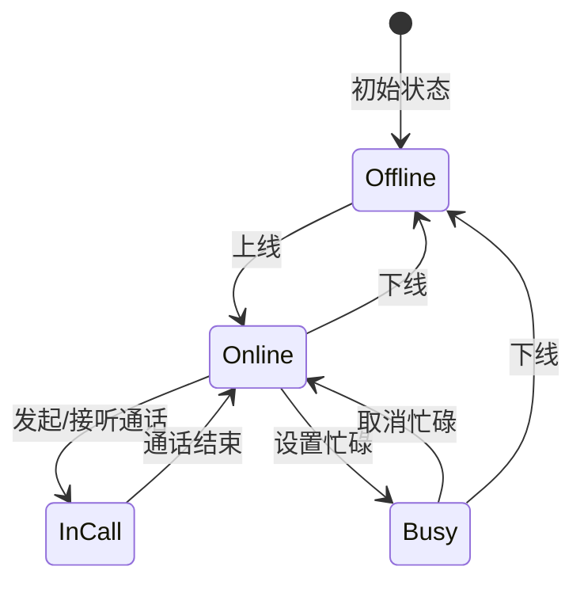

### 4.4 渠道状态机

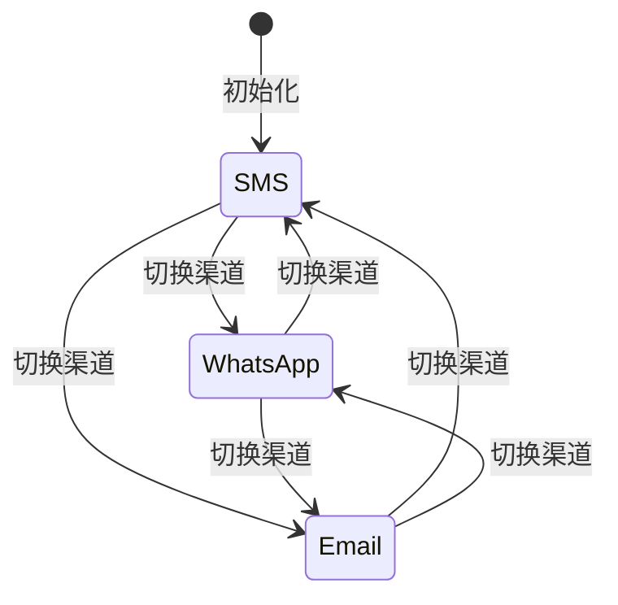

---

## 5. 组件关系图

### 5.1 渲染层组件关系

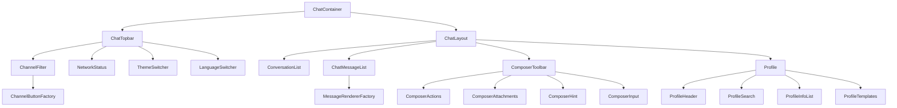

### 5.2 Store Slice 关系

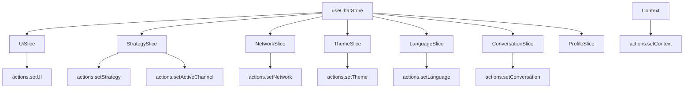

### 5.3 ChannelAdapter 关系

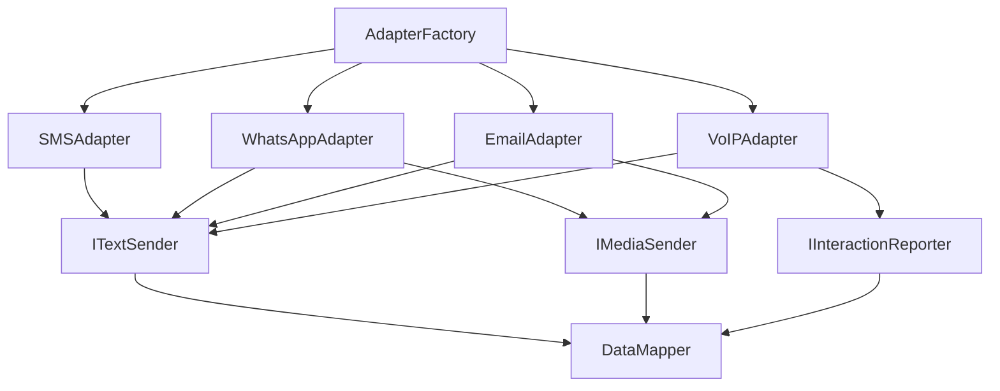

### 5.4 MessageRendererFactory 关系

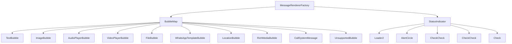

---

## 6. 协议映射图

### 6.1 Packet → StandardMessage 映射

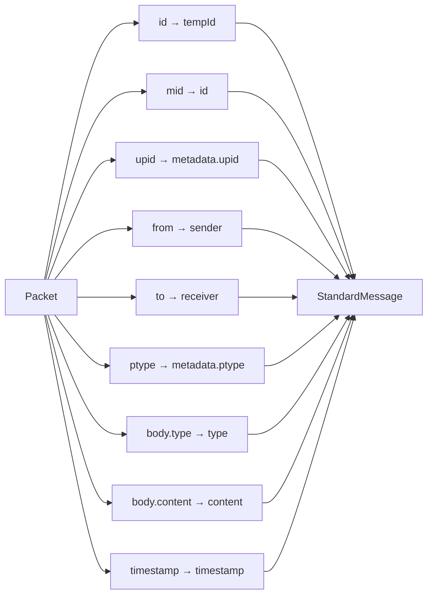

### 6.2 ACK → MessageStatus 映射

```mermaid
graph LR
    A[msg_receive_ack] --> B[Delivered]
    C[msg_read_ack] --> D[Read]

    B --> E[MessageStatus]
    D --> E
```

### 6.3 会话列表映射

```mermaid
graph LR
    A[会话列表协议] --> B[sid → conversation.id]
    A --> C[newUnreadCount → conversation.hasUnread]
    A --> D[lastMessage → conversation.lastMessage]
    A --> E[time → conversation.lastMessageTime]

    B --> F[Conversation]
    C --> F
    D --> F
    E --> F
```

---

## 7. 设计模式应用

### 7.1 工厂模式

```mermaid
graph TB
    F[Factory] -->|type| M1[Component 1]
    F -->|type| M2[Component 2]
    F -->|type| M3[Component 3]
    F -->|type| M4[Component 4]

    M1 --> R[Renderer]
    M2 --> R
    M3 --> R
    M4 --> R
```

### 7.2 策略模式

```mermaid
graph TB
    C[Context] -->|channel| S1[Strategy 1]
    C -->|channel| S2[Strategy 2]
    C -->|channel| S3[Strategy 3]

    S1 --> A[Algorithm]
    S2 --> A
    S3 --> A
```

### 7.3 适配器模式

```mermaid
graph LR
    C[Client] --> I[Interface]
    A1[Adapter 1] --> I
    A2[Adapter 2] --> I
    A3[Adapter 3] --> I

    A1 --> S1[Service 1]
    A2 --> S2[Service 2]
    A3 --> S3[Service 3]
```

---

**文档版本**: 1.0.0
**最后更新**: 2026-02-02
**维护者**: Bifrost-Chat Team
