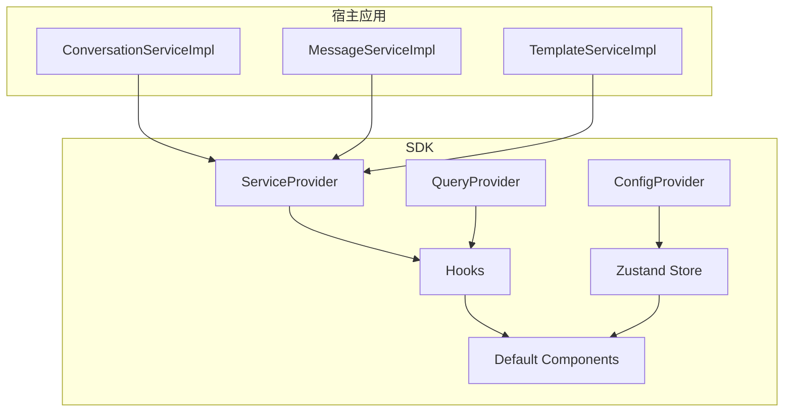
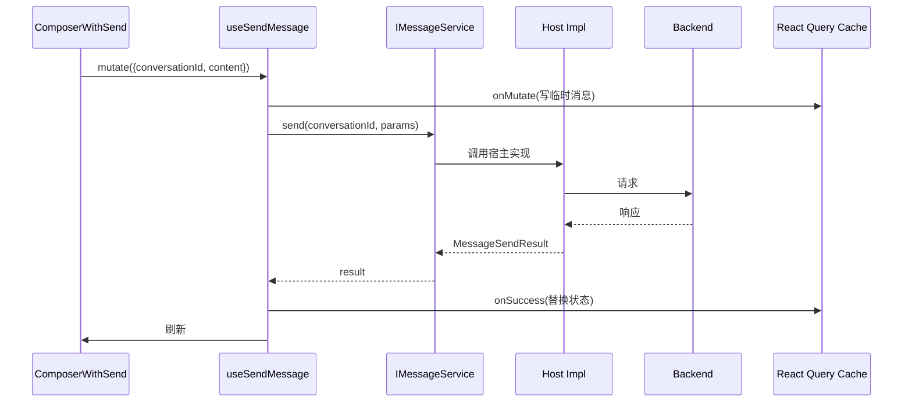
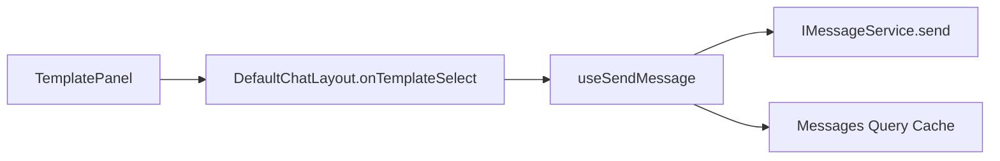
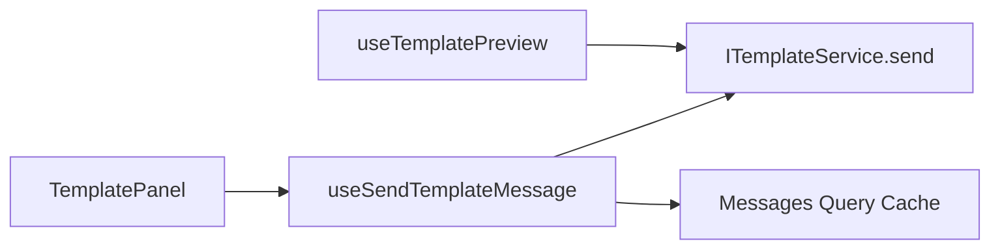

# 架构图（v3.1）

## 1. 当前实现数据流（As-Is）

```mermaid
graph TB
  subgraph Host[宿主应用]
    S1[ConversationServiceImpl]
    S2[MessageServiceImpl]
    S3[TemplateServiceImpl]
  end

  subgraph SDK[SDK]
    CP[ConfigProvider]
    QP[QueryProvider]
    SP[ServiceProvider]
    ST[Zustand Store]
    HK[Hooks]
    UI[Default Components]
  end

  S1 --> SP
  S2 --> SP
  S3 --> SP
  CP --> ST
  SP --> HK
  QP --> HK
  HK --> UI
  ST --> UI
```

## 2. 当前发送消息流程（As-Is）

```mermaid
sequenceDiagram
  participant UI as ComposerWithSend
  participant Hook as useSendMessage
  participant Svc as IMessageService
  participant Host as Host Impl
  participant API as Backend
  participant Cache as React Query Cache

  UI->>Hook: mutate({conversationId, content})
  Hook->>Cache: onMutate(写临时消息)
  Hook->>Svc: send(conversationId, params)
  Svc->>Host: 调用宿主实现
  Host->>API: 请求
  API-->>Host: 响应
  Host-->>Svc: MessageSendResult
  Svc-->>Hook: result
  Hook->>Cache: onSuccess(替换状态)
  Hook->>UI: 刷新
```

## 3. 当前模板链路（As-Is）

```mermaid
graph LR
  TP[TemplatePanel] --> DSL[DefaultChatLayout.onTemplateSelect]
  DSL --> USM[useSendMessage]
  USM --> IMS[IMessageService.send]
  USM --> MQC[Messages Query Cache]
```

## 4. 目标数据流（To-Be）

```mermaid
graph LR
  TP[TemplatePanel] --> UST[useSendTemplateMessage]
  UST --> ITS[ITemplateService.send]
  UST --> MQC[Messages Query Cache]
  UTP[useTemplatePreview] --> ITS
```

说明：目标流尚未作为公开 API 落地，当前以 `useSendMessage` 路径为准。
