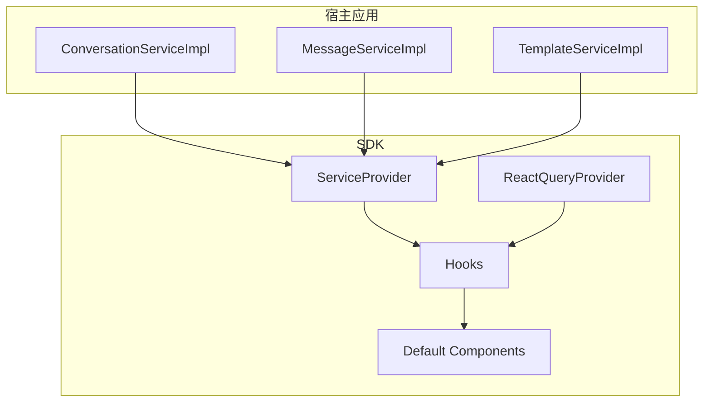
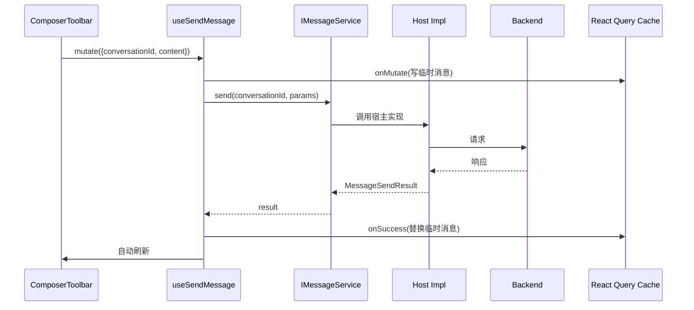
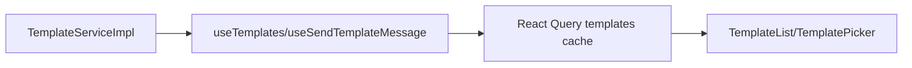

# 架构图（v3 基线）

## 1. 系统架构图

```mermaid
graph TB
  subgraph Host[宿主应用]
    C1[ConversationServiceImpl]
    C2[MessageServiceImpl]
    C3[TemplateServiceImpl]
  end

  subgraph SDK[SDK]
    P1[ServiceProvider]
    P2[ReactQueryProvider]
    H[Hooks]
    U[Default Components]
  end

  C1 --> P1
  C2 --> P1
  C3 --> P1
  P1 --> H
  P2 --> H
  H --> U
```

## 2. 发送消息流程

```mermaid
sequenceDiagram
  participant UI as ComposerToolbar
  participant Hook as useSendMessage
  participant Svc as IMessageService
  participant Host as Host Impl
  participant API as Backend
  participant Cache as React Query Cache

  UI->>Hook: mutate({conversationId, content})
  Hook->>Cache: onMutate(写临时消息)
  Hook->>Svc: send(conversationId, params)
  Svc->>Host: 调用宿主实现
  Host->>API: 请求
  API-->>Host: 响应
  Host-->>Svc: MessageSendResult
  Svc-->>Hook: result
  Hook->>Cache: onSuccess(替换临时消息)
  Hook->>UI: 自动刷新
```

## 3. 模板数据边界图

```mermaid
graph LR
  TAPI[TemplateServiceImpl] --> TQ[useTemplates/useSendTemplateMessage]
  TQ --> TCache[React Query templates cache]
  TCache --> TUI[TemplateList/TemplatePicker]
```
