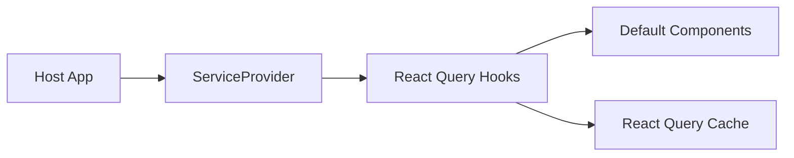

# 架构总览（v3）

## 1. 目标

- 提供可嵌入的默认聊天组件
- 用接口注入适配不同宿主后端
- 以声明式状态管理降低维护成本

## 2. 高层结构

## 3. 模块职责

- `src/services/*`：接口契约层
- `src/providers/service.provider.tsx`：依赖注入容器
- `src/providers/query.provider.tsx`：查询客户端与 QueryKey
- `src/hooks/*`：声明式数据访问
- `src/components/*`：默认 UI 组件
- `src/store/*`：客户端 UI 状态

## 4. 边界声明

- SDK 不约束调用方协议适配实现。
- SDK 不要求 DataLayer/Repository/Manager 分层。
- SDK 只对“组件行为 + 接口契约 + 状态边界”负责。

## 5. 术语红线

- 公开 API 使用 `Conversation`，禁止 `Session`。
- 模板统一 `Template`，禁止“模板与 Profile 类型耦合”。
