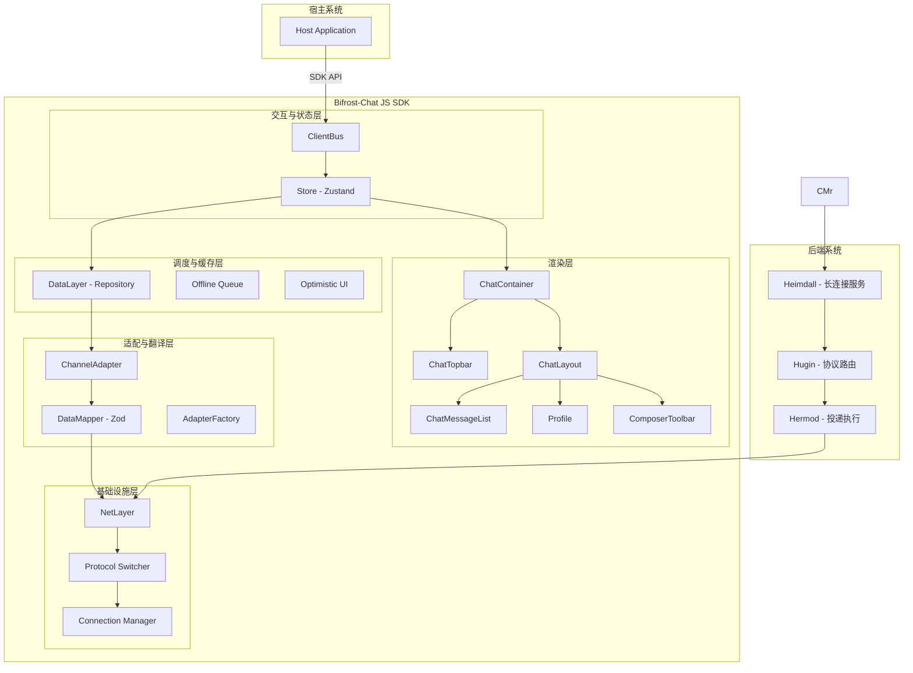
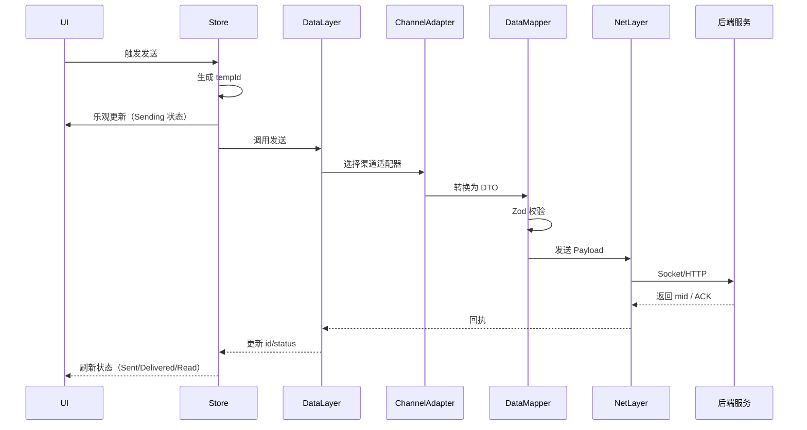
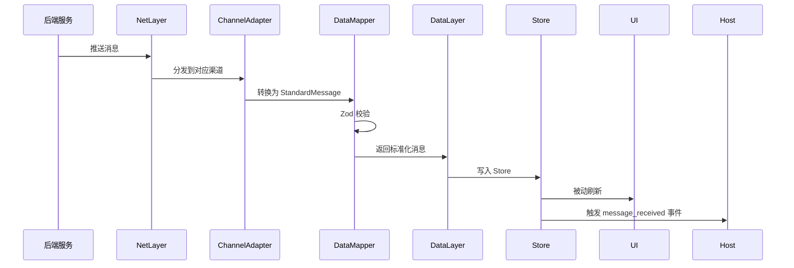
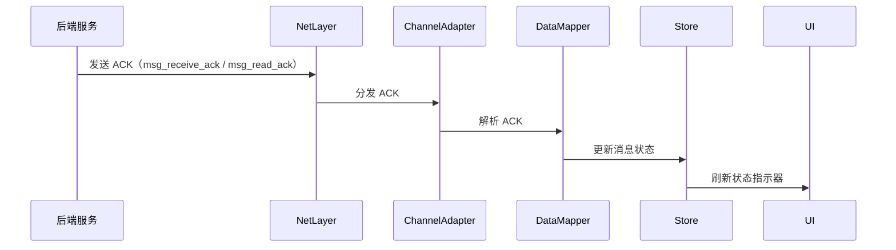
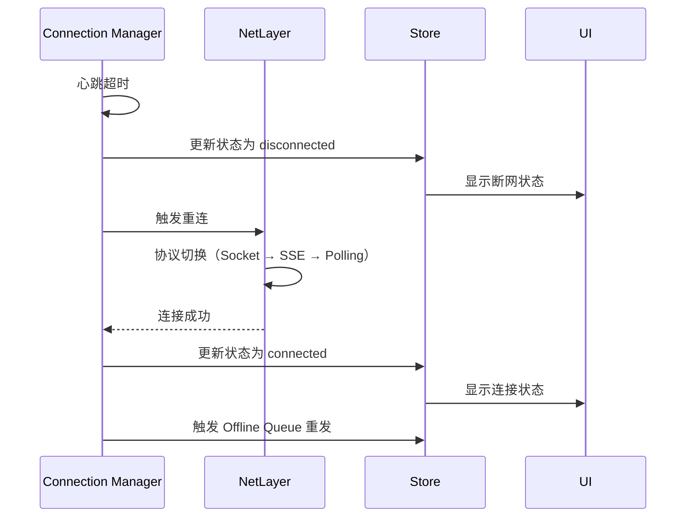

# Bifrost-Chat JS SDK 架构整理文档

> 本文档整合现有架构文档、协议规范与代码实现，作为 SDK 架构的单一事实源（SSOT）。

**⚠️ 重要提示**: 本文档描述的是传统的分层架构设计。最新的架构设计 (v2.0.0) 请参考 [`final-architecture.md`](./final-architecture.md)，其中包括:
- ✅ 会话概念统一 (使用 Conversation)
- ✅ Template 从 Profile 剥离
- ✅ 使用泛型解耦参数类型
- ✅ 接口抽象与依赖注入
- ✅ React Query + 声明式编程
- ✅ 完整的命名规范

**版本信息**:
- 当前文档: 传统分层架构 (v1.0.0)
- 最新架构: 最终架构设计 (v2.0.0) - [`final-architecture.md`](./final-architecture.md)

## 目录

1. [架构概览](#1-架构概览)
2. [分层架构](#2-分层架构)
3. [协议映射](#3-协议映射)
4. [关键流程](#4-关键流程)
5. [设计模式](#5-设计模式)
6. [技术栈](#6-技术栈)
7. [扩展指南](#7-扩展指南)

---

## 1. 架构概览

### 1.1 目标与边界

**目标**：
- 统一前端接入形态
- 屏蔽渠道/协议差异
- 确保可维护性与可扩展性
- 提供高性能、可访问的用户体验

**边界**：
- 不改变既有 SDK 公共 API
- 新增能力必须走 Adapter + Mapper + Factory
- 不承担业务系统规则
- 不强依赖后端实现细节

**非目标**：
- 不处理业务逻辑规则
- 不直接依赖后端具体实现

### 1.2 架构层次图



---

## 2. 分层架构

### 2.1 渲染层（Rendering Layer）

**职责**：负责 UI 渲染与用户交互，从 Store 订阅状态并展示。

#### 2.1.1 组件层级

```
ChatContainer (根容器)
└── ChatLayout (三栏布局)
    ├── ChatTopbar (顶部工具栏)
    │   ├── ChannelToolsList (渠道按钮列表)
    │   ├── NetworkStatus (网络状态)
    │   ├── ThemeSwitcher (主题切换)
    │   └── LanguageSwitcher (语言切换)
    ├── ConversationList (会话列表)
    ├── ChatMessageList (消息列表)
    ├── ComposerToolbar (输入工具栏)
    ├── Profile (上下文面板)
    └── TemplateList (模版列表)
```

#### 2.1.2 核心组件

| 组件 | 职责 | 状态来源 | 关键特性 |
|------|------|----------|----------|
| [`ChatContainer`](src/components/layout/ChatContainer.tsx) | SDK 根容器，初始化 Provider | Store + Provider | I18n/Theme 支持 |
| [`ChatTopbar`](src/components/layout/ChatTopbar.tsx) | 顶部工具栏 | Store.strategy / Store.network / Store.theme | 左渠道，右网络/主题 |
| [`ChannelToolsList`](src/components/toolbar/ChannelFilter.tsx) | 渲染渠道按钮 | Strategy Slice | 策略驱动，互斥逻辑 |
| [`NetworkStatus`](src/components/toolbar/NetworkStatus.tsx) | 展示连接状态 | NetLayer -> Store.network | connected/disconnected/connecting |
| [`ChatMessageList`](src/components/messages/ChatMessageList.tsx) | 消息虚拟列表 | DataLayer -> Store.conversation | react-virtuoso/react-window |
| [`MessageRendererFactory`](src/components/messages/MessageRendererFactory.tsx) | 消息渲染工厂 | MessageType 映射 | 策略模式 + 工厂模式 |
| [`ComposerToolbar`](src/components/composer/ComposerToolbar.tsx) | 输入工具栏 | Strategy Slice | 按渠道动态切换 |
| [`Profile`](src/components/profile/Profile.tsx) | 上下文面板 | Profile Slice | Profile/Templates/Other |

#### 2.1.3 UI 灵活性设计

为了保持最大的可扩展性，渲染层采用 **三层 API 设计**：

| 层级 | 组件 | 用途 | 适用场景 |
|------|------|------|----------|
| **Headless** | `ChatContainer` | 只提供数据源 + Provider | 需要深度定制 |
| **Compound** | `ChatContainer` + `ChatLayout` | 提供默认布局 + 可选插槽 | 需要部分定制 |
| **All-in-One** | `ChatContainer` + `DefaultChatLayout` | 开箱即用，使用默认组件 | 快速原型和简单场景 |

**详细设计参考**: [`ui-flexibility-design.md`](./ui-flexibility-design.md)

**使用示例**:

```typescript
// 层级 1：Headless 模式（完全自定义）
<ChatContainer locale="zh-CN">
  <MyCustomLayout />
</ChatContainer>

// 层级 2：Compound 模式（部分自定义）
<ChatContainer locale="zh-CN">
  <ChatLayout
    topbar={<CustomTopbar />}
    conversationPanel={<CustomConversationPanel />}
    composer={<CustomComposer />}
    profilePanel={<CustomProfile />}
  >
    <CustomMessageList />
  </ChatLayout>
</ChatContainer>

// 层级 3：All-in-One 模式（开箱即用）
<ChatContainer locale="zh-CN">
  <DefaultChatLayout />
</ChatContainer>
```

**设计优势**:
- ✅ ChatContainer 只负责集成 Store 提供数据源 + Provider
- ✅ ChatLayout 提供默认布局，所有组件都是灵活设计，可传可不传
- ✅ 支持用户自己实现各个部分组件
- ✅ 提供最大可扩展性

#### 2.1.4 渲染策略

**渠道按钮策略**：
- 根据 [`strategy.allowedChannels`](src/store/slices/strategy.slice.ts) 动态渲染
- 根据 [`state.agentStatus`](src/store/slices/strategy.slice.ts) 实现互斥（如 `in_call` 时禁用其他渠道）
- 使用 [`ChannelButtonFactory`](src/components/toolbar/ChannelButtonFactory.tsx) 工厂模式

**消息渲染策略**：
- 使用 [`MessageRendererFactory`](src/components/messages/MessageRendererFactory.tsx) 按 [`MessageType`](src/interfaces/message.interface.ts) 映射
- 支持的消息类型：`text`、`image`、`audio`、`video`、`file`、`template`、`location`、`rich_media`、`other`
- 状态处理：`Sending`（半透明 + Loading）、`Failed`（红色感叹号 + 重试）、`Read`（双蓝勾）

**输入框策略**：
- SMS：禁止上传视频、禁止富文本、显示字符数/计费条数
- WhatsApp：允许发送图片/文件、显示模板选择按钮
- Email：显示富文本编辑器（Subject + Body）

### 2.2 交互与状态层（Logic Layer）

**职责**：管理 UI 状态与行为，暴露 SDK API。

#### 2.2.1 ClientBus

ClientBus 是 Host ↔ SDK 的唯一入口，暴露以下 API：

```typescript
interface IChatSDK {
  init(config: { endpoint: string; debug?: boolean }): Promise<boolean>;
  destroy(): void;
  openContext(context: SDKContext): Promise<void>;
  closeContext(): void;
  on(event: 'message_received', callback: (msg: StandardMessage) => void): void;
  on(event: 'incoming_call', callback: (data: unknown) => void): void;
  emit(action: 'make_call', params: { phone: string }): void;
}
```

#### 2.2.2 Store（Zustand）

Store 使用 Zustand 管理 UI 状态，包含以下 Slice：

| Slice | 职责 | 关键字段 |
|-------|------|----------|
| [`UiSlice`](src/store/slices/ui.slice.ts) | UI 状态 | 输入框内容、面板状态等 |
| [`StrategySlice`](src/store/slices/strategy.slice.ts) | 渠道策略 | `allowedChannels`、`activeChannel`、`agentStatus` |
| [`NetworkSlice`](src/store/slices/network.slice.ts) | 网络状态 | `status`（connected/disconnected/connecting） |
| [`ThemeSlice`](src/store/slices/theme.slice.ts) | 主题状态 | `mode`（system/light/dark） |
| [`LanguageSlice`](src/store/slices/language.slice.ts) | 语言状态 | `locale`（en-US/zh-CN） |
| [`ConversationSlice`](src/store/slices/conversation.slice.ts) | 会话状态 | 会话列表、当前会话 |
| [`ProfileSlice`](src/store/slices/profile.slice.ts) | 上下文状态 | Profile、Templates、Other |

**数据流**：Host → Action → Store → UI（单向数据流）

### 2.3 调度与缓存层（DataLayer）

**职责**：隔离业务逻辑与数据访问细节，决定使用哪个渠道及协议。

#### 2.3.1 Repository

- 选择渠道并决定走 HTTP 还是 Socket
- 协调调度：管理和注册当前支持的策略以及渠道适配器
- 去重：同一时间内重复文本消息去重

#### 2.3.2 Offline Queue

- 网络断开时写入 IndexedDB/localStorage/内存队列
- 网络恢复后自动重发

#### 2.3.3 Optimistic UI

- 先写入 Store（假装发送成功），让 UI 立即响应
- 如果 NetLayer 报错，再回滚状态

### 2.4 适配与翻译层（Adapter Layer）

**职责**：渠道适配与数据映射，抹平不同触达服务的差异性。

#### 2.4.1 ChannelAdapter

每个渠道一个独立的 Adapter 类：

| Adapter | 职责 |
|---------|------|
| SMSAdapter | SMS 渠道适配 |
| WhatsAppAdapter | WhatsApp 渠道适配 |
| EmailAdapter | Email 渠道适配 |
| VoIPAdapter | VoIP 渠道适配 |

**能力接口拆分**：
- `ITextSender`：文本发送能力
- `IMediaSender`：媒体发送能力
- `IInteractionReporter`：交互上报能力

#### 2.4.2 DataMapper

- 使用 Zod 进行 Schema 校验，防止脏数据污染 Store
- 纯函数设计，便于单元测试
- 防腐层：后端字段变化只需修改 Mapper 层

#### 2.4.3 AdapterFactory

通过 [`channelType`](src/interfaces/channel.interface.ts) 选择对应的 Adapter 实现。

### 2.5 基础设施层（Infrastructure Layer）

**职责**：网络通信与连接管理。

#### 2.5.1 NetLayer

**统一接口**：

```typescript
interface INetwork {
  connect(): Promise<void>;
  disconnect(): void;
  send(data: unknown): Promise<void>;
  on(event: string, callback: (...args: unknown[]) => void): void;
  off(event: string, callback: (...args: unknown[]) => void): void;
  isConnected(): boolean;
}
```

#### 2.5.2 Protocol Switcher

支持根据策略环境自动切换：
- Socket（WebSocket）
- SSE（Server-Sent Events）
- Polling（HTTP 轮询）

#### 2.5.3 Connection Manager

- 心跳管理：定时发送 `client_heartbeat`
- 重连策略：超时未收到 ACK 触发重连
- 连接状态监控：更新 `Store.network.status`

---

## 3. 协议映射

### 3.1 Packet 标准消息体 → StandardMessage

| 协议字段 | SDK 字段 | 说明 |
|----------|----------|------|
| `id` | `tempId` | 客户端生成的临时 ID（发送侧） |
| `mid` | `id` | 服务端生成的真实 ID（回执后写入） |
| `upid` | `metadata.upid` | 上一条消息 ID |
| `from`/`to` | `sender`/`receiver` | 标准化发送者/接收者字段 |
| `from`/`to` | `metadata.from`/`metadata.to` | 保留原始协议字段 |
| `ptype` | `metadata.ptype` | 保留协议原始类型 |
| `body.type` | `type` | 与 [`MessageType`](src/interfaces/message.interface.ts) 对齐 |
| `body.content` | `content` | 统一内容结构 |
| `timestamp` | `timestamp` | 服务端时间戳 |

**发送侧流程**：创建 `tempId` → 发送 → 收到 `mid` → 完成 `tempId -> id` 绑定与状态更新

#### StandardMessage 结构

```typescript
interface StandardMessage {
  id: string;                    // 真实消息 ID（mid）
  tempId?: string;               // 临时消息 ID（客户端生成）
  direction: MessageDirection;   // inbound | outbound
  channelType: ChannelType;      // sms | whatsapp | email
  status: MessageStatus;         // created | sending | sent | delivered | read | failed
  timestamp: number;             // 服务端时间戳
  type: MessageType;             // text | image | audio | video | file | template | location | rich_media | other
  content: MessageContent;       // 消息内容
  sender?: MessageParticipant;   // 标准化发送者
  receiver?: MessageParticipant; // 标准化接收者
  metadata?: Record<string, unknown>; // 透传协议字段
}
```

### 3.2 ACK 协议 → 消息状态

| ACK 类型 | 消息状态 | 说明 |
|----------|----------|------|
| `msg_receive_ack` | `delivered` | 消息已送达 |
| `msg_read_ack` | `read` | 消息已读 |

ACK 仅由 Adapter/Mapper 解析，Store 只接收标准化状态更新事件。

### 3.3 心跳协议 → 连接状态

- 上行：`client_heartbeat` 由 Connection Manager 定时发送
- 下行：收到 ACK 视为连接健康，更新 `net.status = connected`
- 超时：未收到 ACK 触发重连策略

### 3.4 会话列表协议 → ConversationList

| 协议字段 | SDK 字段 | 说明 |
|----------|----------|------|
| `sid` | `conversation.id` | 会话 ID |
| `newUnreadCount` | `conversation.hasUnread` | 是否存在未读 |
| `lastMessage`（Packet） | `conversation.lastMessage` | 经过 Mapper 转成 [`StandardMessage`](src/interfaces/message.interface.ts) |

---

## 4. 关键流程

### 4.1 Outbound（发送）流程



**关键点**：
1. UI 触发发送 → Store 生成 `tempId` 并渲染（Optimistic UI）
2. DataLayer 选择 Adapter → Mapper → NetLayer
3. 服务端回执 `mid` 或 ACK → Store 更新 `id/status`
4. 失败时回滚状态，显示重试按钮

### 4.2 Inbound（接收）流程



**关键点**：
1. Server → NetLayer → Adapter → Mapper 校验
2. DataLayer 生成 [`StandardMessage`](src/interfaces/message.interface.ts) 并写入 Store
3. UI 被动刷新，并向 Host 触发 `message_received` 事件

### 4.3 状态同步流程



**关键点**：
- ACK 更新消息状态
- 失败重试走 Offline Queue
- 断网期间消息入队，恢复后按顺序重放

### 4.4 网络重连流程



---

## 5. 设计模式

### 5.1 工厂模式（Factory）

**MessageRendererFactory**：按 [`MessageType`](src/interfaces/message.interface.ts) 映射到对应的 Bubble 组件

```typescript
const BubbleMap = {
  text: TextBubble,
  image: ImageBubble,
  audio: AudioPlayerBubble,
  template: WhatsAppTemplateBubble,
  call_log: CallSystemMessage,
};
```

**ChannelButtonFactory**：按 [`ChannelType`](src/interfaces/channel.interface.ts) 映射到对应的按钮组件

**AdapterFactory**：按 [`channelType`](src/interfaces/channel.interface.ts) 选择对应的 Adapter 实现

### 5.2 策略模式（Strategy）

**Protocol Switcher**：根据策略环境自动切换 Socket/SSE/Polling

**Composer Strategy**：根据当前渠道动态切换输入能力（SMS/WhatsApp/Email）

### 5.3 适配器模式（Adapter）

**ChannelAdapter**：每个渠道一个独立的 Adapter 类，将不同渠道的接口适配为统一接口

### 5.4 外观模式（Facade）

**ClientBus**：对外暴露统一的 SDK API，隐藏内部复杂性

**DataLayer**：隔离业务逻辑与数据访问细节

### 5.5 仓储模式（Repository）

**Repository**：管理数据访问逻辑，提供统一的 CRUD 接口

---

## 6. 技术栈

### 6.1 核心技术

| 类别 | 技术 | 用途 |
|------|------|------|
| 语言 | TypeScript | 类型安全、开发体验 |
| 框架 | React | UI 组件库 |
| 状态管理 | Zustand | 轻量级状态管理 |
| 样式 | Tailwind CSS | 原子化 CSS |
| 虚拟滚动 | react-virtuoso / react-window | 高性能列表 |
| 日期处理 | dayjs | 轻量级日期处理 |
| 图标 | @ant-design/icons / lucide-react | 统一图标库 |
| 数据校验 | Zod | Schema 校验 |

### 6.2 构建与测试

| 类别 | 技术 | 用途 |
|------|------|------|
| 构建工具 | Rslib | 库构建 |
| 测试框架 | Vitest | 单元测试 |
| 代码质量 | Biome | Lint / Format |
| 组件文档 | Storybook | 组件示例 |

### 6.3 常用命令

```bash
# 安装依赖
pnpm install

# 生产构建
pnpm run build

# 监听模式构建
pnpm run dev

# 运行测试
pnpm run test

# 代码检查
pnpm run lint

# 代码格式化
pnpm run format

# 启动 Storybook
pnpm run storybook
```

---

## 7. 扩展指南

### 7.1 新增渠道

**步骤**：
1. 在 [`ChannelType`](src/interfaces/channel.interface.ts) 枚举中添加新渠道类型
2. 创建对应的 Adapter 类（如 `NewChannelAdapter`）
3. 创建对应的 Mapper 函数（使用 Zod 校验）
4. 在 [`ChannelButtonFactory`](src/components/toolbar/ChannelButtonFactory.tsx) 中注册图标
5. 在 [`MessageRendererFactory`](src/components/messages/MessageRendererFactory.tsx) 中注册渲染组件（如需要）
6. 在 [`AvailableChannelTypes`](src/interfaces/channel.interface.ts) 中添加新渠道

**示例**：

```typescript
// 1. 添加 ChannelType
export enum ChannelType {
  SMS = 'sms',
  WhatsApp = 'whatsapp',
  Email = 'email',
  VoIP = 'voip',  // 新增
}

// 2. 创建 Adapter
class VoIPAdapter implements ITextSender, IMediaSender {
  async sendText(content: string): Promise<void> { /* ... */ }
  async sendMedia(content: MediaMessage): Promise<void> { /* ... */ }
}

// 3. 创建 Mapper
const VoIPMessageMapper = z.object({
  // Zod schema
});

// 4. 注册图标
const iconMap: Record<ChannelType, React.ReactNode> = {
  [ChannelType.SMS]: <Smartphone className="h-4 w-4" />,
  [ChannelType.WhatsApp]: <MessageSquare className="h-4 w-4" />,
  [ChannelType.Email]: <Mail className="h-4 w-4" />,
  [ChannelType.VoIP]: <Phone className="h-4 w-4" />,  // 新增
};
```

### 7.2 新增消息类型

**步骤**：
1. 在 [`MessageType`](src/interfaces/message.interface.ts) 枚举中添加新类型
2. 在 [`MessageContent`](src/interfaces/message.interface.ts) 联合类型中添加内容结构
3. 在 [`MessageRendererFactory`](src/components/messages/MessageRendererFactory.tsx) 中注册渲染组件
4. 在 Mapper 中添加对应的转换逻辑

**示例**：

```typescript
// 1. 添加 MessageType
export enum MessageType {
  Text = 'text',
  Image = 'image',
  Location = 'location',  // 新增
}

// 2. 添加 MessageContent
export interface LocationMessage {
  latitude: number;
  longitude: number;
  address?: string;
}

export type MessageContent = StringMessage | MediaMessage | TemplateMessage | LocationMessage;

// 3. 注册渲染组件
const BubbleMap = {
  text: TextBubble,
  image: ImageBubble,
  location: LocationBubble,  // 新增
};
```

### 7.3 新增主题

**步骤**：
1. 在 [`theme.css`](src/styles/theme.css) 中添加主题 token
2. 在 [`ThemeSlice`](src/store/slices/theme.slice.ts) 中添加主题模式
3. 在 [`ThemeSwitcher`](src/components/toolbar/ThemeSwitcher.tsx) 中添加主题选项

**示例**：

```css
/* theme.css */
[data-theme='high-contrast'] {
  --color-primary: #000000;
  --color-text: #ffffff;
  /* ... */
}
```

### 7.4 新增协议

**步骤**：
1. 实现 [`INetwork`](src/interfaces/network.interface.ts) 接口
2. 在 [`Protocol Switcher`](src/interfaces/network.interface.ts) 中注册新协议
3. 在 [`Connection Manager`](src/interfaces/network.interface.ts) 中添加协议切换逻辑

**示例**：

```typescript
class MQTTNetwork implements INetwork {
  async connect(): Promise<void> { /* ... */ }
  disconnect(): void { /* ... */ }
  async send(data: unknown): Promise<void> { /* ... */ }
  on(event: string, callback: (...args: unknown[]) => void): void { /* ... */ }
  off(event: string, callback: (...args: unknown[]) => void): void { /* ... */ }
  isConnected(): boolean { /* ... */ }
}
```

---

## 8. 关键约束

### 8.1 API 约束

- 公共 API 必须有明确类型定义，避免 `any`
- 不能写死渠道按钮，必须依赖 `strategy.allowedChannels`
- 渲染层通过工厂模式/策略模式扩展消息与组件类型

### 8.2 架构约束

- 逻辑层必须遵循 Store/DataLayer/Adapter/NetLayer 分层
- 任何数据格式变化只在 Mapper 层消化，避免污染 Store/UI
- 新增渠道/消息类型必须走 Adapter + Mapper + Factory 注册

### 8.3 代码规范

- TypeScript：类型优先，避免 `any`；公共 API 需有明确类型
- React：函数组件 + PascalCase 文件名；JSX 使用双引号
- 格式化：Biome 统一格式（空格缩进、80 字符换行、TS/JS 单引号）
- Tailwind：变量命名前缀 `@color-`、`@spacing-`

### 8.4 质量保障

- 测试：发送/接收/ACK/重试/策略切换需有 Vitest 覆盖
- 构建：确保构建后产物可被正确消费
- Storybook：新增组件需要生成新的 storybook

---

## 9. 参考文档

### 9.1 架构文档

- [`docs/architecture.md`](../docs/architecture.md) - 架构设计
- [`docs/component-architecture.md`](../docs/component-architecture.md) - 组件架构设计

### 9.2 技能文档

- [`AGENTS.md`](../AGENTS.md) - 开发助手指南
- [`skills/bifrost-chat-js-sdk/SKILL.md`](../skills/bifrost-chat-js-sdk/SKILL.md) - SDK 技能说明
- [`skills/bifrost-chat-js-sdk/references/architecture.md`](../skills/bifrost-chat-js-sdk/references/architecture.md) - 架构总览
- [`skills/bifrost-chat-js-sdk/references/logic.md`](../skills/bifrost-chat-js-sdk/references/logic.md) - 逻辑层规范
- [`skills/bifrost-chat-js-sdk/references/rendering.md`](../skills/bifrost-chat-js-sdk/references/rendering.md) - 渲染层规范
- [`skills/bifrost-chat-js-sdk/references/conventions.md`](../skills/bifrost-chat-js-sdk/references/conventions.md) - 代码规范
- [`skills/bifrost-chat-js-sdk/references/toolchain.md`](../skills/bifrost-chat-js-sdk/references/toolchain.md) - 工具链与命令

### 9.3 协议文档

- [`specs/消息协议.md`](../specs/消息协议.md) - Packet 包协议
- [`specs/聊天消息协议.md`](../specs/聊天消息协议.md) - 聊天消息协议
- [`specs/ACK 协议.md`](../specs/ACK 协议.md) - ACK 协议
- [`specs/心跳协议.md`](../specs/心跳协议.md) - 心跳协议
- [`specs/会话列表.md`](../specs/会话列表.md) - 会话列表协议

### 9.4 外部文档

- Rslib: https://rslib.rs/llms.txt
- Rsbuild: https://rsbuild.rs/llms.txt
- Rspack: https://rspack.rs/llms.txt
- 前端开发规范: https://www.notion.so/mountainwu/296d0703435c4d8686f6f84b44bb06a3

---

## 10. 附录

### 10.1 核心接口定义

#### 10.1.1 SDK 接口

```typescript
interface SDKContext {
  sessionId: string;
  customerToken: string;
  hostUser: { id: string; name: string };
  initialStrategy?: { allowedChannels: ChannelType[] };
}

type SDKEvent = 'message_received' | 'incoming_call';
type SDKAction = 'make_call';

interface IChatSDK {
  init(config: { endpoint: string; debug?: boolean }): Promise<boolean>;
  destroy(): void;
  openContext(context: SDKContext): Promise<void>;
  closeContext(): void;
  on(event: 'message_received', callback: (msg: StandardMessage) => void): void;
  on(event: 'incoming_call', callback: (data: unknown) => void): void;
  emit(action: 'make_call', params: { phone: string }): void;
}
```

#### 10.1.2 消息接口

```typescript
enum MessageDirection {
  Incoming = 'incoming',
  Outgoing = 'outgoing',
}

enum MessageStatus {
  Created = 'created',
  Sending = 'sending',
  Sent = 'sent',
  Delivered = 'delivered',
  Read = 'read',
  Failed = 'failed',
}

enum MessageType {
  Text = 'text',
  Image = 'image',
  Audio = 'audio',
  Video = 'video',
  File = 'file',
  Template = 'template',
  Location = 'location',
  RichMedia = 'rich_media',
  Other = 'other',
}

interface MessageParticipant {
  id: string;
  app?: string;
  clientType?: string;
}

interface StandardMessage {
  id: string;
  tempId?: string;
  direction: MessageDirection;
  channelType: ChannelType;
  status: MessageStatus;
  timestamp: number;
  type: MessageType;
  content: MessageContent;
  sender?: MessageParticipant;
  receiver?: MessageParticipant;
  metadata?: Record<string, unknown>;
}
```

#### 10.1.3 网络接口

```typescript
enum NetworkStatus {
  Connected = 'connected',
  Disconnected = 'disconnected',
  Connecting = 'connecting',
}

interface NetworkState {
  status: NetworkStatus;
}

interface INetwork {
  connect(): Promise<void>;
  disconnect(): void;
  send(data: unknown): Promise<void>;
  on(event: string, callback: (...args: unknown[]) => void): void;
  off(event: string, callback: (...args: unknown[]) => void): void;
  isConnected(): boolean;
}
```

### 10.2 目录结构

```
src/
├── components/          # UI 组件
│   ├── composer/       # 输入工具栏
│   ├── context/        # 上下文面板
│   ├── conversation/   # 会话列表
│   ├── layout/         # 布局组件
│   ├── messages/       # 消息组件
│   └── toolbar/        # 工具栏
├── events/            # 事件定义
├── interfaces/        # TypeScript 接口
├── locales/           # 国际化
├── providers/         # React Providers
├── store/            # Zustand Store
│   ├── slices/       # Store Slices
│   └── mock/         # Mock 数据
├── styles/           # 样式文件
├── types/            # TypeScript 类型
└── utils/            # 工具函数
```

---

**文档版本**: 1.0.0
**最后更新**: 2026-02-02
**维护者**: Bifrost-Chat Team
