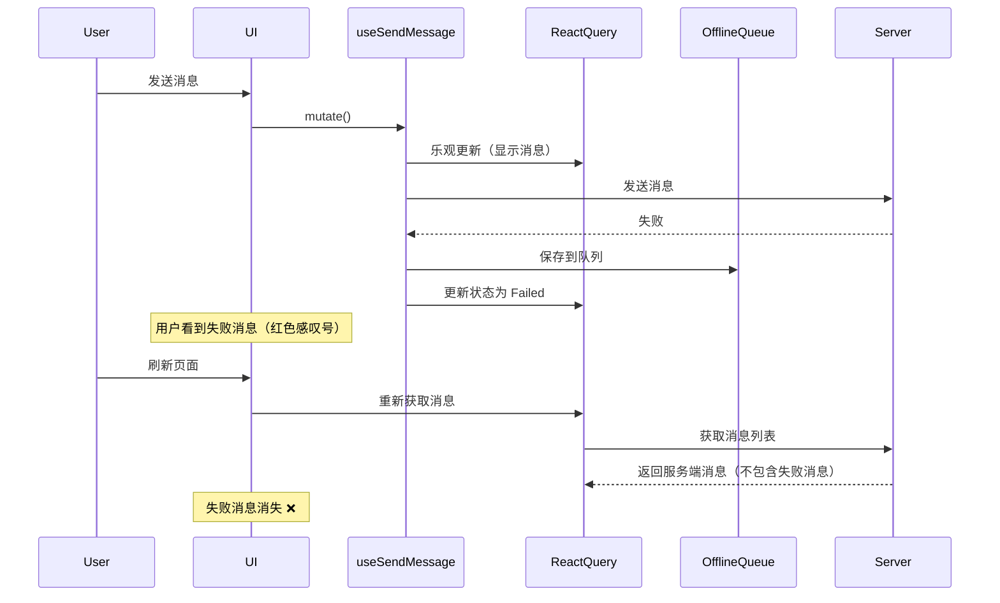
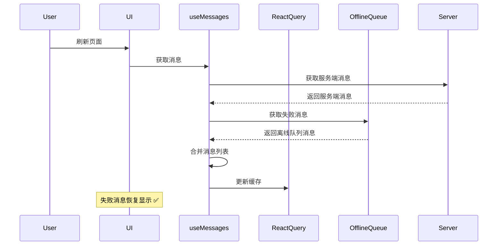
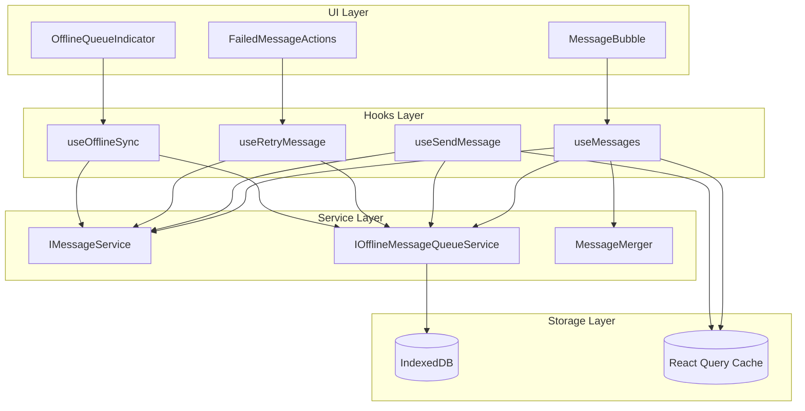
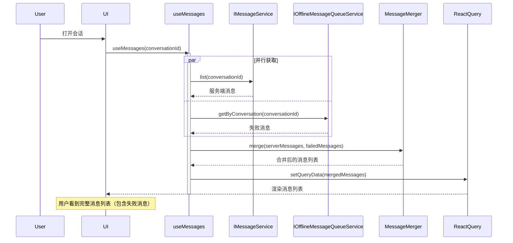

# 失败消息恢复机制设计

## 文档版本

| 版本 | 日期 | 作者 | 变更说明 |
|------|------|------|----------|
| 1.0.0 | 2026-02-09 | Kilo Code | 初始版本 |

---

## 概述

### 当前已实现（As-Is）

当前 `src/hooks/use-send-message.hook.ts` 和 `src/hooks/use-messages.hook.ts` 的实现：

- 使用 React Query Mutation 管理消息发送
- 支持乐观更新，发送前立即在 UI 上显示消息
- 发送失败时，消息被保存到离线队列（[`OfflineMessageQueueService`](src/services/offline-message-queue.service.ts:19)）
- **问题**：刷新页面后，失败的消息从 UI 中消失，因为：
  1. 乐观更新的消息只存在于 React Query 的内存缓存中
  2. [`useMessages`](src/hooks/use-messages.hook.ts:75) 只从服务端获取消息列表
  3. 离线队列虽然持久化了消息，但不会自动恢复到 UI
  4. 用户看到消息"消失"，会感到困惑

### 目标架构（To-Be）

实现完整的失败消息恢复机制：

- **消息合并**：刷新后，自动将离线队列中的失败消息合并到消息列表
- **持久化标识**：失败消息有明确的视觉标识（红色感叹号、错误提示）
- **操作能力**：用户可以重试或删除失败的消息
- **自动重试**：网络恢复时自动重试失败的消息
- **批量操作**：支持批量重试和批量删除
- **消息不丢失**：确保发送失败的消息不会丢失

---

## 问题场景分析

### 场景 1：发送失败后刷新页面（当前问题）



### 场景 2：目标架构（消息恢复）



---

## 核心设计原则

### 1. 消息来源分类

| 消息类型 | 来源 | 持久化 | 刷新后保留 |
|---------|------|--------|-----------|
| 服务端消息 | 服务端 API | ✅ 服务端 | ✅ |
| 本地失败消息 | 离线队列（IndexedDB/LocalStorage） | ✅ 本地 | ✅ |
| 临时消息（发送中） | React Query 缓存 | ❌ 内存 | ❌ |

### 2. 消息合并策略

**合并规则**：

1. **服务端消息优先**：以服务端消息为主数据源
2. **失败消息追加**：将离线队列中的失败消息追加到列表末尾
3. **去重逻辑**：通过 `tempId` 避免重复显示
4. **时间排序**：失败消息按创建时间排序，显示在相应位置

**伪代码**：

```typescript
function mergeMessages(
  serverMessages: StandardMessage[],
  offlineMessages: OfflineMessage[]
): StandardMessage[] {
  // 1. 将失败消息转换为 StandardMessage
  const failedMessages = offlineMessages.map(msg => ({
    ...msg.message,
    id: msg.id, // 使用离线消息的 ID
    tempId: msg.id, // 保存 tempId 用于去重
    status: MessageStatusEnum.Failed,
    _isLocal: true, // 标记为本地消息
  }));

  // 2. 合并消息
  const allMessages = [...serverMessages, ...failedMessages];

  // 3. 去重（如果有相同的 tempId，只保留一个）
  const uniqueMessages = Array.from(
    new Map(allMessages.map(msg => [msg.tempId || msg.id, msg])).values()
  );

  // 4. 按时间排序
  return uniqueMessages.sort((a, b) => a.timestamp - b.timestamp);
}
```

### 3. 消息标识策略

为了区分服务端消息和本地失败消息，我们需要：

1. **添加 `_source` 字段**：
   ```typescript
   interface StandardMessage {
     // ... 现有字段
     _source?: 'server' | 'local'; // 消息来源
     _offlineMessageId?: string; // 离线消息 ID（用于重试/删除）
   }
   ```

2. **视觉区分**：
   - 失败消息：红色边框 + 红色感叹号图标
   - 添加"未发送"标签
   - 显示错误原因（如果有）

---

## 架构设计

### 系统架构图



### 数据流图



---

## 核心组件设计

### 1. 消息合并器（MessageMerger）

```typescript
/**
 * 消息合并器
 *
 * @description
 * 负责合并服务端消息和本地失败消息
 */
export class MessageMerger {
  /**
   * 合并服务端消息和本地失败消息
   *
   * @param serverMessages 服务端消息列表
   * @param offlineMessages 本地失败消息列表
   * @returns 合并后的消息列表
   */
  static merge(
    serverMessages: StandardMessage[],
    offlineMessages: OfflineMessage[]
  ): StandardMessage[] {
    // 1. 将失败消息转换为 StandardMessage
    const failedMessages = offlineMessages.map((offlineMsg) =>
      this.offlineToStandard(offlineMsg)
    );

    // 2. 创建消息映射（用于去重）
    const messageMap = new Map<string, StandardMessage>();

    // 3. 先添加服务端消息
    for (const msg of serverMessages) {
      const key = msg.tempId || msg.id;
      messageMap.set(key, { ...msg, _source: 'server' });
    }

    // 4. 再添加失败消息（会覆盖同 tempId 的服务端消息）
    for (const msg of failedMessages) {
      const key = msg.tempId || msg.id;
      messageMap.set(key, { ...msg, _source: 'local' });
    }

    // 5. 转换为数组并排序
    const mergedMessages = Array.from(messageMap.values());

    return mergedMessages.sort((a, b) => a.timestamp - b.timestamp);
  }

  /**
   * 将离线消息转换为标准消息
   */
  static offlineToStandard(
    offlineMsg: OfflineMessage
  ): StandardMessage {
    return {
      ...offlineMsg.message,
      id: offlineMsg.id,
      tempId: offlineMsg.id,
      status: MessageStatusEnum.Failed,
      _source: 'local',
      _offlineMessageId: offlineMsg.id, // 保存离线消息 ID，用于重试/删除
    } as StandardMessage;
  }

  /**
   * 判断消息是否为本地失败消息
   */
  static isLocalFailedMessage(
    message: StandardMessage
  ): boolean {
    return message._source === 'local' &&
           message.status === MessageStatusEnum.Failed;
  }
}
```

### 2. useMessages 增强

```typescript
export function useMessages<TParams = any>(
  conversationId: string,
  params?: TParams,
) {
  const services = useServices();
  const queryClient = useQueryClient();

  // 获取离线队列中的失败消息
  const { data: offlineMessages = [] } = useQuery({
    queryKey: ['offlineMessages', conversationId],
    queryFn: async () => {
      if (!services?.offlineMessageQueue) {
        return [];
      }
      return services.offlineMessageQueue.getByConversation(conversationId);
    },
    staleTime: 0, // 始终重新获取
  });

  return useInfiniteQuery({
    queryKey: queryKeys.messages.list(conversationId),
    queryFn: async ({ pageParam = 1 }) => {
      if (!services?.messageService) {
        return {
          items: [],
          nextCursor: undefined,
        } as MessagesPage;
      }

      const serverMessages = await services.messageService.list(
        conversationId,
        {
          ...(params ?? {}),
          page: pageParam,
        } as TParams
      );

      // 合并服务端消息和失败消息
      const mergedMessages = MessageMerger.merge(
        serverMessages,
        offlineMessages
      );

      return {
        items: mergedMessages,
        nextCursor: mergedMessages.length >= 20 ? pageParam + 1 : undefined,
      } as MessagesPage;
    },
    initialPageParam: 1,
    getNextPageParam: (lastPage) => lastPage.nextCursor,
    staleTime: 1000 * 60 * 5,
    enabled: !!conversationId && !!services?.messageService,
  });
}
```

### 3. useRetryMessage Hook

```typescript
/**
 * 重试失败消息的 Hook
 *
 * @description
 * 用于重试发送失败的消息
 */
export function useRetryMessage() {
  const { messageService, offlineMessageQueue } = useServices();
  const queryClient = useQueryClient();

  const retryMessage = useMutation({
    mutationFn: async ({
      conversationId,
      offlineMessageId,
    }: {
      conversationId: string;
      offlineMessageId: string;
    }) => {
      // 1. 从离线队列获取消息
      const offlineMsg =
        await offlineMessageQueue?.get(offlineMessageId);

      if (!offlineMsg) {
        throw new Error('离线消息不存在');
      }

      // 2. 重新发送
      const result = await messageService?.send(
        conversationId,
        offlineMsg.sendParams
      );

      // 3. 发送成功，从队列中移除
      if (result) {
        await offlineMessageQueue?.dequeue(offlineMessageId);
      }

      return result;
    },

    onMutate: async ({ conversationId, offlineMessageId }) => {
      // 取消查询
      await queryClient.cancelQueries({
        queryKey: queryKeys.messages.list(conversationId),
      });

      // 更新消息状态为 Sending
      queryClient.setQueryData(
        queryKeys.messages.list(conversationId),
        (old: any) => {
          if (!old) return old;
          return {
            ...old,
            pages: old.pages.map((page: any) => ({
              ...page,
              items: page.items.map((item: StandardMessage) =>
                item._offlineMessageId === offlineMessageId
                  ? { ...item, status: MessageStatusEnum.Sending }
                  : item,
              ),
            })),
          };
        }
      );
    },

    onSuccess: (data, { conversationId, offlineMessageId }) => {
      // 刷新消息列表
      queryClient.invalidateQueries({
        queryKey: queryKeys.messages.list(conversationId),
      });
    },

    onError: (error, { conversationId, offlineMessageId }) => {
      // 更新消息状态为 Failed
      queryClient.setQueryData(
        queryKeys.messages.list(conversationId),
        (old: any) => {
          if (!old) return old;
          return {
            ...old,
            pages: old.pages.map((page: any) => ({
              ...page,
              items: page.items.map((item: StandardMessage) =>
                item._offlineMessageId === offlineMessageId
                  ? {
                      ...item,
                      status: MessageStatusEnum.Failed,
                      error: error.message,
                    }
                  : item,
              ),
            })),
          };
        }
      );
    },
  });

  return retryMessage;
}
```

### 4. useDeleteFailedMessage Hook

```typescript
/**
 * 删除失败消息的 Hook
 *
 * @description
 * 用于删除本地失败的消息（不发送到服务端）
 */
export function useDeleteFailedMessage() {
  const { offlineMessageQueue } = useServices();
  const queryClient = useQueryClient();

  const deleteMessage = useMutation({
    mutationFn: async ({
      conversationId,
      offlineMessageId,
    }: {
      conversationId: string;
      offlineMessageId: string;
    }) => {
      // 从离线队列中删除
      await offlineMessageQueue?.dequeue(offlineMessageId);
    },

    onSuccess: (_, { conversationId }) => {
      // 刷新消息列表
      queryClient.invalidateQueries({
        queryKey: queryKeys.messages.list(conversationId),
      });
    },
  });

  return deleteMessage;
}
```

---

## UI 组件设计

### 1. FailedMessageActions 组件

```typescript
/**
 * 失败消息操作组件
 *
 * @description
 * 显示在失败消息下方，提供重试和删除操作
 */
export function FailedMessageActions({
  message,
  conversationId,
}: {
  message: StandardMessage;
  conversationId: string;
}) {
  const { t } = useTranslation();
  const retryMessage = useRetryMessage();
  const deleteMessage = useDeleteFailedMessage();

  if (message.status !== MessageStatusEnum.Failed || !message._offlineMessageId) {
    return null;
  }

  return (
    <div className="flex items-center gap-2 mt-1">
      {/* 重试按钮 */}
      <button
        onClick={() =>
          retryMessage.mutate({
            conversationId,
            offlineMessageId: message._offlineMessageId!,
          })
        }
        disabled={retryMessage.isPending}
        className="flex items-center gap-1 px-2 py-1 text-xs rounded-md bg-primary/10 text-primary hover:bg-primary/20 disabled:opacity-50"
        aria-label={t('message.retry')}
      >
        <RefreshCw className={cn('w-3 h-3', retryMessage.isPending && 'animate-spin')} />
        {t('message.retry')}
      </button>

      {/* 删除按钮 */}
      <button
        onClick={() =>
          deleteMessage.mutate({
            conversationId,
            offlineMessageId: message._offlineMessageId!,
          })
        }
        disabled={deleteMessage.isPending}
        className="flex items-center gap-1 px-2 py-1 text-xs rounded-md bg-error/10 text-error hover:bg-error/20 disabled:opacity-50"
        aria-label={t('message.delete')}
      >
        <Trash2 className="w-3 h-3" />
        {t('message.delete')}
      </button>

      {/* 错误提示 */}
      {message.error && (
        <span className="text-xs text-error/80">
          {message.error}
        </span>
      )}
    </div>
  );
}
```

### 2. MessageBubble 增强

```typescript
export function MessageBubble({ message, conversationId }: MessageBubbleProps) {
  const isLocalFailed = MessageMerger.isLocalFailedMessage(message);

  return (
    <div
      className={cn(
        'flex gap-2',
        isLocalFailed && 'bg-error/5 rounded-lg p-2'
      )}
    >
      {/* 消息内容 */}
      <MessageContentRenderer message={message} />

      {/* 状态指示器 */}
      <StatusIndicator status={message.status} />

      {/* 失败消息操作 */}
      {isLocalFailed && (
        <FailedMessageActions
          message={message}
          conversationId={conversationId}
        />
      )}
    </div>
  );
}
```

### 3. 批量操作组件

```typescript
/**
 * 批量操作失败消息的组件
 *
 * @description
 * 显示在聊天界面顶部，当有失败消息时显示
 */
export function FailedMessageBatchActions({
  conversationId,
}: {
  conversationId: string;
}) {
  const { t } = useTranslation();
  const { offlineMessageQueue } = useServices();
  const [failedCount, setFailedCount] = useState(0);
  const queryClient = useQueryClient();

  // 监听离线队列变化
  useEffect(() => {
    if (!offlineMessageQueue) return;

    const unsubscribe = offlineMessageQueue.subscribe(async (messages) => {
      const conversationMessages = messages.filter(
        (msg) => msg.conversationId === conversationId
      );
      setFailedCount(conversationMessages.length);
    });

    return unsubscribe;
  }, [conversationId, offlineMessageQueue]);

  if (failedCount === 0) {
    return null;
  }

  const handleRetryAll = async () => {
    const messages =
      await offlineMessageQueue?.getByConversation(conversationId);

    for (const msg of messages ?? []) {
      // 触发重试（可以优化为批量重试）
      // ...
    }
  };

  const handleDeleteAll = async () => {
    const messages =
      await offlineMessageQueue?.getByConversation(conversationId);

    for (const msg of messages ?? []) {
      await offlineMessageQueue?.dequeue(msg.id);
    }

    queryClient.invalidateQueries({
      queryKey: queryKeys.messages.list(conversationId),
    });
  };

  return (
    <div className="flex items-center justify-between px-4 py-2 bg-error/10 border-b border-error/20">
      <span className="text-sm text-error">
        {t('message.failed_count', { count: failedCount })}
      </span>

      <div className="flex gap-2">
        <button
          onClick={handleRetryAll}
          className="text-sm text-primary hover:underline"
        >
          {t('message.retry_all')}
        </button>
        <button
          onClick={handleDeleteAll}
          className="text-sm text-error hover:underline"
        >
          {t('message.delete_all')}
        </button>
      </div>
    </div>
  );
}
```

---

## 国际化文本

需要在 `src/locales/zh-CN.json` 和 `src/locales/en-US.json` 中添加：

```json
{
  "message": {
    "status": {
      "created": "创建中",
      "sending": "发送中",
      "sent": "已发送",
      "delivered": "已送达",
      "read": "已读",
      "failed": "发送失败",
      "queued": "等待发送"
    },
    "retry": "重试",
    "delete": "删除",
    "retry_all": "全部重试",
    "delete_all": "全部删除",
    "failed_count": "{{count}} 条消息发送失败",
    "not_sent": "未发送",
    "error_reason": "错误：{{error}}"
  }
}
```

---

## 实现步骤

### 阶段 1：核心功能（必须）

1. **创建 MessageMerger 工具类**
   - 实现 `merge()` 方法
   - 实现 `offlineToStandard()` 方法
   - 实现 `isLocalFailedMessage()` 方法

2. **增强 useMessages Hook**
   - 并行获取服务端消息和离线消息
   - 使用 MessageMerger 合并消息
   - 更新 React Query 缓存

3. **增强 StandardMessage 接口**
   - 添加 `_source` 字段
   - 添加 `_offlineMessageId` 字段

4. **实现 useRetryMessage Hook**
   - 从离线队列获取消息
   - 重新发送
   - 成功后从队列移除

5. **实现 useDeleteFailedMessage Hook**
   - 从离线队列删除
   - 刷新消息列表

6. **创建 FailedMessageActions 组件**
   - 重试按钮
   - 删除按钮
   - 错误提示

### 阶段 2：UI 优化（推荐）

7. **增强 MessageBubble 组件**
   - 添加失败消息视觉标识
   - 集成 FailedMessageActions

8. **创建 FailedMessageBatchActions 组件**
   - 显示失败消息数量
   - 批量重试
   - 批量删除

9. **优化 StatusIndicator**
   - 失败状态显示红色感叹号
   - 添加工具提示

### 阶段 3：体验优化（可选）

10. **添加动画效果**
    - 失败消息出现动画
    - 重试按钮加载动画

11. **添加键盘快捷键**
    - 选中失败消息后按 Enter 重试
    - 按 Delete 删除

12. **添加通知提示**
    - 重试成功/失败通知
    - 批量操作完成通知

---

## 测试要点

### 单元测试

- `MessageMerger.merge()` 各种场景测试
- `useRetryMessage` 成功/失败场景
- `useDeleteFailedMessage` 删除场景

### 集成测试

- 发送失败后刷新页面，消息仍然显示
- 重试失败消息成功后，消息状态更新
- 删除失败消息后，消息从列表移除

### E2E 测试

- 完整的发送失败 → 刷新 → 重试流程
- 批量重试多个失败消息
- 批量删除失败消息

---

## 注意事项

1. **性能优化**：
   - 离线消息查询使用索引
   - 避免频繁的 IndexedDB 读取
   - 使用 React Query 缓存合并后的消息

2. **数据一致性**：
   - 确保离线队列和 UI 状态同步
   - 重试成功后及时清理离线队列
   - 删除消息后更新所有相关缓存

3. **用户体验**：
   - 失败消息有明显视觉区分
   - 操作反馈及时（加载状态、成功/失败提示）
   - 批量操作有确认提示

4. **边界情况**：
   - 离线队列已满
   - 网络断开时重试
   - 消息重试次数超限
   - 离线消息过期清理

---

## 相关文档

- [离线消息队列设计](./offline-message-queue-design.md)
- [离线消息队列使用指南](./offline-message-queue-usage.md)
- [消息协议](../specs/聊天消息协议.md)
