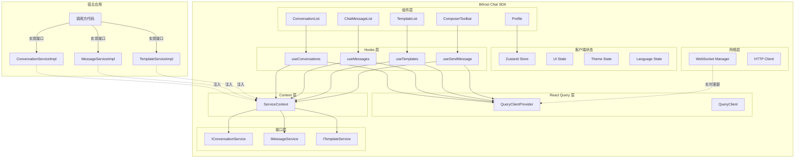

# Bifrost-Chat JS SDK 最终架构设计

> 本文档是 Bifrost-Chat JS SDK 的最终架构设计,整合了所有设计决策和最佳实践。

## 版本信息

- **版本**: 2.0.0
- **最后更新**: 2026-02-05
- **状态**: 最终版

## 核心设计原则

### 1. 会话概念统一

**决策**: 统一使用 **Conversation**

**理由**:
- ✅ 更符合即时通讯的业务语义
- ✅ 更直观和易于理解
- ✅ 与业界标准一致 (WhatsApp, Telegram, iMessage 都使用 Conversation)
- ✅ 更好的可读性

**命名规范**:
```typescript
// ✅ 正确
interface Conversation { }
interface IConversationService { }
useConversations()
export const ConversationList = () => { }

// ❌ 错误 - 禁止使用
interface Session { }
interface ISessionService { }
useSessions()
```

### 2. Template 从 Profile 剥离

**职责划分**:

| 模块 | 职责 | 目录 |
|------|------|------|
| **Profile** | 展示客户/联系人信息 (姓名、头像、标签等) | `src/components/profile/` |
| **Template** | 管理和选择消息模版 (模版列表、预览、发送) | `src/components/templates/` |

**目录结构**:
```
src/
├── components/
│   ├── profile/           # Profile 组件 (独立)
│   │   ├── Profile.tsx
│   │   ├── ProfileInfo.tsx
│   │   └── ...
│   └── templates/         # Template 组件 (独立)
│       ├── TemplateList.tsx
│       ├── TemplatePicker.tsx
│       └── TemplatePreview.tsx
├── interfaces/
│   ├── profile.interface.ts
│   └── template.interface.ts  # 独立的接口
├── store/
│   ├── profile.slice.ts
│   └── template.slice.ts  # 独立的状态
└── hooks/
    ├── use-profile.hook.ts
    └── use-templates.hook.ts  # 独立的 hooks
```

### 3. 使用泛型解耦参数类型

**问题**: 不同业务方的 API 参数不同

**解决方案**: 使用泛型,调用方自定义参数类型

```typescript
// ✅ 使用泛型
interface IConversationService<
  TListParams = any,
  TCreateParams = any,
  TQueryParams = any,
> {
  list(params?: TListParams): Promise<Conversation[]>;
  create(params: TCreateParams): Promise<Conversation>;
  query(params: TQueryParams): Promise<Conversation | null>;
}

// 业务方 A: 使用临时方案 API
class TemporaryConversationService
  implements IConversationService<TemporaryListParams, TemporaryCreateParams, any> {
  async list(params?: TemporaryListParams) {
    // 实现...
  }
}

// 业务方 B: 使用标准化协议
class StandardConversationService
  implements IConversationService<StandardListParams, StandardCreateParams, any> {
  async list(params?: StandardListParams) {
    // 实现...
  }
}
```

### 4. 接口抽象与依赖注入

**核心设计**: SDK 提供接口,调用方提供实现

```typescript
// SDK 定义接口
export interface IConversationService<...> {
  list(params?: TListParams): Promise<Conversation[]>;
  // ...
}

// 调用方实现接口
class MyConversationService implements IConversationService<...> {
  async list(params) {
    // 自定义实现
  }
}

// 使用 SDK
<ServiceProvider
  conversationService={new MyConversationService()}
  messageService={new MyMessageService()}
  templateService={new MyTemplateService()}
>
  <ChatContainer />
</ServiceProvider>
```

### 5. React Query + 声明式编程

**状态分类**:

| 状态类型 | 管理方案 | 示例 |
|---------|---------|------|
| **服务端状态** | React Query | 会话列表、消息列表、模版列表 |
| **客户端状态** | Zustand | 输入框内容、面板状态、主题、语言 |

**优势**:
- 代码量减少 80%
- 自动缓存和重新获取
- 内置乐观更新
- 更好的开发者体验

## 架构层次



## 核心接口定义

### 1. 会话服务接口

```typescript
/**
 * 会话服务接口 (泛型版本)
 * @template TListParams 列表查询参数类型
 * @template TCreateParams 创建参数类型
 * @template TQueryParams 查询参数类型
 */
export interface IConversationService<
  TListParams = any,
  TCreateParams = any,
  TQueryParams = any,
> {
  /**
   * 获取会话列表
   */
  list(params?: TListParams): Promise<Conversation[]>;

  /**
   * 获取会话详情
   */
  get(conversationId: string): Promise<Conversation | null>;

  /**
   * 创建会话
   */
  create(params: TCreateParams): Promise<Conversation>;

  /**
   * 查询会话
   */
  query(params: TQueryParams): Promise<Conversation | null>;
}
```

### 2. 消息服务接口

```typescript
/**
 * 消息服务接口 (泛型版本)
 * @template TListParams 列表查询参数类型
 * @template TSendParams 发送参数类型
 * @template TReadParams 已读参数类型
 */
export interface IMessageService<
  TListParams = any,
  TSendParams = any,
  TReadParams = any,
> {
  /**
   * 获取消息列表
   */
  list(conversationId: string, params: TListParams): Promise<StandardMessage[]>;

  /**
   * 发送消息
   */
  send(conversationId: string, params: TSendParams): Promise<SendMessageResult>;

  /**
   * 标记消息已读
   */
  markAsRead(params: TReadParams): Promise<void>;

  /**
   * 订阅实时消息
   */
  subscribeToMessages(
    callback: (message: StandardMessage) => void,
  ): () => void;

  /**
   * 订阅消息状态更新
   */
  subscribeToMessageStatus(
    callback: (update: MessageStatusUpdate) => void,
  ): () => void;
}
```

### 3. 模版服务接口

```typescript
/**
 * 模版服务接口 (泛型版本)
 * @template TListParams 列表查询参数类型
 * @template TSendParams 发送参数类型
 */
export interface ITemplateService<
  TListParams = any,
  TSendParams = any,
> {
  /**
   * 获取可用模版列表
   */
  list(params: TListParams): Promise<Template[]>;

  /**
   * 发送模版消息
   */
  send(params: TSendParams): Promise<SendMessageResult>;
}
```

## 数据结构

### Conversation (会话)

```typescript
interface Conversation {
  id: string;
  businessId: string;
  extendBusinessId?: string;
  contactAccount: string;
  channel: ChannelTypeEnum;
  source: number;
  customer: {
    encryptedName?: string;
    name?: string;
  };
  contact: {
    encryptedName?: string;
    name?: string;
  };
  relationType?: string;
  remark?: string;
  unreadPosition?: string;
  unreadCount: number;
  lastMessageAt?: number;
  lastSenderId?: string;
  createdAt: number;
}
```

### StandardMessage (标准消息)

```typescript
interface StandardMessage {
  id: string;
  tempId?: string;
  direction: MessageDirectionEnum;
  channelType: ChannelTypeEnum;
  status: MessageStatusEnum;
  timestamp: number;
  type: MessageTypeEnum;
  content: MessageContent;
  sender?: MessageParticipant;
  receiver?: MessageParticipant;
  conversationId: string;
  metadata?: Record<string, unknown>;
}
```

### Template (模版)

```typescript
interface Template {
  id: string;
  name: string;
  content: string;
  category?: string;
  variables?: TemplateVariable[];
  createdAt: number;
  updatedAt: number;
}

interface TemplateVariable {
  key: string;
  label: string;
  type: 'text' | 'number' | 'date';
  required: boolean;
}
```

## 命名规范

### 组件命名

```typescript
// ✅ 正确
export const ConversationList = () => { };
export const ChatMessageList = () => { };
export const TemplatePicker = () => { };

// ❌ 错误 - 禁止使用 Session
export const SessionList = () => { };
export const MessageList = () => { };
```

### 类型命名

```typescript
// ✅ 正确
interface Conversation { }
interface ConversationData { }
interface ConversationProps { }
enum MessageStatusEnum { }

// ❌ 错误 - 禁止使用 Session
interface Session { }
interface SessionData { }
```

### Hooks 命名

```typescript
// ✅ 正确
export function useConversations() { }
export function useMessages() { }
export function useTemplates() { }

// ❌ 错误 - 禁止使用 Session
export function useSessions() { }
```

### 服务命名

```typescript
// ✅ 正确
interface IConversationService { }
class ConversationServiceImpl implements IConversationService { }

// ❌ 错误 - 禁止使用 Session
interface ISessionService { }
class SessionServiceImpl implements ISessionService { }
```

## 关键特性

### 1. 类型安全

- 使用 TypeScript 严格模式
- 使用 Zod 进行运行时类型校验
- 所有公共 API 都有明确的类型定义

### 2. 错误处理

```typescript
// 统一的错误类型
export class SDKError extends Error { }
export class NetworkError extends SDKError { }
export class ValidationError extends SDKError { }
export class AuthorizationError extends SDKError { }
```

### 3. 性能优化

- 虚拟滚动 (react-virtuoso)
- 分页加载 (React Query 无限滚动)
- 懒加载 (组件级别的代码分割)
- 自动缓存 (React Query)

### 4. 国际化

- 支持中英文
- 使用 i18next
- 可扩展到其他语言

### 5. 主题定制

- 支持 light/dark/system 三种模式
- 使用 CSS Variables
- 支持自定义主题色

### 6. 可访问性

- ARIA 属性
- 键盘导航
- 屏幕阅读器支持

### 7. 安全性

- 数据脱敏
- XSS 防护 (DOMPurify)
- CSRF 防护
- 敏感信息加密

## 使用示例

### 基础使用 (使用默认实现)

```typescript
import {
  ChatContainer,
  ServiceProvider,
  DefaultConversationService,
  DefaultMessageService,
  DefaultTemplateService,
  DefaultChatLayout,
} from '@feoe/bifrost-chat';

function App() {
  return (
    <ServiceProvider
      conversationService={new DefaultConversationService()}
      messageService={new DefaultMessageService()}
      templateService={new DefaultTemplateService()}
    >
      <ChatContainer locale="zh-CN">
        <DefaultChatLayout />
      </ChatContainer>
    </ServiceProvider>
  );
}
```

### 自定义实现

```typescript
import {
  ChatContainer,
  ServiceProvider,
  type IConversationService,
  type IMessageService,
  type ITemplateService,
} from '@feoe/bifrost-chat';

// 自定义会话服务
class MyConversationService implements IConversationService<MyParams> {
  async list(params?: MyParams) {
    // 自定义实现
  }
}

// 使用自定义实现
function App() {
  return (
    <ServiceProvider
      conversationService={new MyConversationService()}
      messageService={new MyMessageService()}
      templateService={new MyTemplateService()}
    >
      <ChatContainer locale="zh-CN">
        {/* 自定义布局 */}
      </ChatContainer>
    </ServiceProvider>
  );
}
```
