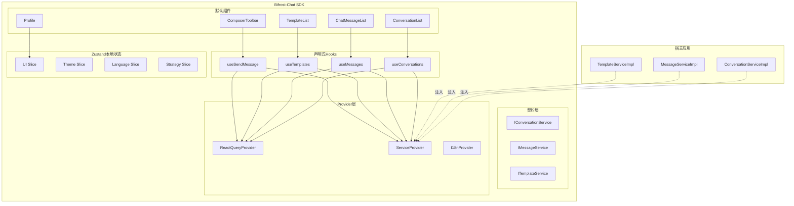

# Bifrost-Chat JS SDK 最终架构基线（v3）

> 本文档是 SDK 架构的单一事实源（SSOT）。

## 版本信息

- 版本：3.0.0
- 状态：生效中
- 更新日期：2026-02-05

## 1. 不可变决策

1. **公开 API 禁用 Session**
   - 所有公开类型、字段、事件、Hook、QueryKey 必须使用 `Conversation` 语义。
2. **SDK 形态固定为：纯接口 + DI + 默认组件实现**
   - SDK 负责接口契约、Provider、Hooks、默认组件。
   - 调用方负责具体数据接入实现。
3. **SDK 不承载协议适配与字段转换设计责任**
   - 协议适配与后端字段翻译属于调用方实现细节，不作为 SDK 约束层。
4. **状态边界固定**
   - React Query：服务端状态（会话、消息、模板）。
   - Zustand：客户端状态（输入、面板、主题、语言、当前选中会话）。
5. **Template 从 Profile 完整剥离**
   - 模板数据、模板能力、模板类型独立定义，不与 Profile 类型耦合。

## 2. 架构分层



## 3. 状态职责边界

| 状态类型 | 管理方案 | 例子 |
|---|---|---|
| 服务端状态 | React Query | `conversations`、`messages`、`templates` |
| 客户端状态 | Zustand | `composerText`、`isTemplatePanelOpen`、`activeConversationId` |

**模板边界**：
- `templates` 列表、模板预览、模板发送结果 -> React Query
- 模板面板开关、模板变量草稿、当前选中模板 -> Zustand

## 4. 接口与 DI 基线

接口定义以 `src/services/*.service.ts` 为准：

- `IConversationService<TListParams, TCreateParams, TQueryParams>`
- `IMessageService<TListParams, TSendParams, TReadParams>`
- `ITemplateService<TListParams, TSendParams>`

注入方式：

```tsx
import {
  ReactQueryProvider,
  ServiceProvider,
  ChatContainer,
} from '@feoe/bifrost-chat';

<ReactQueryProvider>
  <ServiceProvider
    conversationService={conversationServiceImpl}
    messageService={messageServiceImpl}
    templateService={templateServiceImpl}
  >
    <ChatContainer locale="zh-CN">...</ChatContainer>
  </ServiceProvider>
</ReactQueryProvider>
```

## 5. QueryKey 规范

统一使用：

- `['conversations', 'list', filters]`
- `['messages', 'list', conversationId]`
- `['templates', 'list', conversationId]`

禁止出现 `sessions` 作为公开 QueryKey。

## 6. 错误模型

SDK 统一错误类型（以当前代码为准）：

- `SDKError`
- `HTTPError`
- `ValidationError`
- `AuthorizationError`
- `ConfigurationError`

## 7. 对调用方的边界声明

调用方负责：

- 后端 API 请求与鉴权
- 协议/字段差异处理（如有）
- 实时订阅实现细节
- 业务级重试、审计、限流策略

SDK 不负责：

- 绑定某个后端协议或 DTO
- 预设业务协议适配实现方案
- 宿主业务规则实现

## 8. 迁移落地优先级

1. Session 命名清理为 Conversation。
2. 固化三大 Service 接口与 `ServiceProvider`。
3. 会话/消息/模板迁移到 React Query。
4. 收敛 Zustand 到纯客户端状态。
5. 完成实时消息与离线重试（可选能力）。
