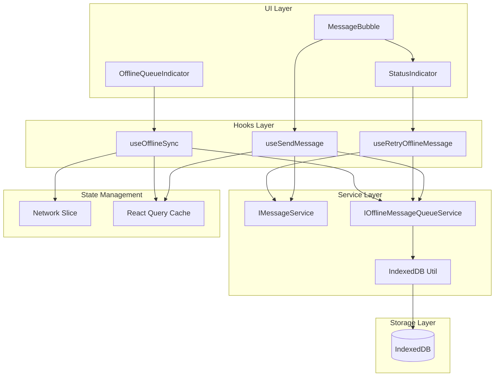
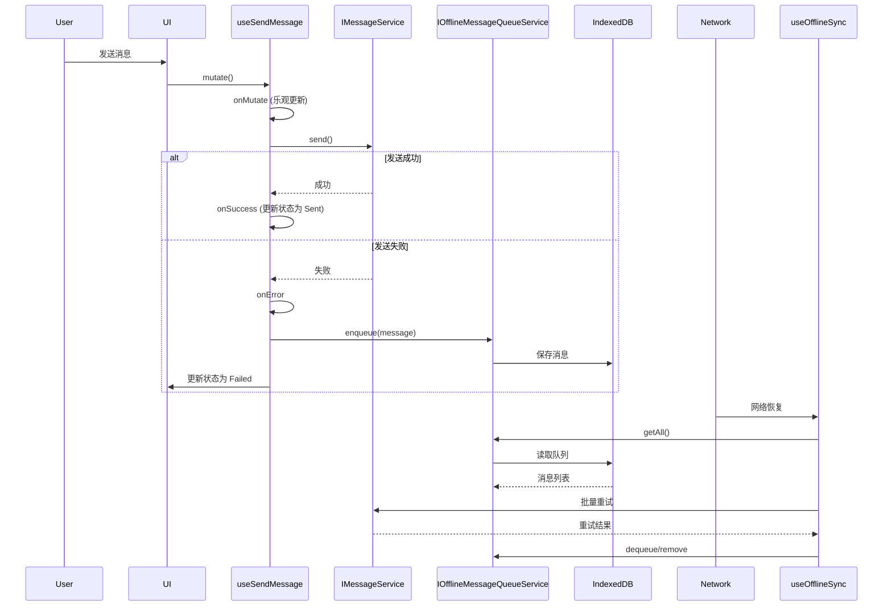

# 离线消息队列架构设计

## 文档版本

| 版本 | 日期 | 作者 | 变更说明 |
|------|------|------|----------|
| 1.0.0 | 2026-02-07 | Kilo Code | 初始版本 |

---

## 概述

### 当前已实现（As-Is）

当前 `src/providers/query.provider.tsx` 和 `src/hooks/use-send-message.hook.ts` 的实现：

- 使用 React Query Mutation 管理消息发送
- 支持乐观更新，发送前立即在 UI 上显示消息
- **发送失败时回滚到之前的状态**，消息从 UI 中消失
- **没有持久化存储**，刷新页面后失败的消息丢失
- **没有重试机制**，用户无法重新发送失败的消息

### 目标架构（To-Be）

实现完整的离线消息队列系统：

- **持久化存储**：使用 IndexedDB 存储发送失败的消息
- **自动重试**：网络恢复时自动重试发送队列中的消息
- **手动重试**：用户可以手动重试失败的消息
- **UI 反馈**：显示离线队列状态和失败消息的重试按钮
- **消息不丢失**：确保发送失败的消息不会丢失

---

## 架构设计

### 系统架构图



### 数据流图



---

## 核心组件设计

### 1. 离线消息队列服务

#### 接口定义

```typescript
/**
 * 离线消息接口
 */
export interface OfflineMessage {
  /** 唯一标识 */
  id: string;
  /** 原始消息数据 */
  message: Omit<StandardMessage, 'id' | 'status'>;
  /** 会话 ID */
  conversationId: string;
  /** 发送参数 */
  sendParams: any;
  /** 重试次数 */
  retryCount: number;
  /** 最大重试次数 */
  maxRetries: number;
  /** 失败原因 */
  error?: string;
  /** 创建时间 */
  createdAt: number;
  /** 最后重试时间 */
  lastRetryAt?: number;
  /** 下次重试时间 */
  nextRetryAt?: number;
  /** 优先级 */
  priority: MessagePriorityEnum;
}

/**
 * 离线消息队列服务接口
 */
export interface IOfflineMessageQueueService {
  /**
   * 将消息加入队列
   * @param message 离线消息
   */
  enqueue(message: OfflineMessage): Promise<void>;

  /**
   * 从队列中移除消息
   * @param messageId 消息 ID
   */
  dequeue(messageId: string): Promise<void>;

  /**
   * 获取所有待发送的消息
   * @returns 消息列表（按优先级和创建时间排序）
   */
  getAll(): Promise<OfflineMessage[]>;

  /**
   * 获取指定会话的待发送消息
   * @param conversationId 会话 ID
   */
  getByConversation(conversationId: string): Promise<OfflineMessage[]>;

  /**
   * 更新消息状态
   * @param messageId 消息 ID
   * @param updates 更新内容
   */
  update(messageId: string, updates: Partial<OfflineMessage>): Promise<void>;

  /**
   * 清空队列
   */
  clear(): Promise<void>;

  /**
   * 获取队列统计信息
   */
  getStats(): Promise<{
    total: number;
    byConversation: Record<string, number>;
    byPriority: Record<MessagePriorityEnum, number>;
  }>;

  /**
   * 清理过期消息
   * @param maxAge 最大保留时间（毫秒）
   */
  cleanup(maxAge: number): Promise<number>;

  /**
   * 订阅队列变化
   * @param callback 回调函数
   */
  subscribe(callback: (messages: OfflineMessage[]) => void): () => void;
}
```

#### 实现要点

- 使用 `idb` 库或原生 IndexedDB API
- 数据库结构：
  - Store Name: `offline_messages`
  - Indexes: `conversationId`, `createdAt`, `priority`, `nextRetryAt`
- 支持事务操作，确保数据一致性

---

### 2. IndexedDB 工具类

```typescript
/**
 * IndexedDB 配置
 */
export interface IndexedDBConfig {
  /** 数据库名称 */
  dbName: string;
  /** 数据库版本 */
  dbVersion: number;
  /** 对象存储定义 */
  stores: {
    [name: string]: {
      keyPath: string;
      autoIncrement?: boolean;
      indexes?: {
        name: string;
        keyPath: string | string[];
        options?: IDBIndexParameters;
      }[];
    };
  };
}

/**
 * IndexedDB 工具类
 */
export class IndexedDBHelper {
  private db: IDBDatabase | null = null;

  /**
   * 打开数据库
   */
  open(config: IndexedDBConfig): Promise<IDBDatabase>;

  /**
   * 关闭数据库
   */
  close(): void;

  /**
   * 添加数据
   */
  add<T>(storeName: string, data: T): Promise<string>;

  /**
   * 获取数据
   */
  get<T>(storeName: string, key: string): Promise<T | null>;

  /**
   * 更新数据
   */
  put<T>(storeName: string, data: T): Promise<void>;

  /**
   * 删除数据
   */
  delete(storeName: string, key: string): Promise<void>;

  /**
   * 获取所有数据
   */
  getAll<T>(storeName: string): Promise<T[]>;

  /**
   * 使用索引查询
   */
  getByIndex<T>(
    storeName: string,
    indexName: string,
    value: any,
  ): Promise<T[]>;

  /**
   * 清空存储
   */
  clear(storeName: string): Promise<void>;

  /**
   * 批量操作
   */
  batch(
    operations: Array<{
      type: 'add' | 'put' | 'delete';
      storeName: string;
      data?: any;
      key?: string;
    }>,
  ): Promise<void>;
}
```

---

### 3. 消息发送增强

#### useSendMessage 修改

```typescript
export function useSendMessage<TParams = any>() {
  const queryClient = useQueryClient();
  const { messageService, offlineMessageQueue } = useServices();

  return useMutation({
    mutationFn: async (params: {
      conversationId: string;
      content: string;
      extra?: TParams;
    }) => {
      return messageService.send(params.conversationId, {
        content: params.content,
        ...params.extra,
      } as any);
    },

    onMutate: async (params) => {
      // ... 现有逻辑保持不变
    },

    // 修改 onError：不再回滚，而是保存到离线队列
    onError: async (error, variables, context) => {
      console.error('消息发送失败:', error);

      // 将失败的消息保存到离线队列
      const offlineMessage: OfflineMessage = {
        id: generateUniqueId(),
        message: context?.tempMessage,
        conversationId: variables.conversationId,
        sendParams: variables.extra,
        retryCount: 0,
        maxRetries: 3,
        error: error.message,
        createdAt: Date.now(),
        priority: MessagePriorityEnum.Normal,
      };

      await offlineMessageQueue.enqueue(offlineMessage);

      // 更新消息状态为 Failed（而不是回滚）
      queryClient.setQueryData(
        queryKeys.messages.list(variables.conversationId),
        (old: any) => {
          if (!old) return old;
          return {
            ...old,
            pages: old.pages.map((page: any) => ({
              ...page,
              items: page.items.map((item: StandardMessage) =>
                item.tempId === context?.tempMessage.tempId
                  ? { ...item, status: MessageStatusEnum.Failed }
                  : item,
              ),
            })),
          };
        },
      );
    },

    onSuccess: (data, variables, context) => {
      // ... 现有逻辑保持不变
    },
  });
}
```

---

### 4. 网络恢复同步

#### useOfflineSync Hook

```typescript
export function useOfflineSync() {
  const { offlineMessageQueue, messageService } = useServices();
  const networkStatus = useAppStore((state) => state.network.status);
  const queryClient = useQueryClient();

  const sync = useCallback(async () => {
    const messages = await offlineMessageQueue.getAll();

    for (const offlineMsg of messages) {
      // 检查是否达到重试上限
      if (offlineMsg.retryCount >= offlineMsg.maxRetries) {
        continue;
      }

      // 检查是否到达重试时间
      if (
        offlineMsg.nextRetryAt &&
        Date.now() < offlineMsg.nextRetryAt
      ) {
        continue;
      }

      try {
        // 重试发送
        await messageService.send(
          offlineMsg.conversationId,
          offlineMsg.sendParams,
        );

        // 发送成功，从队列中移除
        await offlineMessageQueue.dequeue(offlineMsg.id);

        // 更新 UI
        queryClient.invalidateQueries({
          queryKey: queryKeys.messages.list(offlineMsg.conversationId),
        });
      } catch (error) {
        // 更新重试信息
        const nextRetryDelay = Math.min(
          1000 * 2 ** offlineMsg.retryCount,
          30000,
        );

        await offlineMessageQueue.update(offlineMsg.id, {
          retryCount: offlineMsg.retryCount + 1,
          lastRetryAt: Date.now(),
          nextRetryAt: Date.now() + nextRetryDelay,
          error: error.message,
        });
      }
    }
  }, [offlineMessageQueue, messageService, queryClient]);

  // 监听网络状态变化
  useEffect(() => {
    if (networkStatus === NetworkStatusEnum.Connected) {
      sync();
    }
  }, [networkStatus, sync]);

  return {
    sync,
    isSyncing: false, // 可以添加同步状态
  };
}
```

---

### 5. UI 组件增强

#### MessageBubble 重试按钮

```typescript
// 在 MessageBubble 组件中添加
{message.status === MessageStatusEnum.Failed && (
  <button
    onClick={() => retryMessage(message)}
    className="retry-button"
    aria-label="Retry Button"
  >
    <RetryIcon />
  </button>
)}
```

#### OfflineQueueIndicator

```typescript
export function OfflineQueueIndicator() {
  const { offlineMessageQueue } = useServices();
  const [count, setCount] = useState(0);

  useEffect(() => {
    const unsubscribe = offlineMessageQueue.subscribe((messages) => {
      setCount(messages.length);
    });

    return unsubscribe;
  }, [offlineMessageQueue]);

  if (count === 0) return null;

  return (
    <button className="offline-queue-indicator">
      <AlertIcon />
      <span>{count} 条消息待发送</span>
    </button>
  );
}
```

---

## 配置选项

```typescript
/**
 * 离线队列配置
 */
export interface OfflineQueueConfig {
  /** 是否启用离线队列 */
  enabled: boolean;
  /** 数据库名称 */
  dbName?: string;
  /** 最大队列长度 */
  maxQueueSize?: number;
  /** 消息过期时间（毫秒） */
  messageExpiration?: number;
  /** 默认最大重试次数 */
  defaultMaxRetries?: number;
  /** 重试延迟策略 */
  retryStrategy?: 'exponential' | 'linear' | 'fixed';
  /** 是否在网络恢复时自动重试 */
  autoRetryOnReconnect?: boolean;
  /** 批量重试大小 */
  batchSize?: number;
}
```

---

## 错误处理

### 新增错误类型

```typescript
/**
 * 离线队列错误
 */
export class OfflineQueueError extends SDKError {
  constructor(
    message: string,
    public readonly code: OfflineQueueErrorCode,
  ) {
    super(message);
    this.name = 'OfflineQueueError';
  }
}

export enum OfflineQueueErrorCode {
  /** 队列已满 */
  QueueFull = 'QUEUE_FULL',
  /** 存储失败 */
  StorageError = 'STORAGE_ERROR',
  /** 消息过期 */
  MessageExpired = 'MESSAGE_EXPIRED',
  /** 达到最大重试次数 */
  MaxRetriesExceeded = 'MAX_RETRIES_EXCEEDED',
}
```

---

## 测试策略

### 单元测试

- `IndexedDBHelper` 工具类测试
- `OfflineMessageQueueService` 服务测试
- `useOfflineSync` hook 测试
- `useSendMessage` 集成测试

### 集成测试

- 完整的离线发送流程测试
- 网络恢复重试测试
- UI 交互测试

---

## 性能考虑

1. **批量操作**：使用 IndexedDB 事务批量处理消息
2. **索引优化**：为常用查询字段创建索引
3. **定期清理**：清理过期消息，避免存储膨胀
4. **优先级队列**：高优先级消息优先发送
5. **节流重试**：避免短时间内频繁重试

---

## 安全性考虑

1. **敏感数据**：不在 IndexedDB 中存储敏感信息
2. **数据加密**：可选的客户端加密支持
3. **访问控制**：限制对 IndexedDB 的访问

---

## 兼容性

- 浏览器支持：IndexedDB 支持的现代浏览器
- 降级方案：不支持 IndexedDB 时使用 localStorage（容量限制）
- Polyfill：使用 `idb` 库提供更好的 API

---

## 未来扩展（To-Be）

- [ ] 支持消息去重
- [ ] 支持消息合并（批量发送）
- [ ] 支持跨设备同步（云端备份）
- [ ] 支持消息压缩
- [ ] 支持离线消息预览
- [ ] 支持离线消息编辑
- [ ] 支持离线消息删除
