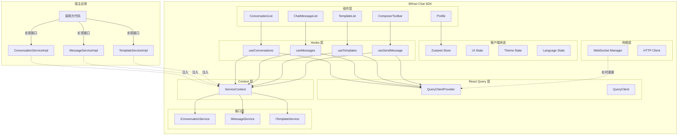

# React 声明式架构设计

## 概述

本文档提出一个更符合 React 生态的架构设计,充分利用 React Query 和声明式编程,简化代码并提高可维护性。

## 核心理念

### 1. 声明式优于命令式

**传统命令式方法**:
```typescript
// ❌ 命令式
const loadSessions = async () => {
  const sessions = await sessionManager.loadList();
  store.setConversations(sessions);
};
```

**React 声明式方法**:
```typescript
// ✅ 声明式
function ConversationList() {
  const { data: sessions, isLoading } = useSessions();
  if (isLoading) return <Spinner />;
  return sessions.map(session => <ConversationItem key={session.id} {...session} />);
}
```

### 2. React Query vs Zustand

**状态分类**:

| 状态类型 | 管理方案 | 示例 |
|---------|---------|------|
| **服务端状态** | React Query | 会话列表、消息列表、模版列表 |
| **客户端状态** | Zustand | 输入框内容、面板状态、主题、语言 |
| **表单状态** | React Hook Form | 表单输入、验证 |
| **URL 状态** | React Router | 路由参数、查询参数 |

**为什么使用 React Query?**

1. **自动缓存**: 自动缓存服务端数据,减少重复请求
2. **自动重新获取**: 数据变化时自动重新获取
3. **后台刷新**: 定期在后台刷新数据
4. **乐观更新**: 支持乐观 UI 更新
5. **重试和错误处理**: 内置重试机制和错误处理
6. **分页和无限滚动**: 内置分页和无限滚动支持
7. **开发者体验**: 减少 80% 的状态管理代码

## 新架构设计

### 架构层次



### 状态管理职责划分

#### React Query 管理的状态

```typescript
// 会话列表
useSessions() // Query: 获取会话列表

// 当前会话的消息
useMessages(sessionId) // Query: 获取消息列表

// 可用模版
useTemplates(sessionId) // Query: 获取模版列表

// 发送消息
useSendMessage() // Mutation: 发送消息

// 创建会话
useCreateSession() // Mutation: 创建会话

// 标记已读
useMarkAsRead() // Mutation: 标记已读
```

#### Zustand 管理的状态

```typescript
// UI 状态
interface UiState {
  // 输入框
  composerText: string;
  composerAttachments: File[];

  // 面板状态
  isProfilePanelOpen: boolean;
  isConversationListOpen: boolean;

  // 当前激活的会话 ID (用于 UI 高亮,不是数据源)
  activeConversationId: string | null;
}

// 主题状态
interface ThemeState {
  mode: 'light' | 'dark' | 'system';
  primaryColor: string;
}

// 语言状态
interface LanguageState {
  locale: 'en-US' | 'zh-CN';
}
```

## 实现方案

### 1. API 层 (简化)

移除 Repository 和 Manager 层,直接使用 React Query 的 Query 和 Mutation。

```typescript
// src/api/session.api.ts
import { httpClient } from '@/network/http-client';

export const sessionApi = {
  list: async (params?: ListSessionsParams) => {
    const response = await httpClient.post<ListSessionsResponse>(
      '/chat/session/list',
      params || {},
    );
    return response.data;
  },

  create: async (params: CreateSessionParams) => {
    const response = await httpClient.post<CreateSessionResponse>(
      '/chat/session/create',
      params,
    );
    return response.data;
  },

  query: async (params: QuerySessionParams) => {
    const response = await httpClient.post<QuerySessionResponse>(
      '/chat/session/query',
      params,
    );
    return response.data;
  },
};
```

### 2. React Query Hooks

#### 会话 Hooks

```typescript
// src/hooks/use-sessions.hook.ts
import { useQuery, useMutation, useQueryClient } from '@tanstack/react-query';
import { sessionApi } from '@/api/session.api';
import { sessionMapper } from '@/mappers/session.mapper';

/**
 * 获取会话列表
 */
export function useSessions(params?: ListSessionsParams) {
  return useQuery({
    queryKey: ['sessions', params],
    queryFn: async () => {
      const response = await sessionApi.list(params);
      return response.sessionList.map(item => sessionMapper.fromDto(item));
    },
    staleTime: 1000 * 60 * 5, // 5 分钟内数据视为新鲜
  });
}

/**
 * 创建会话
 */
export function useCreateSession() {
  const queryClient = useQueryClient();

  return useMutation({
    mutationFn: async (params: CreateSessionParams) => {
      const dto = sessionMapper.toCreateDto(params);
      const response = await sessionApi.create(dto);
      return sessionMapper.fromCreateResponse(response);
    },
    onSuccess: (newSession) => {
      // 乐观更新会话列表
      queryClient.setQueryData(
        ['sessions'],
        (old: Conversation[] | undefined) => {
          return old ? [...old, newSession] : [newSession];
        },
      );
    },
  });
}

/**
 * 查询会话
 */
export function useQuerySession() {
  return useMutation({
    mutationFn: async (params: QuerySessionParams) => {
      const dto = sessionMapper.toQueryDto(params);
      const response = await sessionApi.query(dto);
      if (!response.id) return null;
      return sessionMapper.fromQueryResponse(response);
    },
  });
}
```

#### 消息 Hooks

```typescript
// src/hooks/use-messages.hook.ts
import { useQuery, useMutation, useQueryClient, useInfiniteQuery } from '@tanstack/react-query';
import { messageApi } from '@/api/message.api';
import { messageMapper } from '@/mappers/message.mapper';

/**
 * 获取会话消息列表 (支持无限滚动)
 */
export function useMessages(sessionId: string) {
  return useInfiniteQuery({
    queryKey: ['messages', sessionId],
    queryFn: async ({ pageParam = 1 }) => {
      const response = await messageApi.list({
        sessionId,
        page: pageParam,
        pageSize: 50,
      });
      return {
        items: response.messageList.map(item => messageMapper.fromDto(item)),
        nextCursor: response.hasNext ? pageParam + 1 : undefined,
      };
    },
    getNextPageParam: (lastPage) => lastPage.nextCursor,
    staleTime: 1000 * 60 * 5, // 5 分钟内数据视为新鲜
    enabled: !!sessionId, // 只有当 sessionId 存在时才执行查询
  });
}

/**
 * 发送消息
 */
export function useSendMessage() {
  const queryClient = useQueryClient();

  return useMutation({
    mutationFn: async (params: { content: string; sessionId: string }) => {
      const message = messageMapper.buildStandardMessage(
        params.content,
        params.sessionId,
      );
      const dto = messageMapper.toSendDto(message);
      const response = await messageApi.send(dto);
      return { message, response };
    },
    onMutate: async (params) => {
      // 乐观更新:立即在 UI 上显示消息
      await queryClient.cancelQueries({ queryKey: ['messages', params.sessionId] });

      const tempMessage = messageMapper.buildStandardMessage(
        params.content,
        params.sessionId,
      );

      queryClient.setQueryData(
        ['messages', params.sessionId],
        (old: InfiniteData<MessagesPage> | undefined) => {
          if (!old) return old;
          return {
            ...old,
            pages: old.pages.map(page => ({
              ...page,
              items: [...page.items, tempMessage],
            })),
          };
        },
      );

      return { tempMessage };
    },
    onError: (error, variables, context) => {
      // 错误时回滚乐观更新
      if (context?.tempMessage) {
        queryClient.setQueryData(
          ['messages', variables.sessionId],
          (old: InfiniteData<MessagesPage> | undefined) => {
            if (!old) return old;
            return {
              ...old,
              pages: old.pages.map(page => ({
                ...page,
                items: page.items.filter(m => m.id !== context.tempMessage.id),
              })),
            };
          },
        );
      }
    },
  });
}

/**
 * 标记消息已读
 */
export function useMarkAsRead() {
  return useMutation({
    mutationFn: async (messageIds: string[]) => {
      const dto = messageMapper.toMarkReadDto(messageIds);
      await messageApi.markAsRead(dto);
    },
  });
}
```

#### 模版 Hooks

```typescript
// src/hooks/use-templates.hook.ts
import { useQuery } from '@tanstack/react-query';
import { templateApi } from '@/api/template.api';
import { templateMapper } from '@/mappers/template.mapper';

/**
 * 获取可用模版
 */
export function useTemplates(sessionId: string) {
  return useQuery({
    queryKey: ['templates', sessionId],
    queryFn: async () => {
      const response = await templateApi.list({ sessionId });
      return response.templateList.map(item => templateMapper.fromDto(item));
    },
    staleTime: 1000 * 60 * 30, // 30 分钟内数据视为新鲜
    enabled: !!sessionId,
  });
}
```

### 3. WebSocket 集成

```typescript
// src/hooks/use-websocket.hook.ts
import { useEffect, useRef } from 'react';
import { useQueryClient } from '@tanstack/react-query';
import { WebSocketManager } from '@/network/websocket-manager';
import { messageMapper } from '@/mappers/message.mapper';

export function useWebSocket() {
  const queryClient = useQueryClient();
  const wsRef = useRef<WebSocketManager | null>(null);

  useEffect(() => {
    // 初始化 WebSocket
    wsRef.current = new WebSocketManager('ws://localhost:8080');

    // 监听消息通知
    wsRef.current.on('message_notification', (data) => {
      const message = messageMapper.fromNotificationDto(data);

      // 更新消息列表
      queryClient.setQueryData(
        ['messages', message.conversationId],
        (old: InfiniteData<MessagesPage> | undefined) => {
          if (!old) return old;
          return {
            ...old,
            pages: old.pages.map(page => ({
              ...page,
              items: [...page.items, message],
            })),
          };
        },
      );
    });

    // 监听会话未读通知
    wsRef.current.on('conversation_unread_notification', (data) => {
      queryClient.setQueryData(
        ['sessions'],
        (old: Conversation[] | undefined) => {
          if (!old) return old;
          return old.map(session =>
            session.id === data.sessionId
              ? { ...session, unreadCount: data.unreadCount }
              : session,
          );
        },
      );
    });

    // 监听消息状态通知
    wsRef.current.on('message_status_notification', (data) => {
      // 更新所有会话的消息状态
      queryClient.invalidateQueries({ queryKey: ['messages'] });
    });

    return () => {
      wsRef.current?.disconnect();
    };
  }, [queryClient]);

  return wsRef.current;
}
```

### 4. 组件实现

#### 会话列表组件

```typescript
// src/components/conversation/ConversationList.tsx
import { useSessions, useCreateSession, useQuerySession } from '@/hooks';
import { useUIStore } from '@/store/ui.store';

export function ConversationList() {
  const { data: sessions, isLoading } = useSessions();
  const createSession = useCreateSession();
  const querySession = useQuerySession();
  const { activeConversationId, setActiveConversationId } = useUIStore();

  const handleSelectConversation = async (conversationId: string) => {
    setActiveConversationId(conversationId);
  };

  const handleCreateConversation = async (params: CreateSessionParams) => {
    // 先查询是否已存在
    const existing = await querySession.mutateAsync(params);
    if (existing) {
      setActiveConversationId(existing.id);
    } else {
      // 不存在则创建
      const newSession = await createSession.mutateAsync(params);
      setActiveConversationId(newSession.id);
    }
  };

  if (isLoading) return <ConversationListSkeleton />;

  return (
    <div>
      {sessions?.map(session => (
        <ConversationItem
          key={session.id}
          {...session}
          isActive={session.id === activeConversationId}
          onSelect={handleSelectConversation}
        />
      ))}
    </div>
  );
}
```

#### 消息列表组件

```typescript
// src/components/messages/ChatMessageList.tsx
import { useMessages } from '@/hooks';
import { useUIStore } from '@/store/ui.store';

export function ChatMessageList({ sessionId }: { sessionId: string }) {
  const { data, isLoading, fetchNextPage, hasNextPage } = useMessages(sessionId);
  const { composerText, setComposerText } = useUIStore();

  const messages = data?.pages.flatMap(page => page.items) || [];

  const handleScroll = (e: React.UIEvent<HTMLDivElement>) => {
    const target = e.target as HTMLDivElement;
    if (target.scrollTop === 0 && hasNextPage) {
      fetchNextPage();
    }
  };

  if (isLoading) return <MessageListSkeleton />;

  return (
    <div onScroll={handleScroll}>
      {messages.map(message => (
        <MessageBubble key={message.id} {...message} />
      ))}
    </div>
  );
}
```

#### 输入框组件

```typescript
// src/components/composer/ComposerToolbar.tsx
import { useSendMessage } from '@/hooks';
import { useUIStore } from '@/store/ui.store';

export function ComposerToolbar({ sessionId }: { sessionId: string }) {
  const sendMessage = useSendMessage();
  const { composerText, setComposerText } = useUIStore();

  const handleSend = async () => {
    if (!composerText.trim()) return;

    try {
      await sendMessage.mutateAsync({
        content: composerText,
        sessionId,
      });
      setComposerText(''); // 清空输入框
    } catch (error) {
      console.error('Failed to send message:', error);
    }
  };

  return (
    <div>
      <input
        value={composerText}
        onChange={(e) => setComposerText(e.target.value)}
        placeholder="输入消息..."
      />
      <button onClick={handleSend}>发送</button>
    </div>
  );
}
```

### 5. Zustand Store (简化)

```typescript
// src/store/ui.store.ts
import { create } from 'zustand';

interface UiState {
  // 输入框状态
  composerText: string;
  composerAttachments: File[];

  // 面板状态
  isProfilePanelOpen: boolean;
  isConversationListOpen: boolean;

  // 当前激活的会话 ID (用于 UI 高亮)
  activeConversationId: string | null;

  // Actions
  setComposerText: (text: string) => void;
  setComposerAttachments: (files: File[]) => void;
  setActiveConversationId: (id: string | null) => void;
  toggleProfilePanel: () => void;
  toggleConversationList: () => void;
}

export const useUIStore = create<UiState>((set) => ({
  // 初始状态
  composerText: '',
  composerAttachments: [],
  isProfilePanelOpen: false,
  isConversationListOpen: true,
  activeConversationId: null,

  // Actions
  setComposerText: (text) => set({ composerText: text }),
  setComposerAttachments: (files) => set({ composerAttachments: files }),
  setActiveConversationId: (id) => set({ activeConversationId: id }),
  toggleProfilePanel: () => set((state) => ({ isProfilePanelOpen: !state.isProfilePanelOpen })),
  toggleConversationList: () => set((state) => ({ isConversationListOpen: !state.isConversationListOpen })),
}));
```

### 6. 离线队列 (简化)

使用 React Query 的 Mutation 和持久化插件:

```typescript
// src/hooks/use-offline-mutation.hook.ts
import { useMutation } from '@tanstack/react-query';
import { offlineQueue } from '@/offline/offline-queue';

export function useOfflineMutation<T, V>(
  mutationFn: (variables: V) => Promise<T>,
  options?: {
    onSuccess?: (data: T, variables: V) => void;
    onError?: (error: Error, variables: V) => void;
  },
) {
  return useMutation({
    mutationFn: async (variables: V) => {
      try {
        const result = await mutationFn(variables);
        options?.onSuccess?.(result, variables);
        return result;
      } catch (error) {
        // 网络错误时加入离线队列
        if (error instanceof NetworkError) {
          await offlineQueue.enqueue({
            type: 'mutation',
            mutationFn,
            variables,
          });
        }
        options?.onError?.(error as Error, variables);
        throw error;
      }
    },
  });
}
```

## 优势对比

### 旧架构 (Zustand + Repository + Manager)

```typescript
// ❌ 复杂的状态管理
1. Store 定义状态
2. Repository 获取数据
3. Manager 封装业务逻辑
4. Action 更新 Store
5. 组件订阅 Store

// 代码量: ~500 行
```

### 新架构 (React Query + 声明式)

```typescript
// ✅ 简洁的声明式代码
1. 定义 API 函数
2. 创建 React Query Hook
3. 组件直接使用 Hook

// 代码量: ~100 行 (减少 80%)
```

## 迁移策略

### 阶段 1: 引入 React Query (1-2 天)

- [ ] 安装 @tanstack/react-query
- [ ] 配置 QueryClient 和 QueryClientProvider
- [ ] 创建基础的 API 层
- [ ] 创建第一个 React Query Hook

### 阶段 2: 迁移会话管理 (2-3 天)

- [ ] 创建 useSessions Hook
- [ ] 创建 useCreateSession Hook
- [ ] 更新 ConversationList 组件
- [ ] 移除旧的 SessionManager 和 SessionRepository

### 阶段 3: 迁移消息管理 (3-4 天)

- [ ] 创建 useMessages Hook (支持无限滚动)
- [ ] 创建 useSendMessage Hook (支持乐观更新)
- [ ] 创建 useMarkAsRead Hook
- [ ] 更新 ChatMessageList 组件
- [ ] 更新 ComposerToolbar 组件
- [ ] 移除旧的 MessageManager 和 MessageRepository

### 阶段 4: 集成 WebSocket (2-3 天)

- [ ] 创建 useWebSocket Hook
- [ ] 集成 WebSocket 消息到 React Query
- [ ] 实现实时更新

### 阶段 5: 简化 Zustand Store (1 天)

- [ ] 移除服务端状态
- [ ] 只保留客户端状态
- [ ] 更新相关组件

### 阶段 6: 测试和优化 (2-3 天)

- [ ] 更新单元测试
- [ ] 更新集成测试
- [ ] 性能优化

**总预计时间**: 11-16 天

## 总结

### 核心改进

1. **代码量减少 80%**: 从 ~500 行减少到 ~100 行
2. **声明式编程**: 更符合 React 的设计理念
3. **自动缓存**: React Query 自动处理缓存和重新获取
4. **乐观更新**: 内置乐观 UI 更新支持
5. **无限滚动**: 内置分页和无限滚动支持
6. **更好的开发者体验**: 减少样板代码

### 保留的设计模式

1. **Mapper 模式**: 仍然需要,用于数据格式转换
2. **API 适配层**: 仍然需要,用于封装 API 调用
3. **WebSocket Manager**: 仍然需要,用于 WebSocket 连接管理

### 移除的层次

1. ~~Repository 层~~: 被 React Query 替代
2. ~~Manager 层~~: 被 React Query Hooks 替代
3. ~~复杂的 Store Actions~~: 被 React Query Mutations 替代

### 新架构的优势

1. **更简洁**: 代码量大幅减少
2. **更符合 React 生态**: 充分利用 React 的特性
3. **更易维护**: 减少了层次和复杂度
4. **更易测试**: React Query Hooks 易于测试
5. **更好的性能**: 自动缓存和优化

这个新架构完全符合 React 的声明式编程理念,同时保持了可扩展性和可维护性。
