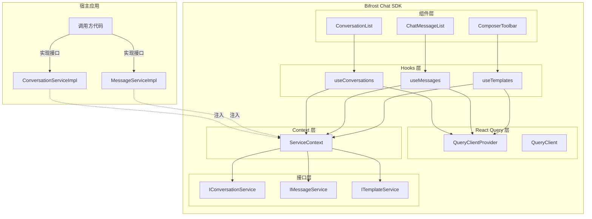
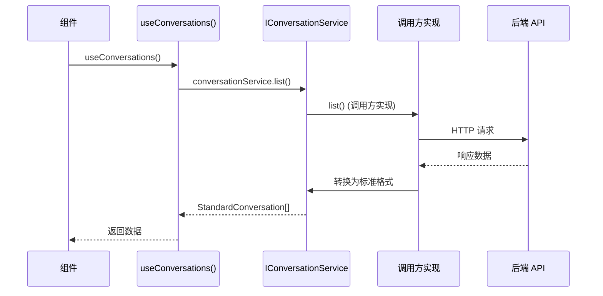

# SDK 接口抽象与依赖注入设计

## 概述

本文档提出一个基于接口抽象和依赖注入的架构设计,让 SDK 的组件与状态管理完全解耦,支持不同的后端 API 实现,真正做到"开箱即用"。

## 核心设计理念

### 1. SDK 提供什么?

**SDK 提供**:
- ✅ 标准化的组件 (ConversationList, ChatMessageList, ComposerToolbar 等)
- ✅ 标准化的数据结构 (StandardMessage, Conversation 等)
- ✅ 标准化的接口定义 (IConversationService, IMessageService 等)
- ✅ React Query Provider 和配置
- ✅ 默认实现 (基于临时方案 API)

**SDK 不提供**:
- ❌ 具体的数据获取逻辑 (可由调用方自定义)
- ❌ 具体的 API 调用 (可由调用方自定义)
- ❌ 绑定到特定的后端协议

### 2. 调用方提供什么?

**调用方提供**:
- 数据获取的具体实现 (实现 SDK 定义的接口)
- API 调用的具体逻辑
- 可选:自定义的缓存策略、错误处理等

## 架构设计

### 分层架构



### 数据流



## 接口定义

### 1. 会话服务接口

```typescript
// src/interfaces/conversation-service.interface.ts

import type { Conversation } from './conversation.interface';
import type { Pagination } from './common.interface';

/**
 * 会话服务接口
 * SDK 定义接口,调用方提供实现
 */
export interface IConversationService {
  /**
   * 获取会话列表
   * @param params 查询参数
   * @returns 会话列表
   */
  list(params?: ListConversationsParams): Promise<Conversation[]>;

  /**
   * 获取会话详情
   * @param conversationId 会话 ID
   * @returns 会话详情
   */
  get(conversationId: string): Promise<Conversation | null>;

  /**
   * 创建会话
   * @param params 创建参数
   * @returns 新创建的会话
   */
  create(params: CreateConversationParams): Promise<Conversation>;

  /**
   * 查询会话 (根据业务编号和联系人)
   * @param params 查询参数
   * @returns 会话或 null
   */
  query(params: QueryConversationParams): Promise<Conversation | null>;
}

/**
 * 查询参数
 */
export interface ListConversationsParams {
  page?: number;
  pageSize?: number;
  // 其他查询参数...
}

/**
 * 创建参数
 */
export interface CreateConversationParams {
  businessNo: string;
  contactAccount: string;
  channel: number;
  source: number;
  customerEncName?: string;
  customerName?: string;
  contactEncName?: string;
  contactName?: string;
  relationType?: string;
  remark?: string;
}

/**
 * 查询参数
 */
export interface QueryConversationParams {
  businessNo: string;
  contactAccount: string;
  channel: number;
  source: number;
}
```

### 2. 消息服务接口

```typescript
// src/interfaces/message-service.interface.ts

import type { StandardMessage } from './message.interface';
import type { Pagination } from './common.interface';

/**
 * 消息服务接口
 * SDK 定义接口,调用方提供实现
 */
export interface IMessageService {
  /**
   * 获取消息列表
   * @param conversationId 会话 ID
   * @param pagination 分页参数
   * @returns 消息列表
   */
  list(conversationId: string, pagination: Pagination): Promise<StandardMessage[]>;

  /**
   * 发送消息
   * @param conversationId 会话 ID
   * @param content 消息内容
   * @param options 发送选项
   * @returns 发送结果
   */
  send(
    conversationId: string,
    content: string,
    options?: SendMessageOptions,
  ): Promise<SendMessageResult>;

  /**
   * 标记消息已读
   * @param messageIds 消息 ID 列表
   * @returns void
   */
  markAsRead(messageIds: string[]): Promise<void>;

  /**
   * 订阅实时消息 (WebSocket)
   * @param callback 消息回调
   * @returns 取消订阅函数
   */
  subscribeToMessages(
    callback: (message: StandardMessage) => void,
  ): () => void;

  /**
   * 订阅消息状态更新
   * @param callback 状态更新回调
   * @returns 取消订阅函数
   */
  subscribeToMessageStatus(
    callback: (update: MessageStatusUpdate) => void,
  ): () => void;
}

/**
 * 发送选项
 */
export interface SendMessageOptions {
  type?: string;
  channelType?: string;
  // 其他选项...
}

/**
 * 发送结果
 */
export interface SendMessageResult {
  tempId: string;
  messageId: string;
  status: string;
}

/**
 * 消息状态更新
 */
export interface MessageStatusUpdate {
  messageId: string;
  status: string;
}

/**
 * 分页参数
 */
export interface Pagination {
  page: number;
  pageSize: number;
}
```

### 3. 模版服务接口

```typescript
// src/interfaces/template-service.interface.ts

import type { ProfileTemplate } from './profile.interface';

/**
 * 模版服务接口
 * SDK 定义接口,调用方提供实现
 */
export interface ITemplateService {
  /**
   * 获取可用模版列表
   * @param conversationId 会话 ID
   * @returns 模版列表
   */
  list(conversationId: string): Promise<ProfileTemplate[]>;

  /**
   * 发送模版消息
   * @param conversationId 会话 ID
   * @param templateId 模版 ID
   * @param params 模版参数
   * @returns 发送结果
   */
  send(
    conversationId: string,
    templateId: string,
    params: Record<string, unknown>,
  ): Promise<SendMessageResult>;
}
```

## SDK 实现

### 1. Service Context Provider

```typescript
// src/providers/service-provider.tsx

import React, { createContext, useContext, ReactNode } from 'react';
import type {
  IConversationService,
  IMessageService,
  ITemplateService,
} from '@/interfaces';

/**
 * Service Context 类型
 */
interface ServiceContextValue {
  conversationService: IConversationService;
  messageService: IMessageService;
  templateService: ITemplateService;
}

/**
 * Service Context
 */
const ServiceContext = createContext<ServiceContextValue | null>(null);

/**
 * Service Provider Props
 */
export interface ServiceProviderProps {
  children: ReactNode;
  conversationService: IConversationService;
  messageService: IMessageService;
  templateService: ITemplateService;
}

/**
 * Service Provider
 * 注入服务实现到 Context
 */
export function ServiceProvider({
  children,
  conversationService,
  messageService,
  templateService,
}: ServiceProviderProps) {
  const value: ServiceContextValue = {
    conversationService,
    messageService,
    templateService,
  };

  return (
    <ServiceContext.Provider value={value}>
      {children}
    </ServiceContext.Provider>
  );
}

/**
 * 使用 Service Hook
 */
export function useServices(): ServiceContextValue {
  const context = useContext(ServiceContext);
  if (!context) {
    throw new Error('useServices must be used within ServiceProvider');
  }
  return context;
}
```

### 2. React Query Hooks (使用服务接口)

```typescript
// src/hooks/use-conversations.hook.ts

import { useQuery, useMutation, useQueryClient } from '@tanstack/react-query';
import { useServices } from '@/providers/service-provider';
import type { IConversationService, CreateConversationParams, QueryConversationParams } from '@/interfaces';

/**
 * 获取会话列表
 */
export function useConversations(params?: Parameters<IConversationService['list']>[0]) {
  const { conversationService } = useServices();

  return useQuery({
    queryKey: ['conversations', params],
    queryFn: () => conversationService.list(params),
    staleTime: 1000 * 60 * 5, // 5 分钟
  });
}

/**
 * 创建会话
 */
export function useCreateConversation() {
  const { conversationService } = useServices();
  const queryClient = useQueryClient();

  return useMutation({
    mutationFn: (params: CreateConversationParams) => conversationService.create(params),
    onSuccess: (newConversation) => {
      // 乐观更新
      queryClient.setQueryData(
        ['conversations'],
        (old: Conversation[] | undefined) => {
          return old ? [...old, newConversation] : [newConversation];
        },
      );
    },
  });
}

/**
 * 查询会话
 */
export function useQueryConversation() {
  const { conversationService } = useServices();

  return useMutation({
    mutationFn: (params: QueryConversationParams) => conversationService.query(params),
  });
}
```

```typescript
// src/hooks/use-messages.hook.ts

import { useQuery, useMutation, useQueryClient, useInfiniteQuery } from '@tanstack/react-query';
import { useServices } from '@/providers/service-provider';
import type { IMessageService, SendMessageOptions } from '@/interfaces';

/**
 * 获取消息列表 (支持无限滚动)
 */
export function useMessages(conversationId: string) {
  const { messageService } = useServices();

  return useInfiniteQuery({
    queryKey: ['messages', conversationId],
    queryFn: ({ pageParam = 1 }) =>
      messageService.list(conversationId, { page: pageParam, pageSize: 50 }),
    getNextPageParam: (lastPage, allPages) => {
      if (lastPage.length === 0) return undefined;
      return allPages.length + 1;
    },
    enabled: !!conversationId,
  });
}

/**
 * 发送消息
 */
export function useSendMessage() {
  const { messageService } = useServices();
  const queryClient = useQueryClient();

  return useMutation({
    mutationFn: (params: {
      conversationId: string;
      content: string;
      options?: SendMessageOptions;
    }) =>
      messageService.send(params.conversationId, params.content, params.options),
    onMutate: async (params) => {
      // 取消正在进行的查询
      await queryClient.cancelQueries({ queryKey: ['messages', params.conversationId] });

      // 乐观更新
      queryClient.setQueryData(
        ['messages', params.conversationId],
        (old: InfiniteData<StandardMessage[]> | undefined) => {
          if (!old) return old;
          const tempMessage: StandardMessage = {
            id: `temp_${Date.now()}`,
            tempId: `temp_${Date.now()}`,
            direction: 'outgoing',
            status: 'sending',
            timestamp: Date.now(),
            type: 'text',
            content: { text: params.content },
            conversationId: params.conversationId,
          };
          return {
            ...old,
            pages: [...old.pages, [tempMessage]],
          };
        },
      );

      return { conversationId: params.conversationId };
    },
    onError: (error, variables, context) => {
      // 错误处理
      console.error('Failed to send message:', error);
    },
  });
}

/**
 * 标记消息已读
 */
export function useMarkAsRead() {
  const { messageService } = useServices();

  return useMutation({
    mutationFn: (messageIds: string[]) => messageService.markAsRead(messageIds),
  });
}
```

### 3. SDK 导出

```typescript
// src/index.ts

// 导出组件
export { ConversationList } from './components/conversation/ConversationList';
export { ChatMessageList } from './components/messages/ChatMessageList';
export { ComposerToolbar } from './components/composer/ComposerToolbar';
export { ChatContainer } from './components/layout/ChatContainer';

// 导出 Providers
export { ServiceProvider } from './providers/service-provider';
export { QueryClientProvider, QueryClient } from '@tanstack/react-query';

// 导出 Hooks
export { useConversations } from './hooks/use-conversations.hook';
export { useMessages } from './hooks/use-messages.hook';
export { useTemplates } from './hooks/use-templates.hook';
export { useSendMessage } from './hooks/use-messages.hook';
export { useMarkAsRead } from './hooks/use-messages.hook';

// 导出接口
export { IConversationService } from './interfaces/conversation-service.interface';
export { IMessageService } from './interfaces/message-service.interface';
export { ITemplateService } from './interfaces/template-service.interface';

// 导出类型
export { Conversation } from './interfaces/conversation.interface';
export { StandardMessage } from './interfaces/message.interface';
export { ProfileTemplate } from './interfaces/profile.interface';
```

## 调用方实现

### 1. 实现服务接口

```typescript
// host-app/services/conversation-service.impl.ts

import { IConversationService, CreateConversationParams, QueryConversationParams } from '@bifrost-chat/sdk';
import { httpClient } from './http-client';
import { conversationMapper } from './mappers/conversation.mapper';

/**
 * 会话服务实现
 * 调用方基于自己的 API 实现 SDK 定义的接口
 */
export class ConversationServiceImpl implements IConversationService {
  async list(params?: any): Promise<Conversation[]> {
    const response = await httpClient.post('/chat/conversation/list', params || {});
    return response.data.conversationList.map((item: any) =>
      conversationMapper.fromDto(item),
    );
  }

  async get(conversationId: string): Promise<Conversation | null> {
    const response = await httpClient.post('/chat/conversation/get', { conversationId });
    if (!response.data.id) return null;
    return conversationMapper.fromDto(response.data);
  }

  async create(params: CreateConversationParams): Promise<Conversation> {
    const dto = conversationMapper.toCreateDto(params);
    const response = await httpClient.post('/chat/conversation/create', dto);
    return conversationMapper.fromCreateResponse(response.data);
  }

  async query(params: QueryConversationParams): Promise<Conversation | null> {
    const dto = conversationMapper.toQueryDto(params);
    const response = await httpClient.post('/chat/conversation/query', dto);
    if (!response.data.id) return null;
    return conversationMapper.fromQueryResponse(response.data);
  }
}
```

```typescript
// host-app/services/message-service.impl.ts

import { IMessageService, SendMessageOptions } from '@bifrost-chat/sdk';
import { httpClient } from './http-client';
import { messageMapper } from './mappers/message.mapper';
import { WebSocketManager } from './websocket-manager';

/**
 * 消息服务实现
 */
export class MessageServiceImpl implements IMessageService {
  private wsManager: WebSocketManager;

  constructor() {
    this.wsManager = new WebSocketManager('ws://localhost:8080');
  }

  async list(conversationId: string, pagination: any): Promise<StandardMessage[]> {
    const response = await httpClient.post('/chat/message/list', {
      conversationId,
      ...pagination,
    });
    return response.data.messageList.map((item: any) =>
      messageMapper.fromDto(item),
    );
  }

  async send(
    conversationId: string,
    content: string,
    options?: SendMessageOptions,
  ): Promise<any> {
    const message = messageMapper.buildStandardMessage(content, conversationId, options);
    const dto = messageMapper.toSendDto(message);
    const response = await httpClient.post('/chat/message/send', dto);
    return {
      tempId: message.tempId,
      messageId: response.data.id,
      status: response.data.status,
    };
  }

  async markAsRead(messageIds: string[]): Promise<void> {
    await httpClient.post('/chat/message/read', { chatMessageIds: messageIds });
  }

  subscribeToMessages(callback: (message: StandardMessage) => void): () => void {
    return this.wsManager.on('message_notification', (data: any) => {
      const message = messageMapper.fromNotificationDto(data);
      callback(message);
    });
  }

  subscribeToMessageStatus(callback: (update: any) => void): () => void {
    return this.wsManager.on('message_status_notification', (data: any) => {
      callback(data);
    });
  }
}
```

### 2. 使用 SDK

```typescript
// host-app/App.tsx

import React from 'react';
import {
  ChatContainer,
  ServiceProvider,
  QueryClient,
  QueryClientProvider,
} from '@bifrost-chat/sdk';
import { ConversationServiceImpl } from './services/conversation-service.impl';
import { MessageServiceImpl } from './services/message-service.impl';
import { TemplateServiceImpl } from './services/template-service.impl';

// 创建服务实例
const conversationService = new ConversationServiceImpl();
const messageService = new MessageServiceImpl();
const templateService = new TemplateServiceImpl();

// 创建 QueryClient
const queryClient = new QueryClient({
  defaultOptions: {
    queries: {
      staleTime: 1000 * 60 * 5, // 5 分钟
      retry: 3,
    },
  },
});

function App() {
  return (
    <QueryClientProvider client={queryClient}>
      <ServiceProvider
        conversationService={conversationService}
        messageService={messageService}
        templateService={templateService}
      >
        <ChatContainer>
          {/* SDK 组件会自动使用注入的服务 */}
        </ChatContainer>
      </ServiceProvider>
    </QueryClientProvider>
  );
}

export default App;
```

## SDK 提供默认实现

为了方便快速开始,SDK 可以提供默认实现:

```typescript
// src/services/default-conversation.service.ts

import { IConversationService } from '@/interfaces';
import { TemporaryAPIAdapter } from '@/api/adapters/conversation-api.adapter';
import { ConversationMapper } from '@/mappers/conversation.mapper';

/**
 * 默认会话服务实现
 * 基于临时方案 API
 */
export class DefaultConversationService implements IConversationService {
  constructor(
    private apiAdapter = new TemporaryAPIAdapter(),
    private mapper = new ConversationMapper(),
  ) {}

  async list(params?: any): Promise<Conversation[]> {
    const response = await this.apiAdapter.list(params);
    return response.conversationList.map(item => this.mapper.fromDto(item));
  }

  async get(conversationId: string): Promise<Conversation | null> {
    // 实现细节...
  }

  async create(params: CreateConversationParams): Promise<Conversation> {
    // 实现细节...`
  }

  async query(params: QueryConversationParams): Promise<Conversation | null> {
    // 实现细节...
  }
}
```

**使用默认实现**:

```typescript
import {
  ChatContainer,
  ServiceProvider,
  DefaultConversationService,
  DefaultMessageService,
  DefaultTemplateService,
} from '@bifrost-chat/sdk';

function App() {
  return (
    <ServiceProvider
      conversationService={new DefaultConversationService()}
      messageService={new DefaultMessageService()}
      templateService={new DefaultTemplateService()}
    >
      <ChatContainer />
    </ServiceProvider>
  );
}
```

## 优势

### 1. 组件与状态管理完全解耦

- SDK 的组件不依赖具体的数据获取实现
- 通过接口抽象,组件只关心标准化的数据结构
- 调用方可以自由选择如何获取数据

### 2. 支持多种后端协议

```typescript
// 临时方案 API
const conversationService = new TemporaryConversationService();

// 标准化协议 (未来)
const conversationService = new StandardConversationService();

// Mock 实现 (测试)
const conversationService = new MockConversationService();
```

### 3. 易于测试

```typescript
// 测试时可以注入 Mock 服务
const mockConversationService = {
  list: async () => mockConversations,
  get: async () => mockConversation,
  create: async () => mockConversation,
  query: async () => mockConversation,
};

test('ConversationList renders conversations', () => {
  render(
    <ServiceProvider conversationService={mockConversationService} {...otherServices}>
      <ConversationList />
    </ServiceProvider>,
  );
});
```

### 4. 开箱即用

- SDK 提供默认实现,调用方可以直接使用
- 也支持自定义实现,满足特殊需求
- 接口稳定,不会因为 API 变化而影响组件

### 5. 为未来迁移做准备

```typescript
// 阶段 1: 使用临时方案
const conversationService = new TemporaryConversationService();

// 阶段 2: 迁移到标准化协议 (无需修改组件)
const conversationService = new StandardConversationService();
```

## 总结

这个架构设计通过**接口抽象**和**依赖注入**,实现了:

1. **组件与状态管理解耦**: SDK 的组件不绑定具体的数据获取逻辑
2. **接口一致性**: 无论使用哪种后端 API,组件的使用方式保持一致
3. **开箱即用**: SDK 提供默认实现,调用方可以直接使用
4. **高度可扩展**: 调用方可以自定义实现,满足特殊需求
5. **易于测试**: 可以轻松注入 Mock 服务进行测试
6. **为未来迁移做准备**: 接口稳定,可以平滑过渡到标准化协议

这个设计完美解决了你提出的问题:SDK 提供渲染和标准化逻辑,调用方提供具体的数据获取实现,两者通过接口解耦,既保证了接口一致,又支持非标场景。
