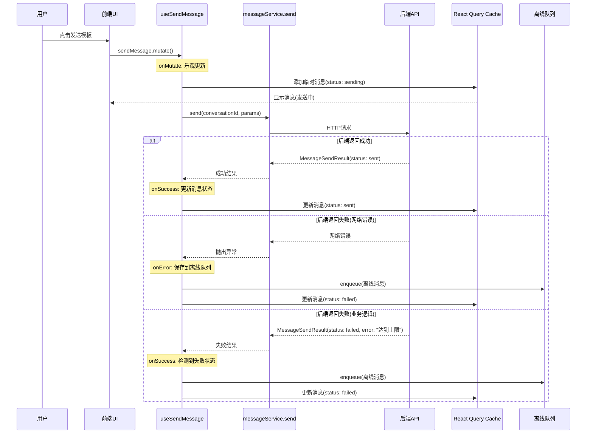
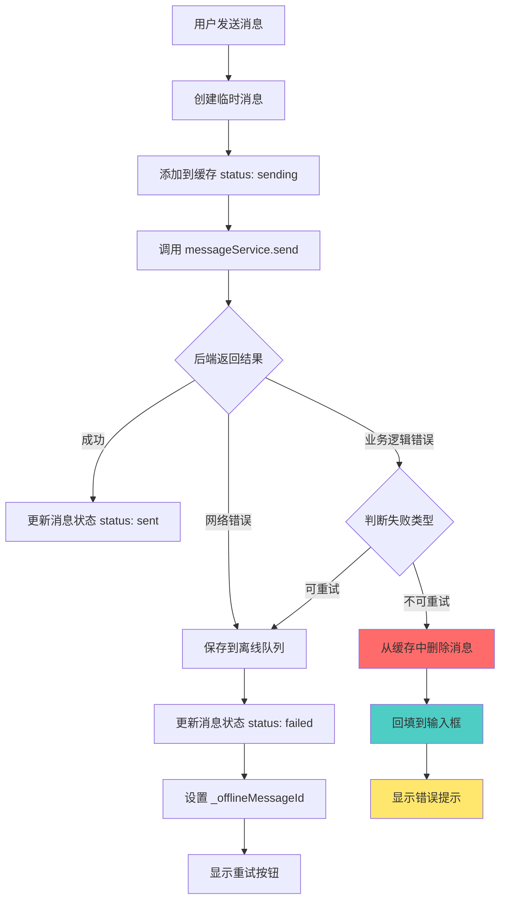

# 模板发送失败恢复设计

## 文档信息

- **创建时间**: 2025-02-09
- **状态**: 设计中
- **版本**: v1.0
- **作者**: Kilo Code

## 问题概述

### 问题1：发送模版失败后，retry 按钮无法点击

**现象描述：**
- 用户发送模板消息后，后端返回失败状态（如达到发送次数上限）
- 前端显示消息发送失败，但重试按钮无法点击或不可见
- 用户无法重新发送失败的消息

**根本原因：**
1. `useSendMessage` hook 在 `onSuccess` 中检测到 `data.status === MessageStatusEnum.Failed` 时，会将消息保存到离线队列
2. 但是消息可能没有正确设置 `_offlineMessageId`，导致 `MessageActions` 组件不显示重试按钮
3. `MessageActions` 组件只在以下条件满足时显示重试按钮：
   - `message.status === MessageStatusEnum.Failed`
   - `message._offlineMessageId` 存在
   - `conversationId` 存在

### 问题2：后台模版发送次数有上限，但到了上限依然可以发送

**现象描述：**
- 后台对模板发送次数有上限限制
- 达到上限后，前端依然可以"发送"消息（乐观更新）
- 刷新页面后，之前发送的消息消失了（因为后端实际没有保存）

**根本原因：**
1. 前端使用乐观更新策略，在发送前就立即在 UI 上显示消息
2. 后端返回失败状态（如达到发送上限），但前端已经显示了消息
3. 刷新页面后，消息从服务端获取，所以之前显示的消息消失了

**两个问题的共同根源：**
前端在发送前就乐观更新显示消息，但后端返回失败状态后，前端没有正确处理这种**业务逻辑失败**（而非网络错误）的情况。

## 现有代码流程分析

### 当前消息发送流程



### 问题点分析

1. **乐观更新的时机不当**：
   - 当前在 `onMutate` 中就添加消息到缓存
   - 无论后端返回成功还是失败，消息都会先显示在 UI 上
   - 对于业务逻辑失败（如达到上限），这种策略不合适

2. **失败处理策略混乱**：
   - 网络错误（`onError`）和业务逻辑失败（`onSuccess` 中检测到失败）都保存到离线队列
   - 但业务逻辑失败（如达到上限）不应该重试，重试也会失败
   - 离线队列应该只用于网络错误，而不是业务逻辑错误

3. **消息回填机制缺失**：
   - 当发送失败时，消息内容没有回填到输入框
   - 用户无法重新编辑或重试发送

## 解决方案设计

### 核心思路

区分两种失败类型，采用不同的处理策略：

1. **网络错误**（可重试）：
   - 保存到离线队列
   - 显示重试按钮
   - 支持手动重试或自动重试

2. **业务逻辑错误**（不可重试）：
   - 撤回消息（从缓存中删除）
   - 将消息内容回填到输入框
   - 显示错误提示
   - 不保存到离线队列

### 方案架构



### 详细实现方案

#### 1. 扩展 MessageSendResult 类型

在 `src/interfaces/message.interface.ts` 中添加失败类型字段：

```typescript
/**
 * 消息发送失败类型
 */
export enum MessageFailureTypeEnum {
  /** 网络错误（可重试） */
  Network = 'network',
  /** 业务逻辑错误（不可重试） */
  BusinessLogic = 'business_logic',
  /** 验证错误（不可重试） */
  Validation = 'validation',
  /** 权限错误（不可重试） */
  Authorization = 'authorization',
  /** 配额错误（不可重试） */
  Quota = 'quota',
}

/**
 * 消息发送结果
 */
export interface MessageSendResult {
  /** 临时消息 ID */
  tempId: string;
  /** 真实消息 ID（服务端返回） */
  messageId?: string;
  /** 发送状态 */
  status: MessageStatusEnum;
  /** 错误信息（如果失败） */
  error?: string;
  /** 错误类型（用于区分可重试和不可重试） */
  errorType?: MessageFailureTypeEnum;
  /** 重试次数 */
  retryCount?: number;
  /** 是否可重试 */
  retryable?: boolean;
}
```

#### 2. 修改 useSendMessage Hook

在 `src/hooks/use-send-message.hook.ts` 中修改 `onSuccess` 回调：

```typescript
onSuccess: async (data, variables, context) => {
  const tempId = context?.tempMessage.tempId;
  if (!tempId) return;

  const isFailed =
    data.status === MessageStatusEnum.Failed || Boolean(data.error);

  if (isFailed) {
    // 判断是否可重试
    const isRetryable = data.retryable ?? 
                        data.errorType === MessageFailureTypeEnum.Network;
    
    if (isRetryable) {
      // 可重试：保存到离线队列
      MessageCacheHelper.updateMessageInCache(
        queryClient,
        variables.conversationId,
        {
          status: MessageStatusEnum.Failed,
          error: data.error,
        },
        undefined,
        tempId,
      );

      if (offlineMessageQueue && context?.tempMessage) {
        try {
          const offlineMessage = offlineMessageQueue.createOfflineMessage(
            context.tempMessage,
            variables.conversationId,
            {
              content: variables.content,
              ...variables.extra,
            },
            MessagePriorityEnum.Normal,
          );

          offlineMessage.error = data.error ?? 'Message send failed';

          await offlineMessageQueue.enqueue(offlineMessage);
        } catch (queueError) {
          console.error('[useSendMessage] 保存到离线队列失败:', queueError);
        }
      }
    } else {
      // 不可重试：撤回消息并回填到输入框
      // 1. 从缓存中删除消息
      MessageCacheHelper.removeMessageFromCache(
        queryClient,
        variables.conversationId,
        undefined,
        tempId,
      );

      // 2. 触发消息回填事件（通过事件总线）
      const event = new CustomEvent('messageSendFailed', {
        detail: {
          conversationId: variables.conversationId,
          content: variables.content,
          templateId: variables.extra?.templateId,
          error: data.error,
        },
      });
      window.dispatchEvent(event);
    }

    return;
  }

  // 成功：更新消息状态
  MessageCacheHelper.updateMessageInCache(
    queryClient,
    variables.conversationId,
    {
      id: data.messageId ?? context?.tempMessage.id,
      status: data.status ?? MessageStatusEnum.Sent,
    },
    undefined,
    tempId,
  );
},
```

#### 3. 创建消息回填 Hook

在 `src/hooks/use-message-rollback.hook.ts` 中创建新 hook：

```typescript
import { useEffect } from 'react';
import type { ComposerToolbarRef } from '@/components/composer/ComposerToolbar';

/**
 * 消息回填 Hook
 *
 * @description
 * 监听消息发送失败事件，将消息内容回填到输入框
 *
 * @param composerRef ComposerToolbar 的 ref
 */
export function useMessageRollback(composerRef: React.RefObject<ComposerToolbarRef>) {
  useEffect(() => {
    const handleMessageSendFailed = (event: CustomEvent) => {
      const { content, templateId } = event.detail;

      // 将消息内容回填到输入框
      composerRef.current?.setValue(content, templateId);
      composerRef.current?.focus();
    };

    // 监听消息发送失败事件
    window.addEventListener('messageSendFailed', handleMessageSendFailed as EventListener);

    return () => {
      window.removeEventListener('messageSendFailed', handleMessageSendFailed as EventListener);
    };
  }, [composerRef]);
}
```

#### 4. 在 DefaultChatLayout 中使用回填 Hook

在 `src/components/layout/DefaultChatLayout.tsx` 中：

```typescript
import { useMessageRollback } from '@/hooks/use-message-rollback.hook';

export function DefaultChatLayout({ ... }) {
  const composerRef = useRef<ComposerToolbarRef>(null);

  // 使用消息回填 hook
  useMessageRollback(composerRef);

  // ... 其他代码
}
```

#### 5. 后端服务实现规范

在宿主应用实现 `IMessageService.send` 方法时，需要正确设置 `MessageSendResult`：

```typescript
class MyMessageService implements IMessageService {
  async send(conversationId: string, params: any): Promise<MessageSendResult> {
    try {
      const response = await fetch('/api/messages', {
        method: 'POST',
        body: JSON.stringify({
          conversationId,
          ...params,
        }),
      });

      const data = await response.json();

      if (!response.ok) {
        // 根据错误类型设置 errorType
        let errorType: MessageFailureTypeEnum;
        let retryable = false;

        if (response.status >= 500) {
          // 服务器错误，可重试
          errorType = MessageFailureTypeEnum.Network;
          retryable = true;
        } else if (response.status === 429) {
          // 配额限制，不可重试
          errorType = MessageFailureTypeEnum.Quota;
          retryable = false;
        } else if (response.status === 403) {
          // 权限错误，不可重试
          errorType = MessageFailureTypeEnum.Authorization;
          retryable = false;
        } else if (response.status === 400) {
          // 验证错误，不可重试
          errorType = MessageFailureTypeEnum.Validation;
          retryable = false;
        } else {
          // 其他业务逻辑错误，不可重试
          errorType = MessageFailureTypeEnum.BusinessLogic;
          retryable = false;
        }

        return {
          tempId: params.tempId,
          status: MessageStatusEnum.Failed,
          error: data.message || '发送失败',
          errorType,
          retryable,
        };
      }

      return {
        tempId: params.tempId,
        messageId: data.id,
        status: MessageStatusEnum.Sent,
      };
    } catch (error) {
      // 网络错误
      return {
        tempId: params.tempId,
        status: MessageStatusEnum.Failed,
        error: error instanceof Error ? error.message : '网络错误',
        errorType: MessageFailureTypeEnum.Network,
        retryable: true,
      };
    }
  }
}
```

### 错误提示优化

在 `ComposerToolbar` 组件中添加错误提示显示：

```typescript
// 在 ComposerToolbar 中添加错误状态
const [sendError, setSendError] = useState<string | null>(null);

// 监听消息发送失败事件
useEffect(() => {
  const handleMessageSendFailed = (event: CustomEvent) => {
    const { error } = event.detail;
    setSendError(error);
    
    // 3秒后自动清除错误提示
    setTimeout(() => {
      setSendError(null);
    }, 3000);
  };

  window.addEventListener('messageSendFailed', handleMessageSendFailed as EventListener);

  return () => {
    window.removeEventListener('messageSendFailed', handleMessageSendFailed as EventListener);
  };
}, []);

// 在 UI 中显示错误提示
{sendError && (
  <div className="bg-error/10 text-error text-sm px-3 py-2 rounded-lg">
    {sendError}
  </div>
)}
```

## 实施计划

### 阶段1：类型定义和接口扩展
- [ ] 在 `src/interfaces/message.interface.ts` 中添加 `MessageFailureTypeEnum`
- [ ] 扩展 `MessageSendResult` 类型，添加 `errorType` 和 `retryable` 字段

### 阶段2：Hook 层修改
- [ ] 修改 `useSendMessage` hook 的 `onSuccess` 回调，区分可重试和不可重试错误
- [ ] 创建 `useMessageRollback` hook

### 阶段3：组件层修改
- [ ] 在 `DefaultChatLayout` 中使用 `useMessageRollback` hook
- [ ] 在 `ComposerToolbar` 中添加错误提示显示

### 阶段4：文档和示例
- [ ] 更新 `IMessageService` 实现示例，展示如何正确设置 `MessageSendResult`
- [ ] 更新错误处理文档

### 阶段5：测试
- [ ] 测试网络错误场景（重试按钮可点击）
- [ ] 测试业务逻辑错误场景（消息撤回并回填）
- [ ] 测试配额限制场景（显示错误提示，不重试）

## 优势分析

1. **清晰的错误分类**：
   - 区分可重试和不可重试错误
   - 避免将业务逻辑错误保存到离线队列

2. **更好的用户体验**：
   - 不可重试错误：消息撤回并回填到输入框，用户可以重新编辑
   - 可重试错误：显示重试按钮，支持手动重试
   - 错误提示清晰，用户知道发生了什么

3. **符合架构原则**：
   - 离线队列只用于网络错误
   - 业务逻辑错误不保存到队列
   - 保持 SDK 的职责边界

4. **向后兼容**：
   - 新增字段都是可选的
   - 如果后端没有设置 `errorType` 和 `retryable`，默认行为与之前一致

## 风险和注意事项

1. **后端实现依赖**：
   - 需要后端正确设置 `MessageSendResult.errorType` 和 `retryable`
   - 如果后端没有设置，默认行为可能与预期不符

2. **事件总线的使用**：
   - 使用 `window` 事件总线可能在某些环境下不可用（如 SSR）
   - 需要考虑使用 SDK 内部的事件系统

3. **输入框状态管理**：
   - 回填消息内容时，需要考虑输入框的当前状态
   - 如果用户正在输入其他内容，回填可能会覆盖

## 替代方案

### 方案A：不使用事件总线，直接在 Hook 中处理

在 `useSendMessage` 中直接调用 `composerRef.current?.setValue()`：

**优点**：
- 不需要事件总线
- 逻辑更集中

**缺点**：
- Hook 需要接收 `composerRef` 作为参数
- 耦合度更高

### 方案B：使用 Zustand Store 管理待回填的消息

在 Store 中添加 `pendingRollbackMessage` 字段：

**优点**：
- 不需要事件总线
- 状态管理更统一

**缺点**：
- 需要修改 Store 结构
- 需要在组件中监听 Store 变化

### 方案C：使用 React Context

创建 `MessageRollbackContext`：

**优点**：
- 符合 React 最佳实践
- 不依赖全局事件

**缺点**：
- 需要创建新的 Context
- 需要在组件树中添加 Provider

## 推荐方案

**推荐使用主方案（事件总线）**，原因：
1. 实现简单，不需要修改 Store 或创建 Context
2. 解耦性好，Hook 和组件之间没有直接依赖
3. 易于测试和维护

如果后续发现事件总线有问题，可以考虑切换到方案B（Zustand Store）。

## 后续优化

1. **错误提示国际化**：
   - 将常见错误消息添加到翻译文件
   - 根据错误类型显示不同的提示

2. **错误分析**：
   - 收集错误统计数据
   - 分析常见错误类型，优化用户体验

3. **智能重试**：
   - 对于某些可重试错误，自动重试
   - 根据错误类型调整重试策略

4. **用户反馈**：
   - 提供用户反馈渠道，报告错误
   - 帮助改进错误处理逻辑
