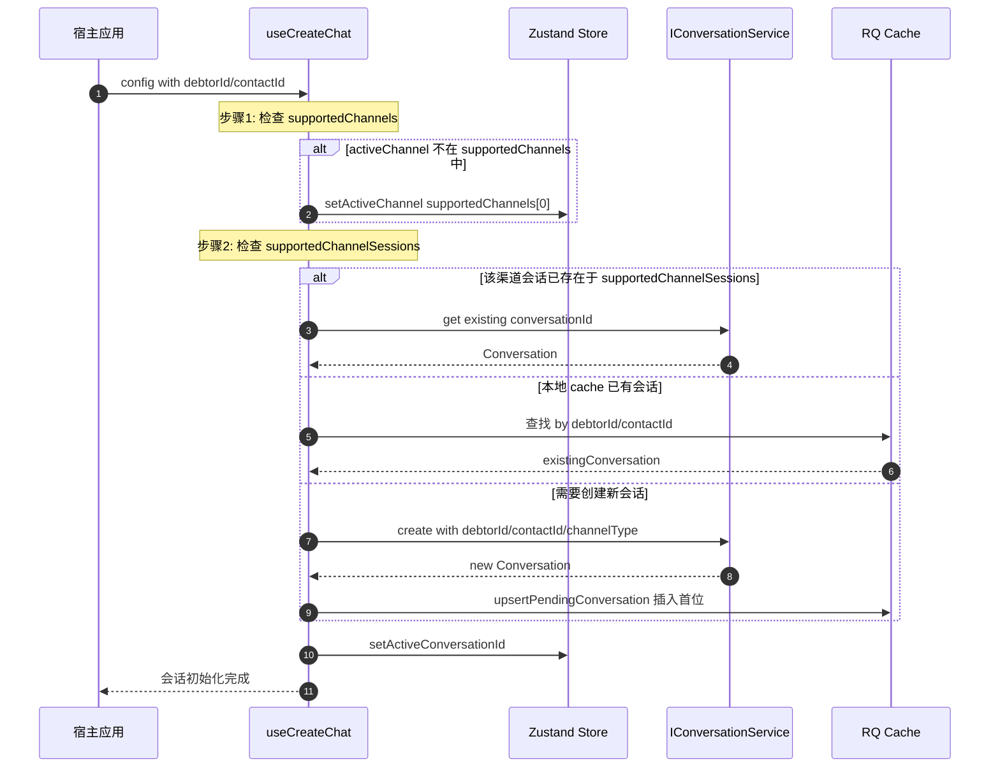

# Conversation 数据流

> 通用宿主集成示例（To-Be）：宿主组件及路径仅用于说明接入方式，不属于当前 SDK 实现（As-Is）。

## system 系统级别打开弹窗

- 渲染 [ConversationList](../src/components/conversation/ConversationList.tsx)，内部执行 [useConversations](../src/hooks/use-conversations.hook.ts) 的 hook 从 IM 获取会话列表
    - 在 useConversations 的 hooks 中获取当前 pending 的客户端会话 pendingConversations
    - 执行 useInfiniteQuery 的 queryFn 调用 conversationService.list 获取服务端会话 serverConversations
    - 最终 conversations 就是合并后的会话 merge(serverConversations, pendingConversations)
    - 而 visibleConversations 就是通过 activeChannel 对 conversations 做 filter 过滤留下对应渠道的会话
- 当切换渠道时，list 渲染对应渠道的数据，并默认渲染该 list 的第一个条会话作为 activeConversationId
- 当 activeConversationId 更新的时候，执行 info 接口，获取会话的 metadata 元数据信息

## customer 用户级别打开弹窗

- 点击 ChatIcon 打开弹窗，HostChatModal 渲染
- HostChatLayout 渲染时调用 useCreateChat hook：
   - useChannelSync: 判断 supportedChannels 是否支持 activeChannel，
     若不支持则 setActiveChannel 更新到 supportedChannels[0]
   - useConversationInitializer: 查找或创建会话
- 会话查找优先级（findExistingConversation）：
   - 优先从 metadata.supportedChannelSessions 查找已存在的会话
     > **注意**：首次打开时 `metadata` 为空（尚未有 `activeConversationId`），此分支不可用。`metadata` 在第一次 create/get 成功后才可用于后续渠道切换。
   - 其次从 RQ pending cache 查找（防止重复创建）
   - 最后从 RQ confirmed cache 查找
- 若找到已存在会话：直接激活（setActiveConversationId）
- 若未找到：执行 create 创建新会话
   - 场景1（全新创建）：传 debtorId/contactId/channelType
   - 场景2（跨渠道）：传 sourceChatId/channelType
- 新会话创建后：
   - 写入 RQ pending cache（ConversationCacheHelper）
   - SDK 的 useConversations 自动合并 pending + server conversations
   - 新会话显示在列表第一位
- 当 activeConversationId 更新时：
   - useConversationMetadata 自动获取会话元数据（声明式）

## System 模式流程图

打开弹窗时的工作台全量会话列表模式。

### 关键实现位置
- System 模式自动激活: [`use-conversation-auto-select.hook.ts`](../src/hooks/use-conversation-auto-select.hook.ts)
  - 受 `strategy.autoSelectFirstConversation` 控制，customer 模式下为 `false`，由 `useConversationInitializer` 管理激活
- channelFilterEnabled 配置: `chat.util.ts:42-43`

---

## Customer 模式流程图

从客户详情页打开特定客户的会话。

### 关键实现位置
- Customer 模式初始化: `create-chat.hook.ts`
- Pending 会话缓存: SDK [`ConversationCacheHelper`](../src/services/cache/conversation-cache-helper.service.ts)

---

