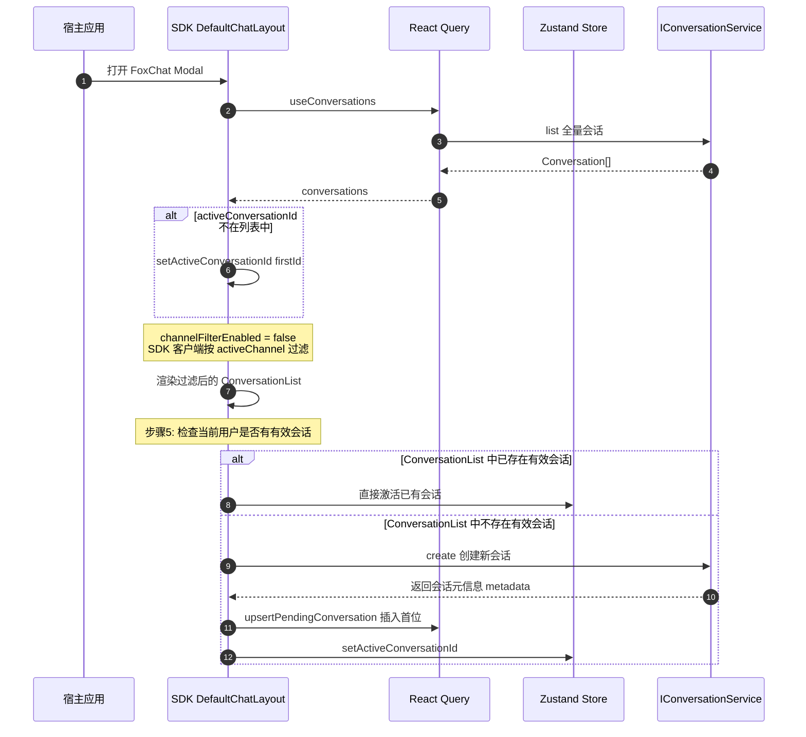
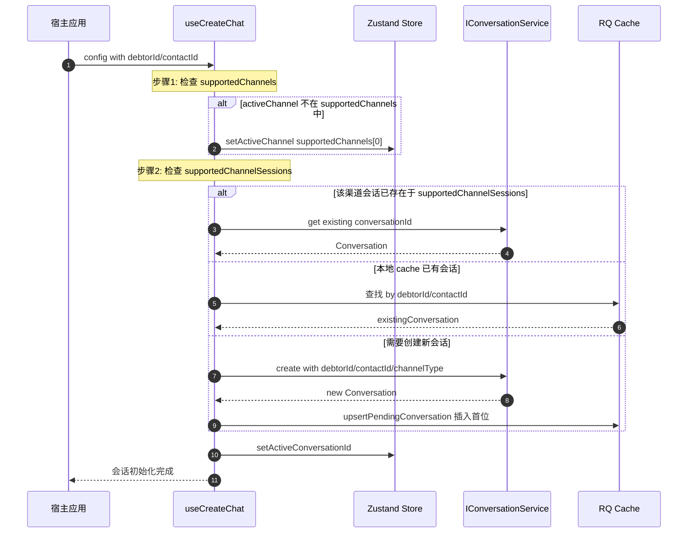

# Conversation 数据流

## 术语说明

| 术语 | 说明 |
|------|------|
| Conversation | 会话对象，包含 id、 user、 lastMessage 皉字段 |
| ConversationList | 会话列表，由 React Query 缓存 |
| activeChannel | 当前激活的渠道类型，存储在 Zustand Store |
| activeConversationId | 当前激活的会话 ID， 存储在 Zustand Store |
| supportedChannels | 会话支持的渠道类型列表 |
| supportedChannelSessions | 各渠道对应的会话信息（chatId + channelType） |
| RQ Cache | React Query 缓存，按 `queryKeys.conversations.list(activeChannel)` 组织 |

## system 系统级别打开弹窗（即初始化进入系统）：

1. 进入系统时，我们调用 Conversation.service.ts 的 list 接口获取所有的 conversation 会话元数据 `conversationList: Conversation[]`
2. 在 ConversationList 获取到列表时候我们拿到会话的第一条数据 firstConversation，获取过程中即 RQ 的 isPending 过程中我们啥都不干
3. 拿到 firstConversation 后我们需要判断是否需要 setActiveConversationId 和 setActiveChannel 更新客户端状态
4. 同时因为 activeChannel 的变更我们需要更新 ConversationList 渲染的会话列表，因为它是按照 activeChannel 过滤的，当切换 activeChannel 的时候也是同样的逻辑，我们需要拿所有的 ConversationList 做按 activeChannel 的 filter 筛选
5. 如果当前用户在 ConversationList 下已存在有效的 conversation 则直接 active，若不存在则调用 ConversationService.create 接口创建基于当前 activeChannel 活跃渠道的会话，它会返回该会话的元信息 metadata，并将该会话临时插入 RQ 的当前渠道 activeChannel 的渠道列表中去并跟现有的渠道列表  RQ Cache 做合并 merge

## customer 用户级别打开弹窗：

1. 调用 ConversationService.create 接口创建基于当前 activeChannel 活跃渠道的会话，它会返回该会话的元信息 metadata，并将该会话临时插入 RQ 的当前渠道 activeChannel 的渠道列表中去并跟现有的渠道列表  RQ Cache 做合并 merge
2. 判断 supportedChannels 是否支持 activeChannel，若不支持则需要 setActiveChannel 更新到 supportedChannels[0] 调整。
3. 判断 supportedChannelSessions 中在该渠道下 activeChannel 是否已存在该会话，若存在则直接走 get 查询会话信息。若不存在则需要执行 create 创建新会话，而重新创建该会话时需要视情况而定传递不同的参数见 [电催接口#3-种场景](./电催接口.md#分成-3-种场景)
4. 当新会话创建成功后走第一条的逻辑，并且插入在会话列表的第一位

---

## System 模式流程图

打开弹窗时的工作台全量会话列表模式。

### 关键实现位置
- System 模式自动激活: [`DefaultChatLayout.tsx:499-504`](../src/components/layout/DefaultChatLayout.tsx)
- channelFilterEnabled 配置: [`chat.util.ts:42-43`](../../fox/fox-admin-ui/packages/components/src/utils/chat.util.ts)

---

## Customer 模式流程图

从客户详情页打开特定客户的会话。

### 关键实现位置
- Customer 模式初始化: [`create-chat.hook.ts`](../../fox/fox-admin-ui/packages/components/src/hooks/create-chat.hook.ts)
- Pending 会话缓存: SDK `ConversationCacheHelper`

---

## 待修复问题

| 问题 | 优先级 | 状态 |
|------|--------|------|
| customer 模式 setActiveChannel 缺失 | 🔴 高 | ✅ 已修复 |
| supportedChannelSessions 判断缺失 | 🟡 中 | ✅ 已修复 |

详见 [`design/conversation-dataflow-review.md`](../design/conversation-dataflow-review.md)