# Bifrost IM 系统客户端接入技术文档

> **版本**: V2.0  
> **最后更新**: 2026-02-09  
> **模型定义模块**: `fox-common-model` (`qsq.fox.common.model.bifrost`)

---

## 目录

- [1. 系统架构](#1-系统架构)
  - [1.1 架构总览](#11-架构总览)
  - [1.2 核心组件职责](#12-核心组件职责)
  - [1.3 数据流转路径](#13-数据流转路径)
  - [1.4 技术栈](#14-技术栈)
- [2. 接入准备](#2-接入准备)
  - [2.1 环境要求](#21-环境要求)
  - [2.2 接入流程总览](#22-接入流程总览)
- [3. 消息协议定义](#3-消息协议定义)
  - [3.1 基础包结构 Packet](#31-基础包结构-packet)
  - [3.2 身份标识 Uid](#32-身份标识-uid)
  - [3.3 协议类型 PType](#33-协议类型-ptype)
  - [3.4 枚举定义](#34-枚举定义)
  - [3.5 各协议 Body 详细定义](#35-各协议-body-详细定义)
  - [3.6 服务端内部消息结构 Message](#36-服务端内部消息结构-message)
  - [3.7 接入点结构 AccessPoint](#37-接入点结构-accesspoint)
  - [3.8 渠道回调消息结构](#38-渠道回调消息结构)
- [4. 业务流程时序图](#4-业务流程时序图)
  - [4.1 连接建立与鉴权](#41-连接建立与鉴权)
  - [4.2 鉴权失败处理](#42-鉴权失败处理)
  - [4.3 心跳保活](#43-心跳保活)
  - [4.4 发送聊天消息](#44-发送聊天消息)
  - [4.5 接收消息与确认](#45-接收消息与确认)
  - [4.6 已读状态上报](#46-已读状态上报)
  - [4.7 多端消息同步](#47-多端消息同步)
  - [4.8 坐席状态切换](#48-坐席状态切换)
  - [4.9 投递失败与离线补偿](#49-投递失败与离线补偿)
  - [4.10 用户登录离线消息推送](#410-用户登录离线消息推送)
  - [4.11 渠道消息回调处理](#411-渠道消息回调处理)
  - [4.12 坐席会话自动移除](#412-坐席会话自动移除)
  - [4.13 外部系统推送消息](#413-外部系统推送消息)
- [5. HTTP 接口文档](#5-http-接口文档)
  - [5.1 消息管理 (Hermod)](#51-消息管理-hermod)
  - [5.2 会话管理 (Hermod)](#52-会话管理-hermod)
  - [5.3 坐席状态管理 (Hermod)](#53-坐席状态管理-hermod)
  - [5.4 消息路由 (Hugin)](#54-消息路由-hugin)
  - [5.5 回调通知 (Hugin)](#55-回调通知-hugin)
- [6. 消息状态映射规则](#6-消息状态映射规则)
- [7. 客户端开发指南](#7-客户端开发指南)
  - [7.1 连接管理](#71-连接管理)
  - [7.2 消息处理](#72-消息处理)
  - [7.3 异常处理](#73-异常处理)
  - [7.4 安全建议](#74-安全建议)
- [8. 常见问题 FAQ](#8-常见问题-faq)

---

## 1. 系统架构

### 1.1 架构总览

```
┌─────────────────────────────────────────────────────────────┐
│                       客户端 (Client)                        │
│              Web / iOS / Android / Gateway                   │
└──────────────────────┬──────────────────────────────────────┘
                       │ WebSocket (JSON)
                       ▼
┌─────────────────────────────────────────────────────────────┐
│                  Heimdall (网关层)                            │
│  ┌────────────┐  ┌────────────┐  ┌────────────────────┐     │
│  │ WebSocket  │  │  鉴权服务   │  │ 心跳 & 连接管理      │     │
│  │  Server    │  │ AuthService│  │ HeartbeatHandler   │     │
│  └─────┬──────┘  └────────────┘  └────────────────────┘     │
│        │ TCP                                                 │
└────────┼────────────────────────────────────────────────────┘
         ▼
┌─────────────────────────────────────────────────────────────┐
│                   Hermod (核心逻辑层)                         │
│  ┌────────────┐  ┌────────────┐  ┌──────────────────┐       │
│  │ 消息路由    │  │ 消息持久化  │  │  离线消息管理     │       │
│  │ & 投递      │  │ MySQL      │  │  Redis Set       │       │
│  └────────────┘  └────────────┘  └──────────────────┘       │
│  ┌────────────┐  ┌────────────┐  ┌──────────────────┐       │
│  │ 会话管理    │  │ 策略处理器  │  │  MQ 消费者        │       │
│  │ ChatService│  │ Strategy   │  │  MessageConsumer  │       │
│  └────────────┘  └────────────┘  └──────────────────┘       │
└─────────────────────────────────────────────────────────────┘
         ▲
         │ Feign / MQ
         ▼
┌─────────────────────────────────────────────────────────────┐
│                   Hugin (业务适配层)                          │
│  ┌────────────┐  ┌────────────────┐  ┌─────────────────┐    │
│  │ 消息处理    │  │ Fox Collect    │  │  外部渠道回调     │    │
│  │ Handler    │  │ 坐席分配        │  │  Callback       │    │
│  └────────────┘  └────────────────┘  └─────────────────┘    │
└─────────────────────────────────────────────────────────────┘
```

### 1.2 核心组件职责

| 组件 | 职责 | 端口/协议 |
|:---|:---|:---|
| **Heimdall** | WebSocket 长连接管理、客户端鉴权、心跳检测、消息推送/接收 | WebSocket + TCP |
| **Hermod** | 消息路由分发、消息持久化(MySQL)、离线消息存储(Redis Set)、会话管理、多端同步 | HTTP + TCP + MQ |
| **Hugin** | 业务适配(Fox Collect)、消息转换、坐席分配、外部渠道回调处理 | HTTP + MQ |

### 1.3 数据流转路径

**上行消息** (客户端发送):
```
客户端 → Heimdall(WebSocket) → Hugin(业务处理) → Hermod(存储/路由) → Heimdall(TCP) → 接收方客户端
```

**下行消息** (服务端推送):
```
Hermod(查找接入点) → Heimdall(TCP投递) → 接收方客户端(WebSocket推送)
```

**离线消息**:
```
投递失败 → MQ → Hermod → Redis Set 存储 → 用户上线 → 批量推送
```

### 1.4 技术栈

| 技术 | 用途 |
|:---|:---|
| Netty | WebSocket/TCP 长连接服务器 |
| Spring Boot | 微服务框架 |
| Spring Cloud OpenFeign | 内部服务调用 |
| Nacos | 服务注册发现 & 配置中心 |
| RabbitMQ | 异步消息队列 |
| Redis | 接入点注册、离线消息(Set)、会话列表(ZSet)、幂等控制 |
| MySQL + MyBatis-Plus | 消息持久化 |

---

## 2. 接入准备

### 2.1 环境要求

- **传输协议**: WebSocket (ws/wss)
- **连接地址**: `ws://{heimdall_host}:{port}/ws`
- **数据格式**: JSON (UTF-8)
- **Token 获取**: 从业务后端系统获取 JWT Token

### 2.2 接入流程总览

```
1. 建立 WebSocket 连接
2. 发送 auth 鉴权包 (携带 Token)
3. 收到 ack 确认 → 鉴权成功
4. 启动心跳定时器 (30s 间隔)
5. 开始收发消息
6. 收到消息后回复 msg_receive_ack
```

---

## 3. 消息协议定义

> 以下协议定义均来自 `fox-common-model` 模块 (`qsq.fox.common.model.bifrost`)

### 3.1 基础包结构 Packet

**Java 类**: `qsq.fox.common.model.bifrost.entity.Packet<T extends Serializable>`

所有客户端与服务端之间的通信都封装在 `Packet` 对象中。

| 字段 | 类型 | 必填 | 默认值 | 说明 |
|:---|:---|:---|:---|:---|
| `id` | String | 是 | - | 客户端生成的 UUID，用于匹配服务端返回的 ACK |
| `upid` | String | 否 | null | 上游消息 ID，用于关联上下文 |
| `chatId` | String | 否 | null | 会话 ID，标识一个对话 |
| `from` | Uid | 是 | - | 发送方身份信息 |
| `to` | Uid | 否 | null | 接收方身份信息（发送消息时必填） |
| `ptype` | PType | 是 | - | 协议类型，决定 body 的结构 |
| `body` | T | 否 | null | 消息体，泛型，根据 ptype 不同而不同 |
| `mid` | long | 否 | 0 | 服务端生成的全局唯一消息 ID（雪花算法） |
| `ver` | String | 是 | "1.0.0" | 协议版本号 |
| `entry` | String | 否 | null | 消息入口标识（见 EntryEnum） |
| `status` | String | 否 | null | 消息状态（见 MessageStatus） |
| `timestamp` | long | 是 | 当前时间 | 毫秒级时间戳 |

**JSON 示例**:
```json
{
  "id": "550e8400-e29b-41d4-a716-446655440000",
  "upid": null,
  "chatId": "session_abc_123",
  "from": { "app": "fox_collect.customer", "pin": "user_001", "clientType": "web", "channelType": "whatsapp" },
  "to": { "app": "fox_collect.waiter", "pin": "agent_001", "clientType": "web", "channelType": "whatsapp" },
  "ptype": "chat_message",
  "body": { "type": "text", "content": "你好", "ext": {} },
  "mid": 0,
  "ver": "1.0.0",
  "entry": null,
  "status": null,
  "timestamp": 1700000000000
}
```

### 3.2 身份标识 Uid

**Java 类**: `qsq.fox.common.model.bifrost.entity.Uid`

| 字段 | 类型 | 必填 | 说明 |
|:---|:---|:---|:---|
| `app` | String | 是 | 应用标识，用于区分不同业务系统 |
| `pin` | String | 是 | 用户唯一账号 |
| `clientType` | ClientType | 是 | 客户端类型 |
| `channelType` | ChannelType | 否 | 渠道类型（业务相关） |

**JSON 示例**:
```json
{
  "app": "fox_collect.customer",
  "pin": "enc_01_12345_678",
  "clientType": "web",
  "channelType": "whatsapp"
}
```

### 3.3 协议类型 PType

**Java 类**: `qsq.fox.common.model.bifrost.enums.PType`

| 枚举值 | 方向 | Body 类型 | 说明 |
|:---|:---|:---|:---|
| `auth` | C → S | `{"token": "..."}` | 鉴权请求 |
| `auth_fail` | S → C | `{"type": "...", "content": {...}}` | 鉴权失败通知 |
| `chat_message` | 双向 | `ChatMessage` | 聊天消息 |
| `ack` | S → C | `Ack` | 服务端确认 |
| `msg_receive_ack` | C → S | `MsgReceiveAck` | 客户端确认收到推送 |
| `msg_read_ack` | C → S | `MsgReadAck` | 已读状态上报 |
| `client_heartbeat` | C → S | 空 | 客户端心跳 |
| `status_switch` | 双向 | `StatusSwitch` | 坐席状态切换 |
| `fox_message_ack` | S → S | `Packet` | 内部消息确认（渠道回调） |

### 3.4 枚举定义

#### 3.4.1 客户端类型 ClientType

**Java 类**: `qsq.fox.common.model.bifrost.enums.ClientType`

| 枚举值 | code | 说明 |
|:---|:---|:---|
| `ios` | ios | iOS 客户端 |
| `android` | android | Android 客户端 |
| `pc` | pc | PC 桌面客户端 |
| `web` | web | Web 浏览器客户端 |
| `gw` | gw | 网关/系统内部调用 |

#### 3.4.2 渠道类型 ChannelType

**Java 类**: `qsq.fox.common.model.bifrost.enums.ChannelType`

| 枚举值 | code | 说明 |
|:---|:---|:---|
| `sms` | sms | 短信渠道 |
| `ivr` | ivr | IVR 语音渠道 |
| `email` | email | 邮件渠道 |
| `whatsapp` | whatsapp | WhatsApp 渠道 |
| `viber` | viber | Viber 渠道 |

#### 3.4.3 消息内容类型 MsgContentType

**Java 类**: `qsq.fox.common.model.bifrost.enums.MsgContentType`

| 枚举值 | 说明 |
|:---|:---|
| `text` | 纯文本消息 |
| `image` | 图片消息 |
| `video` | 视频消息 |
| `audio` | 语音消息 |
| `file` | 文件消息 |
| `template` | 模板消息 |

#### 3.4.4 消息状态 MessageStatus

**Java 类**: `qsq.fox.common.model.bifrost.enums.MessageStatus`

| 枚举值 | code | 说明 |
|:---|:---|:---|
| `UN_SEND` | un_send | 待发送/发送中 |
| `SEND_FAIL` | send_fail | 发送失败 |
| `UN_READ` | un_read | 已送达未读 |
| `READ` | read | 已读 |
| `REVOKE` | revoke | 已撤回 |
| `DELETE` | delete | 已删除 |

#### 3.4.5 坐席状态 AgentStatus

**Java 类**: `qsq.fox.common.model.bifrost.enums.AgentStatus`

| 枚举值 | 说明 |
|:---|:---|
| `offline` | 离线 |
| `ready` | 就绪/在线 |
| `rest` | 休息中 |
| `busy` | 忙碌 |
| `hang_up` | 挂起 |

#### 3.4.6 应用标识 AppEnum

**Java 类**: `qsq.fox.common.model.bifrost.enums.AppEnum`

| 枚举值 | code | 说明 |
|:---|:---|:---|
| `fox_collect_waiter` | fox_collect.waiter | Fox 催收坐席端 |
| `fox_collect_customer` | fox_collect.customer | Fox 催收客户端 |
| `fox_argus_waiter` | fox_argus.waiter | Fox 风控坐席端 |
| `fox_argus_customer` | fox_argus.customer | Fox 风控客户端 |

#### 3.4.7 连接类型 ConnType

**Java 类**: `qsq.fox.common.model.bifrost.enums.ConnType`

| 枚举值 | id | 说明 |
|:---|:---|:---|
| `normal` | 1 | 正常连接 |
| `client_disconnect` | 2 | 客户端异常断开 |
| `client_normal_quit` | 3 | 客户端主动退出 |

#### 3.4.8 消息入口 EntryEnum

**Java 类**: `qsq.fox.common.model.bifrost.enums.EntryEnum`

| 枚举值 | code | 说明 |
|:---|:---|:---|
| `fox_system` | fox.system | 系统入口 |
| `fox_collect_detail` | fox.collect | 催收详情页入口 |
| `fox_telesales_detail` | fox.telesales | 电销详情页入口 |

#### 3.4.9 服务质量 SLA

**Java 类**: `qsq.fox.common.model.bifrost.enums.SLA`

| 枚举值 | 说明 |
|:---|:---|
| `unreliable` | 非可靠投递，不保证送达 |
| `reliable` | 可靠投递，保证送达（离线存储） |

### 3.5 各协议 Body 详细定义

#### 3.5.1 auth — 鉴权请求

**方向**: 客户端 → 服务端

**Body 结构**: Map

| 字段 | 类型 | 必填 | 说明 |
|:---|:---|:---|:---|
| `token` | String | 是 | 业务系统签发的 JWT Token |

**完整 JSON 示例**:
```json
{
  "id": "uuid-auth-001",
  "ptype": "auth",
  "from": {
    "app": "fox_collect.waiter",
    "pin": "agent_001",
    "clientType": "web",
    "channelType": "whatsapp"
  },
  "body": {
    "token": "eyJhbGciOiJIUzI1NiJ9.eyJ1c2VyIjoiYWdlbnRfMDAxIn0.xxxxx"
  },
  "ver": "1.0.0",
  "timestamp": 1700000000000
}
```

#### 3.5.2 auth_fail — 鉴权失败

**方向**: 服务端 → 客户端

**Body 结构**: Map

| 字段 | 类型 | 说明 |
|:---|:---|:---|
| `type` | String | 固定值 "text" |
| `content` | Map | 包含错误信息 |

**完整 JSON 示例**:
```json
{
  "id": "uuid-auth-fail-001",
  "ptype": "auth_fail",
  "from": { "app": "system", "pin": "system" },
  "body": {
    "type": "text",
    "content": { "text": "auth failed" }
  },
  "ver": "1.0.0",
  "timestamp": 1700000001000
}
```

#### 3.5.3 chat_message — 聊天消息

**方向**: 双向

**Java 类**: `qsq.fox.common.model.bifrost.entity.ChatMessage<T>`

| 字段 | 类型 | 必填 | 说明 |
|:---|:---|:---|:---|
| `type` | MsgContentType | 是 | 内容类型: text/image/video/audio/file/template |
| `content` | String | 是 | 消息文本内容或资源 URL |
| `ext` | Object | 否 | 业务自定义扩展数据 |

**发送文本消息示例**:
```json
{
  "id": "uuid-msg-001",
  "ptype": "chat_message",
  "chatId": "session_abc_123",
  "from": { "app": "fox_collect.customer", "pin": "user_001", "clientType": "web", "channelType": "whatsapp" },
  "to": { "app": "fox_collect.waiter", "pin": "agent_001", "clientType": "web", "channelType": "whatsapp" },
  "body": {
    "type": "text",
    "content": "你好，请问逾期还款怎么处理？",
    "ext": {}
  },
  "ver": "1.0.0",
  "timestamp": 1700000010000
}
```

**发送图片消息示例**:
```json
{
  "id": "uuid-msg-002",
  "ptype": "chat_message",
  "chatId": "session_abc_123",
  "from": { "app": "fox_collect.waiter", "pin": "agent_001", "clientType": "web", "channelType": "whatsapp" },
  "to": { "app": "fox_collect.customer", "pin": "user_001", "clientType": "web", "channelType": "whatsapp" },
  "body": {
    "type": "image",
    "content": "https://cdn.example.com/images/repayment_guide.png",
    "ext": { "width": 800, "height": 600, "size": 102400 }
  },
  "ver": "1.0.0",
  "timestamp": 1700000020000
}
```

**接收消息示例** (服务端推送，带 mid):
```json
{
  "id": "uuid-msg-001",
  "ptype": "chat_message",
  "chatId": "session_abc_123",
  "from": { "app": "fox_collect.customer", "pin": "user_001", "clientType": "web", "channelType": "whatsapp" },
  "to": { "app": "fox_collect.waiter", "pin": "agent_001", "clientType": "web", "channelType": "whatsapp" },
  "body": {
    "type": "text",
    "content": "你好，请问逾期还款怎么处理？",
    "ext": {}
  },
  "mid": 4896573,
  "ver": "1.0.0",
  "timestamp": 1700000010000
}
```

#### 3.5.4 ack — 服务端确认

**方向**: 服务端 → 客户端

**Java 类**: `qsq.fox.common.model.bifrost.entity.Ack`

| 字段 | 类型 | 说明 |
|:---|:---|:---|
| `type` | String | 被确认的原始请求的 ptype |

**完整 JSON 示例**:
```json
{
  "id": "uuid-msg-001",
  "ptype": "ack",
  "from": { "app": "system", "pin": "system" },
  "to": { "app": "fox_collect.customer", "pin": "user_001", "clientType": "web", "channelType": "whatsapp" },
  "body": { "type": "chat_message" },
  "mid": 4896573,
  "ver": "1.0.0",
  "timestamp": 1700000010500
}
```

> **重要**: `ack.id` 字段与原始请求的 `id` 一致，客户端应以此匹配本地的待确认消息。

#### 3.5.5 msg_receive_ack — 接收确认

**方向**: 客户端 → 服务端

**Java 类**: `qsq.fox.common.model.bifrost.entity.MsgReceiveAck`

| 字段 | 类型 | 必填 | 说明 |
|:---|:---|:---|:---|
| `mid` | Long | 是 | 确认接收的消息 ID |
| `id` | String | 否 | 原始消息的 Packet ID |
| `app` | String | 否 | 应用标识 |
| `sender` | String | 否 | 原发送者的 pin |
| `chatId` | String | 否 | 会话 ID |
| `timestamp` | Long | 否 | 时间戳 |

**完整 JSON 示例**:
```json
{
  "id": "uuid-ack-001",
  "ptype": "msg_receive_ack",
  "from": { "app": "fox_collect.waiter", "pin": "agent_001", "clientType": "web", "channelType": "whatsapp" },
  "body": {
    "mid": 4896573,
    "id": "uuid-msg-001",
    "app": "fox_collect.customer",
    "sender": "user_001",
    "chatId": "session_abc_123",
    "timestamp": 1700000011000
  },
  "ver": "1.0.0",
  "timestamp": 1700000011000
}
```

#### 3.5.6 msg_read_ack — 已读确认

**方向**: 客户端 → 服务端

**Java 类**: `qsq.fox.common.model.bifrost.entity.MsgReadAck`

| 字段 | 类型 | 必填 | 说明 |
|:---|:---|:---|:---|
| `mid` | Long | 是 | 已读到的最大消息 ID |
| `id` | String | 否 | 原始消息的 Packet ID |
| `app` | String | 否 | 应用标识 |
| `sender` | String | 否 | 发送方 pin |
| `chatId` | String | 是 | 会话 ID |
| `timestamp` | Long | 否 | 时间戳 |

**完整 JSON 示例**:
```json
{
  "id": "uuid-read-001",
  "ptype": "msg_read_ack",
  "from": { "app": "fox_collect.waiter", "pin": "agent_001", "clientType": "web", "channelType": "whatsapp" },
  "body": {
    "mid": 4896573,
    "id": "uuid-msg-001",
    "app": "fox_collect.customer",
    "sender": "user_001",
    "chatId": "session_abc_123",
    "timestamp": 1700000015000
  },
  "ver": "1.0.0",
  "timestamp": 1700000015000
}
```

#### 3.5.7 client_heartbeat — 客户端心跳

**方向**: 客户端 → 服务端

**Body**: 空（null 或不传）

**完整 JSON 示例**:
```json
{
  "id": "uuid-hb-001",
  "ptype": "client_heartbeat",
  "from": { "app": "fox_collect.waiter", "pin": "agent_001", "clientType": "web", "channelType": "whatsapp" },
  "ver": "1.0.0",
  "timestamp": 1700000030000
}
```

#### 3.5.8 status_switch — 坐席状态切换

**方向**: 双向

**Java 类**: `qsq.fox.common.model.bifrost.entity.StatusSwitch`

| 字段 | 类型 | 必填 | 说明 |
|:---|:---|:---|:---|
| `status` | AgentStatus | 是 | 目标状态: offline/ready/rest/busy/hang_up |
| `ext` | String | 否 | 扩展信息（JSON 字符串） |

**完整 JSON 示例**:
```json
{
  "id": "uuid-status-001",
  "ptype": "status_switch",
  "from": { "app": "fox_collect.waiter", "pin": "agent_001", "clientType": "web", "channelType": "whatsapp" },
  "body": {
    "status": "ready",
    "ext": null
  },
  "ver": "1.0.0",
  "timestamp": 1700000050000
}
```

#### 3.5.9 fox_message_ack — 渠道消息回调确认

**方向**: 服务端内部（Hugin → Hermod）

此协议用于外部渠道（SMS/Email/WhatsApp/Viber）的消息状态回调，由 Hugin 发起，Hermod 消费。客户端不直接处理此协议。

**完整 JSON 示例**:
```json
{
  "id": "uuid-fox-ack-001",
  "ptype": "fox_message_ack",
  "from": { "app": "fox_collect.customer", "pin": "user_001", "clientType": "web", "channelType": "sms" },
  "to": { "app": "fox_collect.waiter", "pin": "agent_001", "clientType": "web", "channelType": "sms" },
  "body": {
    "type": "text",
    "content": "回复内容",
    "ext": {
      "id": 36,
      "type": "sms",
      "service": "msgsvr",
      "channel": "AbroadYXMC",
      "content": { "sendId": "111", "sendResult": "REPLIED", "smsContent": "..." }
    }
  },
  "mid": 4896573,
  "ver": "1.0.0",
  "timestamp": 1700000060000
}
```

### 3.6 服务端内部消息结构 Message

**Java 类**: `qsq.fox.common.model.bifrost.entity.Message`

此结构用于 Hermod 内部消息路由，客户端无需直接处理，但了解有助于理解系统行为。

| 字段 | 类型 | 默认值 | 说明 |
|:---|:---|:---|:---|
| `id` | String | - | 消息唯一 ID，对应 Packet 的 id |
| `sla` | SLA | - | 服务质量等级: unreliable / reliable |
| `data` | Serializable | - | 消息载体（Packet 对象） |
| `mid` | long | 0 | 全局唯一消息 ID |
| `from` | Uid | - | 发送方 |
| `chaInfo` | Object | null | 透传业务信息（如坐席分配详情） |
| `tos` | Set\<Uid\> | 空集合 | 接收方列表 |
| `channels` | Set\<String\> | 空集合 | 目标投递 Channel ID 列表 |
| `status` | MessageStatus | UN_SEND | 消息状态 |
| `needSyncSender` | boolean | true | 是否需要向发送方的其他端同步 |
| `syncSenderChatList` | boolean | true | 是否同步发送方的会话列表 |
| `syncReceiverChatList` | boolean | false | 是否同步接收方的会话列表 |
| `storeOffline` | boolean | false | 投递失败后是否存储离线消息 |
| `chatId` | String | null | 会话 ID |
| `ext` | String | null | 扩展字段 |
| `timestamp` | Long | 当前时间 | 毫秒时间戳 |
| `deliver` | boolean | true | 是否需要实时投递（false 则仅存储） |

### 3.7 接入点结构 AccessPoint

**Java 类**: `qsq.fox.common.model.bifrost.entity.AccessPoint`

| 字段 | 类型 | 说明 |
|:---|:---|:---|
| `position` | String | 接入服务器位置标识，格式: `im-bifrost-{ip}-{port}` |
| `clientType` | ClientType | 客户端类型 |
| `channelId` | Long | Netty Channel ID |
| `expireTime` | Long | 过期时间戳 |
| `clientVersion` | String | 客户端版本号 |
| `machineRoom` | String | 所在机房 |
| `clientIp` | String | 客户端 IP 地址 |
| `deviceId` | String | 设备 ID |
| `connType` | Integer | 连接类型: 1=正常, 2=断开, 3=主动退出 |

### 3.8 渠道回调消息结构

当外部渠道（SMS/Email/WhatsApp/Viber）回调消息状态时，消息 Body 中的 `ext.content` 字段为以下结构之一：

#### 3.8.1 SMS 回调 (SmsResultDTO)

**Java 类**: `qsq.fox.common.model.bifrost.entity.message.SmsResultDTO`

| 字段 | 类型 | 说明 |
|:---|:---|:---|
| `sendId` | String | 发送 ID |
| `sendResult` | String | 发送结果: PROCESSING/SUBMIT_SUCCESS/SUBMIT_FAIL/DELIVER_SUCCESS/DELIVER_FAIL/REPLIED |
| `smsContent` | String | 短信内容 |
| `failReason` | String | 失败原因 |
| `extendInfo` | SmsResultExtendInfoDTO | 扩展信息 |

**SmsResultExtendInfoDTO**:
| 字段 | 类型 | 说明 |
|:---|:---|:---|
| `replyTime` | String | 回复时间（毫秒时间戳字符串） |
| `replyContent` | String | 回复内容 |
| `smsPort` | String | 短信端口 |

#### 3.8.2 Email 回调 (EmailResultDTO)

**Java 类**: `qsq.fox.common.model.bifrost.entity.message.EmailResultDTO`

| 字段 | 类型 | 说明 |
|:---|:---|:---|
| `sendId` | String | 发送 ID |
| `sendResult` | String | 发送结果: PROCESSING/SUBMIT_SUCCESS/SUBMIT_FAIL/DELIVER_SUCCESS/DELIVER_FAIL/RECEIVER_OPENED/REPLIED |
| `emailContent` | String | 邮件内容 |
| `errorCode` | String | 错误码 |
| `errorMsg` | String | 错误信息 |
| `extendInfo` | EmailResultExtendInfoDTO | 扩展信息 |

**EmailResultExtendInfoDTO**:
| 字段 | 类型 | 说明 |
|:---|:---|:---|
| `subject` | String | 邮件主题 |
| `from` | String | 发件人 |
| `sentDate` | Date | 发送时间 |
| `contentType` | EmailMimeTypeEnum | MIME 类型: PLAIN/HTML/NOT_SUPPORT |
| `content` | String | 邮件正文 |

#### 3.8.3 WhatsApp 回调 (WhatsappResultDTO)

**Java 类**: `qsq.fox.common.model.bifrost.entity.message.WhatsappResultDTO`

| 字段 | 类型 | 说明 |
|:---|:---|:---|
| `msgId` | String | 消息 ID |
| `channel` | String | 渠道标识 |
| `service` | String | 服务标识 |
| `senderId` | String | 发送者 ID |
| `receiverId` | String | 接收者 ID |
| `actionType` | Integer | 操作类型 |
| `chatType` | Integer | 聊天类型 |
| `supplierMessageStatus` | String | 供应商消息状态 |
| `supplierSubMessageStatus` | String | 供应商子状态 |
| `messageStatus` | Integer | 消息状态: 1=待上报, 2=上报失败, 3=已上报, 4=失败, 5=已送达, 6=已读, 7=已回复 |
| `content` | String | 消息内容 |
| `contentType` | Integer | 内容类型 |
| `sendTime` | Date | 发送时间 |
| `messageUid` | String | 消息唯一标识 |
| `readAt` | Date | 阅读时间 |
| `remark` | String | 备注 |

#### 3.8.4 Viber 回调 (ViberResultDTO)

**Java 类**: `qsq.fox.common.model.bifrost.entity.message.ViberResultDTO`

结构与 `WhatsappResultDTO` 完全一致，字段定义相同。

#### 3.8.5 通用回调包装 (MessageResultDTO)

**Java 类**: `qsq.fox.common.model.bifrost.entity.message.MessageResultDTO<T>`

| 字段 | 类型 | 说明 |
|:---|:---|:---|
| `id` | Long | 记录 ID |
| `type` | String | 消息类型: sms/email/whatsapp/viber |
| `merchant` | String | 业务域 (JSON 字段名: domain) |
| `service` | String | 服务标识 |
| `channel` | String | 渠道标识 |
| `template` | String | 模板名称 |
| `receiver` | String | 接收者标识 |
| `requestKey` | String | 请求唯一 Key |
| `resultNo` | String | 结果编号 |
| `businessData` | String | 业务数据 (JSON 字符串) |
| `pushFailReason` | String | 推送失败原因 |
| `createAt` | Date | 创建时间 |
| `content` | T | 具体回调内容（SmsResultDTO/EmailResultDTO 等） |

---

## 4. 业务流程时序图

### 4.1 连接建立与鉴权

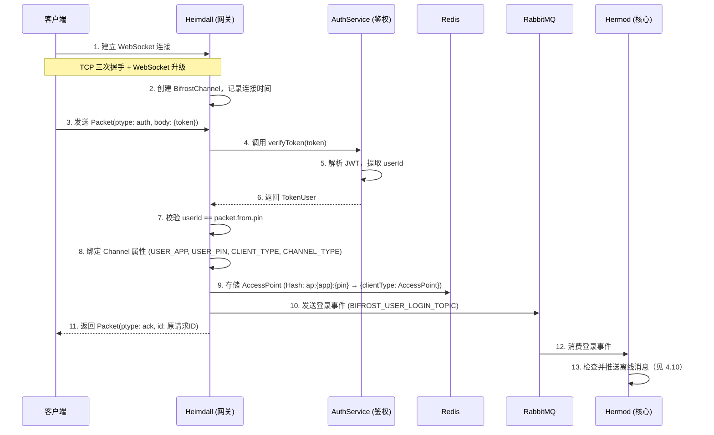

### 4.2 鉴权失败处理

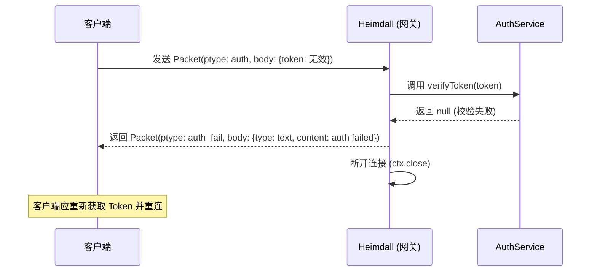

### 4.3 心跳保活

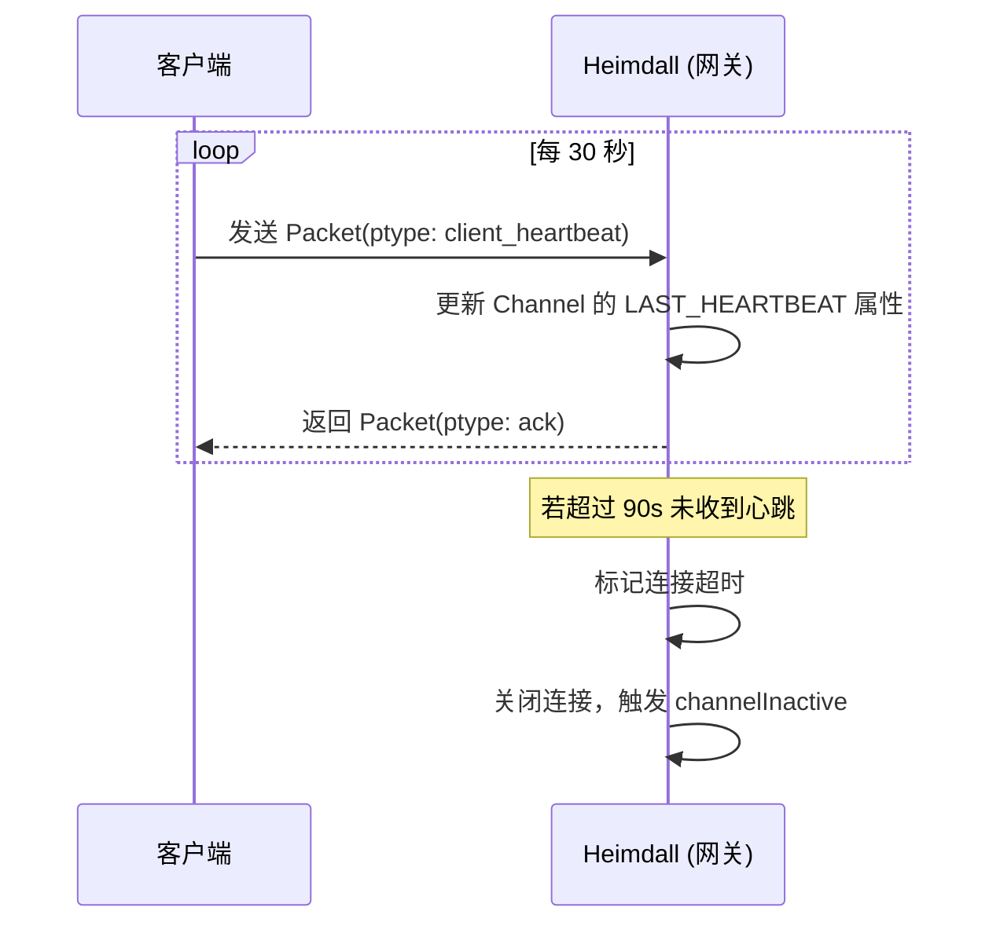

### 4.4 发送聊天消息

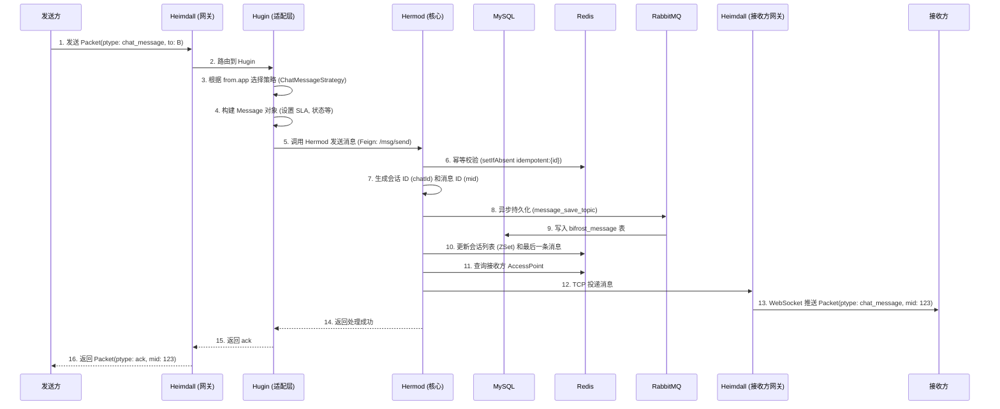

### 4.5 接收消息与确认

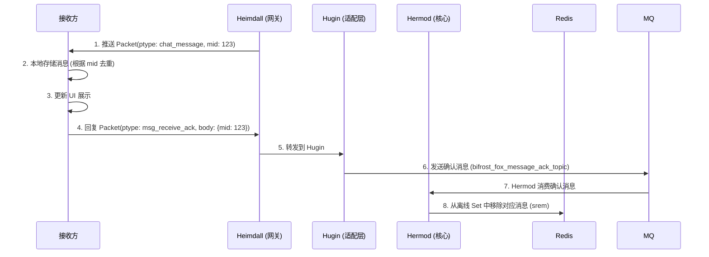

### 4.6 已读状态上报

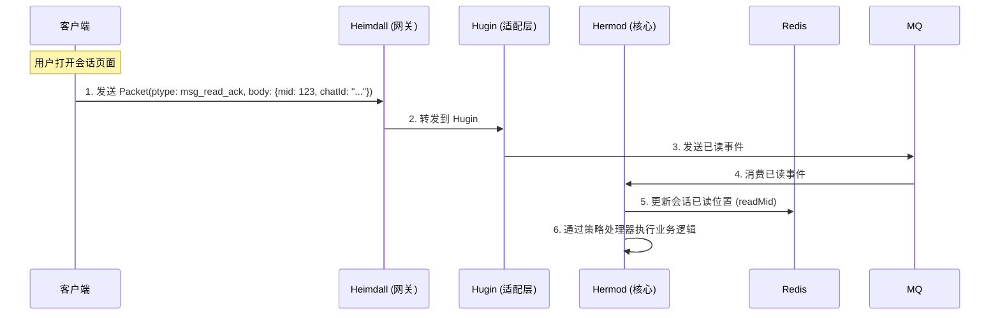

### 4.7 多端消息同步

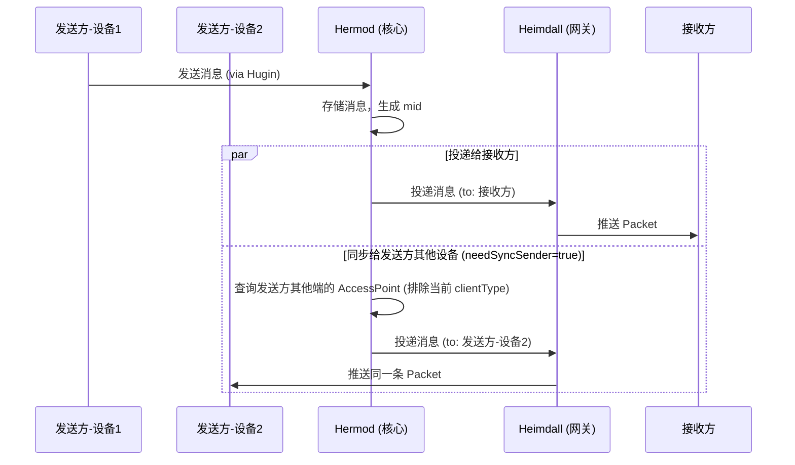

### 4.8 坐席状态切换

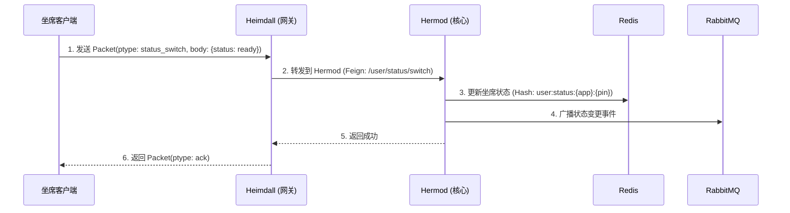

### 4.9 投递失败与离线补偿

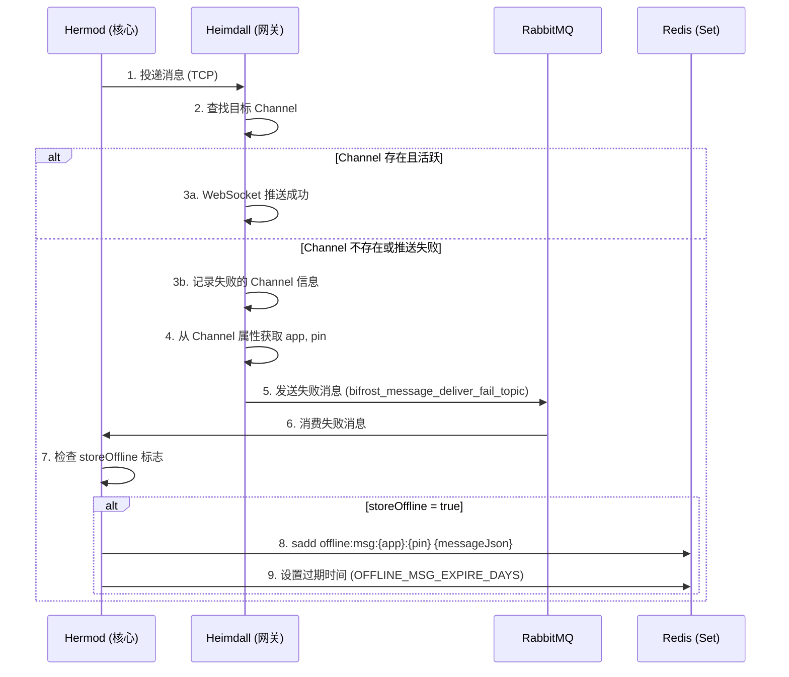

### 4.10 用户登录离线消息推送

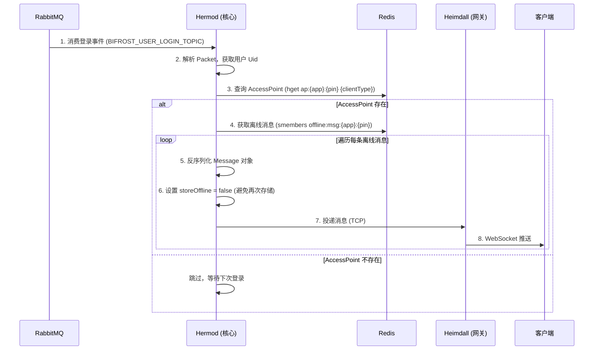

### 4.11 渠道消息回调处理

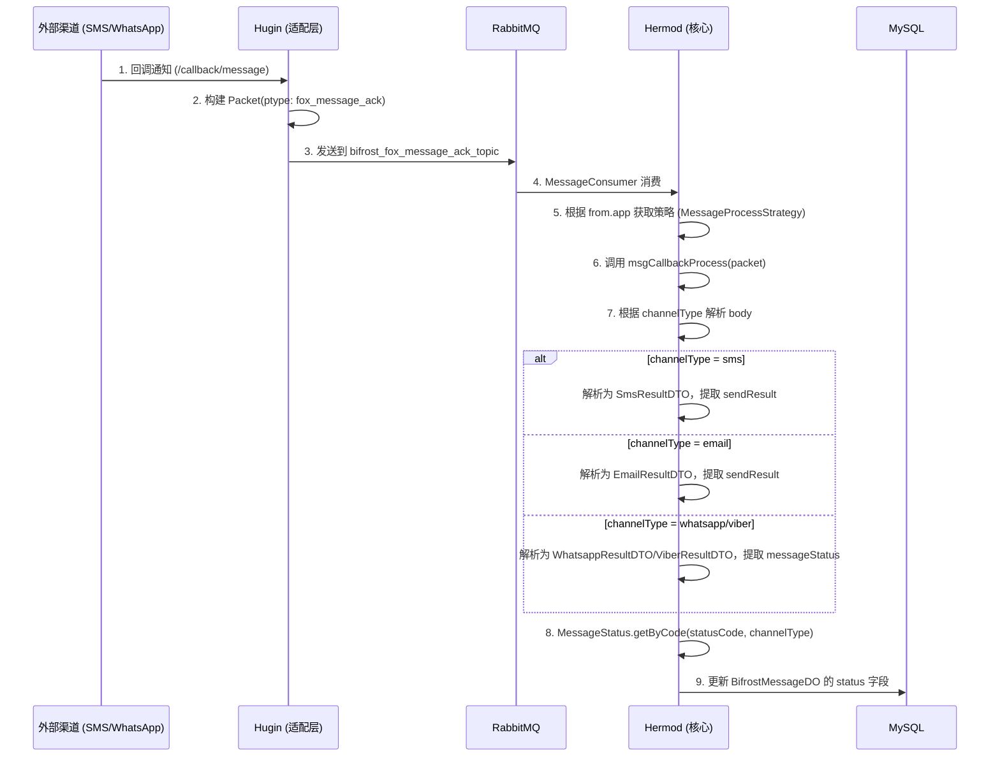

### 4.12 坐席会话自动移除

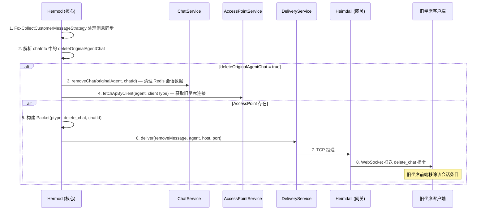

### 4.13 外部系统推送消息

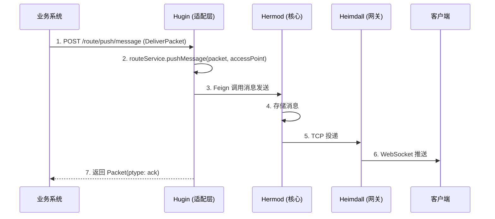

---

## 5. HTTP 接口文档

### 5.1 消息管理 (Hermod)

**基础路径**: `/msg`

#### 5.1.1 获取消息详情

- **URL**: `GET /msg/{id}`
- **参数**:
  | 参数 | 位置 | 类型 | 说明 |
  |:---|:---|:---|:---|
  | `id` | Path | String | 消息 ID |
- **响应**: `Packet` 对象
- **示例**:
  ```json
  // Response
  {
    "id": "uuid-001",
    "mid": 4896573,
    "chatId": "session_abc_123",
    "from": { "app": "fox_collect.customer", "pin": "user_001", "clientType": "web" },
    "to": { "app": "fox_collect.waiter", "pin": "agent_001", "clientType": "web" },
    "ptype": "chat_message",
    "body": { "type": "text", "content": "你好" },
    "ver": "1.0.0",
    "status": "un_read",
    "timestamp": 1700000010000
  }
  ```

#### 5.1.2 发送消息

- **URL**: `POST /msg/send`
- **Content-Type**: `application/json`
- **请求体**: `Message` 对象
- **示例**:
  ```json
  // Request
  {
    "id": "uuid-001",
    "sla": "reliable",
    "data": { /* Packet 对象 */ },
    "from": { "app": "fox_collect.customer", "pin": "user_001", "clientType": "web" },
    "tos": [{ "app": "fox_collect.waiter", "pin": "agent_001", "clientType": "web" }],
    "storeOffline": true,
    "deliver": true
  }
  ```
- **响应**: 无返回体（HTTP 200 表示成功）

#### 5.1.3 删除消息

- **URL**: `DELETE /msg/delete`
- **参数**:
  | 参数 | 位置 | 类型 | 说明 |
  |:---|:---|:---|:---|
  | `mid` | Query | Long | 消息 ID |
  | `sessionId` | Query | String | 会话 ID |
- **响应**: 无返回体（HTTP 200 表示成功）

### 5.2 会话管理 (Hermod)

**基础路径**: `/chat`

#### 5.2.1 获取会话列表

- **URL**: `POST /chat/list`
- **Content-Type**: `application/json`
- **请求体**:
  | 字段 | 类型 | 必填 | 默认值 | 说明 |
  |:---|:---|:---|:---|:---|
  | `app` | String | 是 | - | 应用标识 |
  | `pin` | String | 是 | - | 用户 pin |
  | `current` | Integer | 否 | 1 | 当前页码 |
  | `pageSize` | Integer | 否 | 20 | 每页条数 |
- **响应**: `ResResult<List<ChatLog>>`
  ```json
  {
    "code": 200,
    "data": [
      {
        "sid": "session_abc_123",
        "app": "fox_collect.waiter",
        "pin": "agent_001",
        "name": "坐席张三",
        "newUnreadCount": true,
        "time": 1700000010000,
        "lastMid": 4896573,
        "readMid": 4896570,
        "lastMessage": { /* Packet 对象 */ }
      }
    ]
  }
  ```

#### 5.2.2 获取会话消息列表

- **URL**: `POST /chat/messages`
- **Content-Type**: `application/json`
- **请求体**:
  | 字段 | 类型 | 必填 | 默认值 | 说明 |
  |:---|:---|:---|:---|:---|
  | `app` | String | 是 | - | 应用标识 |
  | `chatId` | String | 是 | - | 会话 ID |
  | `timestamp` | Long | 否 | 当前时间 | 查询起点时间戳（用于分页） |
  | `current` | Integer | 否 | 1 | 当前页码 |
  | `pageSize` | Integer | 否 | 20 | 每页条数 |
- **响应**: `ResResult<List<Packet>>`
  ```json
  {
    "code": 200,
    "current": 1,
    "data": [
      {
        "id": "uuid-001",
        "mid": 4896573,
        "ptype": "chat_message",
        "body": { "type": "text", "content": "你好" },
        "timestamp": 1700000010000
      }
    ]
  }
  ```

### 5.3 坐席状态管理 (Hermod)

**基础路径**: `/user`

#### 5.3.1 坐席状态切换

- **URL**: `POST /user/status/switch`
- **Content-Type**: `application/json`
- **请求体**: `Packet<StatusSwitch>`
  ```json
  {
    "id": "uuid-status-001",
    "ptype": "status_switch",
    "from": { "app": "fox_collect.waiter", "pin": "agent_001", "clientType": "web" },
    "body": { "status": "ready", "ext": null },
    "timestamp": 1700000050000
  }
  ```
- **响应**: 无返回体（HTTP 200 表示成功）

### 5.4 消息路由 (Hugin)

**基础路径**: `/route`

#### 5.4.1 外部推送消息

- **URL**: `POST /route/push/message`
- **Content-Type**: `application/json`
- **请求体**: `DeliverPacket`
  | 字段 | 类型 | 说明 |
  |:---|:---|:---|
  | `packet` | Packet | 消息包 |
  | `message` | Message | 消息路由信息 |
  | `accessPoint` | AccessPoint | 目标接入点 |
- **响应**: `Packet<Ack>`

#### 5.4.2 内部推送消息

- **URL**: `POST /route/inner/push/message`
- **Content-Type**: `application/json`
- **请求体**: `Packet<?>` 对象
- **响应**: `ResResult<?>`

### 5.5 回调通知 (Hugin)

**基础路径**: `/callback`

#### 5.5.1 消息回调

- **URL**: `POST /callback/message`
- **说明**: 接收外部渠道（SMS/Email/WhatsApp/Viber）的消息状态回调
- **响应**: `ResResult<?>`

---

## 6. 消息状态映射规则

各渠道原始状态 → Bifrost 统一 `MessageStatus` 的映射关系：

### 6.1 SMS 渠道

| 渠道原始状态 (SmsResultEnum) | Bifrost 状态 (MessageStatus) |
|:---|:---|
| `PROCESSING` | `UN_SEND` |
| `SUBMIT_SUCCESS` | `UN_SEND` |
| `SUBMIT_FAIL` | `SEND_FAIL` |
| `DELIVER_SUCCESS` | `UN_READ` |
| `DELIVER_FAIL` | `SEND_FAIL` |
| `REPLIED` | `READ` |

### 6.2 Email 渠道

| 渠道原始状态 (EmailResultEnum) | Bifrost 状态 (MessageStatus) |
|:---|:---|
| `PROCESSING` | `UN_SEND` |
| `SUBMIT_SUCCESS` | `UN_SEND` |
| `SUBMIT_FAIL` | `SEND_FAIL` |
| `DELIVER_SUCCESS` | `UN_READ` |
| `DELIVER_FAIL` | `SEND_FAIL` |
| `RECEIVER_OPENED` | `READ` |
| `REPLIED` | `READ` |

### 6.3 WhatsApp / Viber 渠道

| 渠道原始状态 (MessageChatRecordMessageStatusEnum) | code | Bifrost 状态 |
|:---|:---|:---|
| `UNKNOWN` | -1 | `SEND_FAIL` |
| `PENDING_REPORT` | 1 | `UN_SEND` |
| `REPORT_FAILED` | 2 | `SEND_FAIL` |
| `REPORTED` | 3 | `UN_SEND` |
| `FAILED` | 4 | `SEND_FAIL` |
| `SENT_UNREAD` | 5 | `UN_READ` |
| `READ` | 6 | `READ` |
| `REPLIED` | 7 | `READ` |

---

## 7. 客户端开发指南

### 7.1 连接管理

1. **指数退避重连**: 连接断开后按 1s, 2s, 4s, 8s, 16s, 32s, 64s 间隔重连，上限 64s。
2. **心跳频率**: 每 30 秒发送一次 `client_heartbeat`。
3. **Token 刷新**: 收到 `auth_fail` 后，应重新从业务后端获取 Token 并重新连接。

### 7.2 消息处理

1. **消息去重**: 以 `mid` 为唯一键进行去重，防止网络抖动导致的重复推送。
2. **消息排序**: 离线消息存储在 Redis Set（无序），接收后需按 `timestamp` 或 `mid` 升序排列。
3. **ACK 必须回复**: 收到 `chat_message` 推送后，**必须**回复 `msg_receive_ack`，否则消息将始终保留在离线队列。
4. **发送超时**: 发送消息后若 5 秒内未收到 `ack`，标记为发送失败，支持用户手动重发。

### 7.3 异常处理

| 场景 | 处理方式 |
|:---|:---|
| WebSocket 连接断开 | 启动指数退避重连 |
| auth 超时无 ack | 断开并重连 |
| 发送消息无 ack | UI 显示发送失败，支持重发 |
| 收到未知 ptype | 忽略该消息，打印日志 |
| body 解析失败 | 忽略该消息，打印日志 |

### 7.4 安全建议

- **Token 安全**: Token 不应明文存储在客户端本地，建议使用安全存储（如 Keychain / SharedPreferences 加密模式）。
- **传输加密**: 生产环境建议使用 `wss://` (WebSocket over TLS)。
- **敏感信息**: 消息 `body.content` 中的敏感内容建议在业务层进行端到端加密。

---

## 8. 常见问题 FAQ

**Q1: 为什么连接成功后立即被断开？**
> 连接建立后未在规定时间内发送 `auth` 包，或 Token 无效导致鉴权失败。

**Q2: 为什么每次登录都收到重复的旧消息？**
> 客户端收到消息后没有回复 `msg_receive_ack`，服务端认为投递失败，消息保留在 Redis 离线 Set 中。

**Q3: 为什么发送消息后对方收不到？**
> 检查 `to` 字段中的 `app` 和 `pin` 是否正确；检查接收方是否在线（有 AccessPoint）；检查消息的 `deliver` 标志是否为 `true`。

**Q4: 多设备登录时消息如何同步？**
> 当 `Message.needSyncSender = true` 时，发送方的其他已登录设备（不同 clientType）也会收到该消息推送。

**Q5: 离线消息有效期是多久？**
> 由 `Constants.OFFLINE_MSG_EXPIRE_DAYS` 配置，超过有效期后 Redis 自动删除。

---

> **文档结束**
