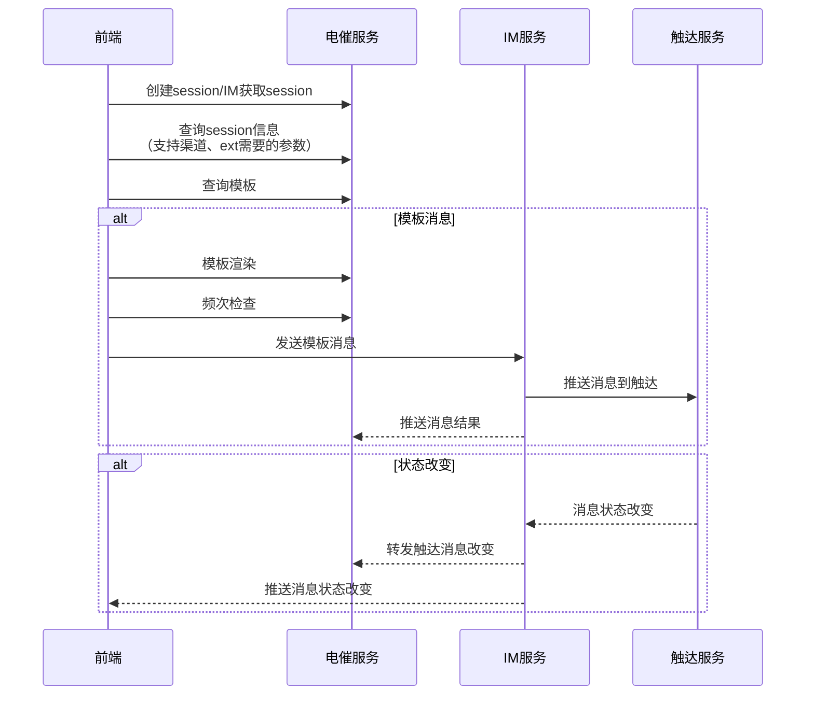

# 电催接口

实时文档地址见 https://kylith.atlassian.net/wiki/spaces/m78rqGL1Q4UV/pages/428148375

## 查询session （IM上行消息查询session）

```
POST: /chat/v2/session/query
request: {
  "chatId": "", // session id
  "customerPin": "" // 客户号码
  "channel": "" // 渠道
}
response: {
  "code": 0,
  "message": "",
  "data": {
    "chatId": "", // session id
    "agentPin": "", // 坐席id
    "lastAgentPin": "", // 最近一次坐席id
    "customerPin": "", // 客户号码
    "customerEncName": "",
    "customerName": "",
    "debtorId": 0, // 债务id
    "assetItemNumber": "", // 资产编号
    "supportedChannels": [],
    "assetFromApp": "",
    "tag": "",
    "uplinkSmsFreeTemplate": "",
    "emailFreeTemplate": "",
    "viberFreeTemplate": "",
    "whatsappFreeTemplate": ""
  }
}
```

## 推送消息 （IM推送消息记录）

```
POST: /chat/v2/result/notify
request: {
    "id": "123", // 发起方生成 uuid
    "mid": "234234", // 投递服务生成消息服务端 id
    "upid" : "234234" // 上一条消息id
    "from": { // 发送人 
        "app": "fox_collect.waiter", // 租户
        "pin": "123323",  // 用户/UID/电话/邮箱 
        "clientType" : "pc", // 可选字段，设备类型
        "channelType": "SMS", // 渠道
    },
    "to": {  // 接收人
        "app": "im.waiter", // 租户
        "pin": "13214", // 用户/UID/电话/邮箱 
        "clientType" : "pc", // 可选字段
        "channelType": "WhatsApp", // 渠道
    },
    "ptype" : "CHAT_MESSAGE", // 消息类型
    "body": {
       // 消息内容， 约定的消息格式，自定义消息，
       // 消息内容，提供固定几个模版， ack/ 撤回 这些是固定消息格式
    },
    "ver": "1.0", // 协议版本
    "timestamp": "124324242"， // 服务端生成时间戳
    "entry": "", // SDK 入口(枚举)：fox.system, fox.collect 电催详情, fox.telesales 电销
    "chatId" : "" // 会话id
}
```

~~## 创建session （前端获取session）~~

2026-03-16 已去除，改为全部是用 info 接口

```
POST: /chat/v2/session/create
request: {
  "debtorId": 0,
  "contactId": 0,
  "channelType": ""
}
response: {
  "code": 0,
  "message": "",
  "data": {
    "chatId": "",
    "agentPin": "",
    "lastAgentPin": "",
    "customerPin": "",
    "customerEncName": "",
    "customerName": "",
    "debtorId": 0,
    "assetItemNumber": "",
    "channelType": "",
    "relation": "", // 关系
    "supportedChannels": [{
      "chatId": "",
      "channelType": ""
    }],
    "assetFromApp": "",
    "tag": "",
    "uplinkSmsFreeTemplate": "",
    "emailFreeTemplate": "",
    "viberFreeTemplate": "",
    "whatsappFreeTemplate": ""
  }
}
```

## 查询模板 （前端查询模板列表）

```
POST: /chat/v2/template/query
request: {
  "chatId": "",
  "channelType": ""
}
response: {
  "code": 0,
  "message": "",
  "data": [
     {
     "id": 0, // 模板id
     "name": "", // 模板名称
     "code": "", // 模板code
     "content": "", // 模板内容（前端直接渲染 content）
     "previewContent": "", // 消息预览
     "language": "" // 模板预览
     }
  ]
}
```

## 发送消息check （前端发送消息前频次检查）

```
POST: /chat/v2/message/check
request: {
  "id": "", // 消息唯一id
  "chatId": "", // session id
  "channelType": "", // 渠道
  "type": "", // 消息类型 template/custom
  "clientType": "", // IM客户端类型
  "template": "" // 模板code
}
response: {
  "code": 0,
  "message": "",
  "data": true
}
```

## 发送消息（前端发送模板消息）

```
POST: /chat/v2/message/send
request: {
  "id": "", // 消息唯一id
  "chatId": "", // session id
  "channelType": "", // 渠道
  "type": "", // 消息类型 template/custom
  "clientType": "", // IM客户端类型
  "template": "" // 模板code
}
response: {
  "code": 0,
  "message": "",
  "data": true
}
```

## 模板渲染（前端）

1. 点击模版之后，调用这个接口获取 previewContent 并渲染到前端
2. 需要将模版参数 params 拼接到 pacakge.body.ext 字段中去

```
POST /chat/v2/template/render
request: {
  "chatId": "",
  "channelType": "",
  "template": ""
}
response: {
  "code": 0,
  "message": "",
  "data": {
    "id": 0, // 模板id
    "name": "", // 模板名称
    "code": "", // 模板code
    "content": "", // 模板内容
    "previewContent": "", // 参数替换后的模板内容
    "params": {} // 模板参数
  }
}
```

## 支持渠道（前端）

1. 需要支持哪些渠道
2. 消息模版的基础数据

### 分成 3 种场景：

1. 点击 FoxChatIcon 创建会话，传 debtorId/contactId/channelType，获取 chatId
2. 在会话列表点击切换会话时，查询当前已有的会话信息，只传 chatId
3. 在当前会话切换渠道时创建会话，传 sourceChatId/channelType

```
POST /chat/v2/session/info
request: {
  chatId": "", // 查询当前已有的会话信息，才传这个 ID
  "sourceChatId": "", // 上一轮渠道创建的会话 ID，即来源 ID
  "debtorId": 0, // 债务 ID
  "contactId": 0, // 联系人 ID
  "channelType": "sms" // 渠道类型
}
response: {
  "code": 0,
  "message": "",
  "data": {
    "chatId": "", // chat id
    "agentPin": "", // 坐席id
    "lastAgentPin": "", // 上一条消息坐席id
    "customerPin": "", // 客户手机号
    "customerEncName": "", // 联系人加密姓名
    "customerName": "", // 联系人姓名
    "debtorId": 0, // 债务id
    "relation": "", // 关系
    "assetItemNumber": "", // 资产编号
    "supportedChannels": [{
      "chatId": "",
      "channelType": ""
    }], // 支持渠道
    "assetFromApp": "", // app包
    "tag": "", // sms标签
    // 发送自定义文本消息的对应的渠道的模版 Code
    "uplinkSmsFreeTemplate": "", // uplink_sms普通消息模板
    "emailFreeTemplate": "", // email普通消息模板
    "viberFreeTemplate": "", // viber普通消息模板
    "whatsappFreeTemplate": "" // whatsapp普通消息模板
  }
}
```

## 触达消息数据结构 (packet.body)

1. 模版消息
2. 自由文本消息

```
{
  type: "text",
  content: {
    text: "",  // 1. 模版消息的 previewContent 2. 自由文本消息的内容
  },
  chatInfo: {
    "assetItemNumber": "", // 资产编号
  },
  ext: {
    "assetItemNumber": "", // 资产编号
    "requestKey": "", // 消息唯一 id, 前端 chat_{message-id}
    "type": "", // 触达类型 sms/email/whatsapp/viber
    "domain": "collect", // 固定值collect
    "receiver": "", // 接收人 customerPin !!!
    "template": "", // 1. 模版消息（模版 Code） 2. 自由文本消息（使用发送自定义文本消息的对应的渠道的模版 Code）
    "params": {
      "freeContent": "", // 1. 自由文本消息
      ...params, // 2. render 返回的 params
    }, // 模板参数 模板消息参数从/template/render中获取 普通消息参数固定 {"freeContent": "xxx"}
    "businessData": {}, // 随路数据，SMS 上行短信场景需要映射成：{"message_type":"uplink_sms" }
    "app": "", // assetFromApp
    "tag": "" // 仅sms渠道，短信tag
  }
}
```

## 流程图

