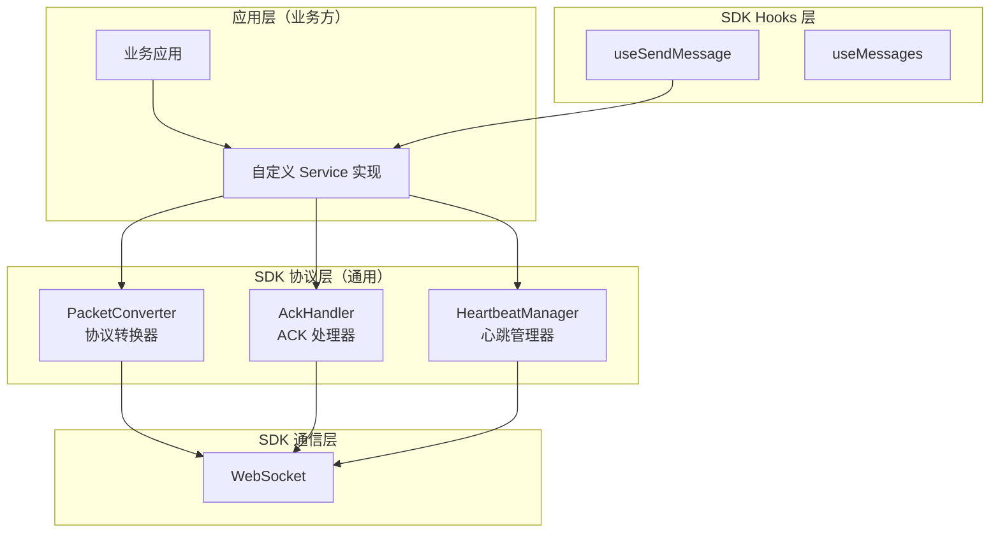

# 协议层（Protocol Layer）

## 概述

协议层提供通用的协议转换能力，支持 Packet/ACK/心跳等标准协议。这些组件是 SDK 的通用功能，不包含任何业务特定逻辑。

## 架构设计



## 核心组件

### 1. PacketConverter - 协议转换器

负责 `StandardMessage` 和 `RawPacket` 之间的双向转换。

**主要方法：**

- `toRawPacket(message, fromApp, fromPin)` - 将 StandardMessage 转换为 RawPacket（发送）
- `toStandardMessage(packet, direction?, currentApp?)` - 将 RawPacket 转换为 StandardMessage（接收）

**使用示例：**

```typescript
import { PacketConverter } from '@feoe/bifrost-chat';

// 发送消息：StandardMessage -> RawPacket
const standardMessage: StandardMessage = {
  id: 'msg-123',
  tempId: 'temp-456',
  conversationId: 'conv-789',
  direction: MessageDirectionEnum.Outgoing,
  channelType: ChannelTypeEnum.WhatsApp,
  status: MessageStatusEnum.Sent,
  timestamp: Date.now(),
  type: MessageTypeEnum.Text,
  content: { text: 'Hello World' },
  sender: {
    app: 'fox_collect.waiter',
    pin: 'agent-123',
  },
  receiver: {
    app: 'im.waiter',
    pin: 'customer-456',
    channelType: ChannelTypeEnum.WhatsApp,
  },
};

const rawPacket = PacketConverter.toRawPacket(
  standardMessage,
  'fox_collect.waiter',
  'agent-123'
);

// 接收消息：RawPacket -> StandardMessage
const incomingPacket = {
  id: 'packet-123',
  mid: 'msg-456',
  from: {
    app: 'im.waiter',
    pin: 'customer-456',
    channelType: 'whatsapp',
  },
  to: {
    app: 'fox_collect.waiter',
    pin: 'agent-123',
    channelType: 'whatsapp',
  },
  ptype: 'CHAT_MESSAGE',
  body: {
    type: 'text',
    content: { text: 'Hello from customer' },
  },
  ver: '1.0',
  timestamp: Date.now(),
};

const standardMessage = PacketConverter.toStandardMessage(
  incomingPacket,
  MessageDirectionEnum.Incoming,
  'fox_collect.waiter'
);
```

### 2. AckHandler - ACK 处理器

负责 ACK 消息的创建和解析。

**主要方法：**

- `createReadAck(ackFrom, params, options?)` - 创建已读 ACK 消息
- `parseDownstream(data)` - 解析下行 ACK 消息
- `isValidAckType(type)` - 验证 ACK 类型
- `ackTypeToMessageStatus(type)` - 映射 ACK 类型到消息状态
- `isHeartbeatAck(data)` - 判断是否为心跳 ACK
- `isSendFailedAck(data)` - 判断是否为发送失败 ACK
- `isReadAck(data)` - 判断是否为已读 ACK
- `isReceiveAck(data)` - 判断是否为已接收 ACK

**使用示例：**

```typescript
import { AckHandler, ChannelTypeEnum } from '@feoe/bifrost-chat';

// 创建已读 ACK
const ackMessage = AckHandler.createReadAck({
  app: 'fox_collect.waiter',
  pin: 'agent-123',
  channelType: ChannelTypeEnum.WhatsApp,
}, {
  sender: 'customer-456',
  app: 'im.waiter',
  mid: 'msg-456',
  chatId: 'conv-789',
  timestamp: Date.now(),
});

// 解析下行 ACK
const data = {
  id: 'ack-123',
  type: 'ack',
  body: {
    type: 'msg_read_ack',
  },
  timestamp: Date.now(),
};

const ackData = AckHandler.parseDownstream(data);
if (ackData) {
  const status = AckHandler.ackTypeToMessageStatus(ackData.body.type);
  console.log('Message status:', status); // MessageStatusEnum.Read
}

// 判断 ACK 类型
if (AckHandler.isReadAck(data)) {
  console.log('这是已读 ACK');
}
```

### 3. HeartbeatManager - 心跳管理器

负责心跳消息的创建和验证。

**主要方法：**

- `createHeartbeat(params)` - 创建心跳消息
- `isHeartbeatResponse(data)` - 验证心跳响应
- `createHeartbeatAck(originalHeartbeat)` - 创建心跳 ACK 响应
- `isValidHeartbeat(data)` - 验证心跳消息格式
- `getHeartbeatInterval(customInterval?)` - 获取心跳间隔时间
- `getNextHeartbeatTime(interval?)` - 计算下次心跳时间

**使用示例：**

```typescript
import { HeartbeatManager } from '@feoe/bifrost-chat';
import { WebSocketManager } from '@feoe/bifrost-chat';

// 创建心跳消息
const heartbeat = HeartbeatManager.createHeartbeat({
  fromApp: 'fox_collect.waiter',
  fromPin: 'agent-123',
  toApp: 'im.waiter',
  toPin: 'customer-456',
});
wsManager.send(heartbeat);

// 验证心跳响应
wsManager.onMessage((data) => {
  if (HeartbeatManager.isHeartbeatResponse(data)) {
    console.log('Heartbeat acknowledged');
  }
});

// 定时发送心跳
setInterval(() => {
  const heartbeat = HeartbeatManager.createHeartbeat({
    fromApp: 'fox_collect.waiter',
    fromPin: 'agent-123',
    toApp: 'im.waiter',
    toPin: 'customer-456',
  });
  wsManager.send(heartbeat);
}, HeartbeatManager.getHeartbeatInterval(30000)); // 30 秒
```

## 完整使用示例

### 电催场景（FoxCollect）

```typescript
import {
  AckHandler,
  type AckPacketBody,
  HeartbeatManager,
  type IMessageService,
  MessageDirectionEnum,
  type MessageSendResult,
  MessageStatusEnum,
  MessageTypeEnum,
  PacketConverter,
  type StandardMessage,
  WebSocketManager,
} from '@feoe/bifrost-chat';

class FoxCollectMessageService implements IMessageService {
  private wsManager: WebSocketManager;
  
  constructor(config: FoxCollectConfig, wsManager: WebSocketManager) {
    this.wsManager = wsManager;
    this.setupWebSocketListeners();
  }
  
  private setupWebSocketListeners(): void {
    this.wsManager.onMessage((data) => {
      // 处理心跳响应
      if (HeartbeatManager.isHeartbeatResponse(data)) {
        return;
      }
      
      // 处理 ACK 消息
      const ackData = AckHandler.parseDownstream(data);
      if (ackData) {
        const status = AckHandler.ackTypeToMessageStatus(ackData.body.type);
        // 更新消息状态
        this.updateMessageStatus(ackData.id, status);
        return;
      }
      
      // 处理聊天消息
      const standardMessage = PacketConverter.toStandardMessage(
        data,
        MessageDirectionEnum.Incoming,
        this.config.fromApp,
      );
      
      // 触发消息接收事件
      this.onMessageReceived(standardMessage);
    });
  }
  
  async send(conversationId: string, params: any): Promise<MessageSendResult> {
    const standardMessage: StandardMessage = {
      id: `temp_${Date.now()}`,
      tempId: `temp_${Date.now()}`,
      conversationId,
      direction: MessageDirectionEnum.Outgoing,
      channelType: params.channelType,
      status: MessageStatusEnum.Sending,
      timestamp: Date.now(),
      type: MessageTypeEnum.Text,
      content: params.content || { text: '' },
      sender: {
        app: 'fox_collect.waiter',
        pin: this.config.agentPin,
      },
      receiver: {
        app: 'im.waiter',
        pin: params.receiverPin,
        channelType: params.channelType,
      },
    };

    // 使用协议转换器
    const rawPacket = PacketConverter.toRawPacket(
      standardMessage,
      'fox_collect.waiter',
      this.config.agentPin,
    );

    // 通过 WebSocket 发送
    this.wsManager.send(rawPacket);

    return {
      tempId: standardMessage.tempId,
      status: MessageStatusEnum.Sending,
    };
  }
  
  async markAsRead(params: AckPacketBody): Promise<void> {
    // 使用 ACK 处理器创建已读 ACK
    const ackMessage = AckHandler.createReadAck(
      {
        app: 'fox_collect.waiter',
        pin: this.config.agentPin,
        channelType: params.channelType,
      },
      params,
    );

    this.wsManager.send(ackMessage);
  }
}
```

## 协议规范

### Packet 包协议

- **文档**: [specs/Packet包协议.md](../../../specs/Packet包协议.md)
- **类型**: `RawPacket`
- **用途**: 聊天消息的标准格式

### ACK 协议

- **文档**: [specs/ACK协议.md](../../../specs/ACK协议.md)
- **类型**: `AckMessageTypeEnum`
- **用途**: 消息确认（已收/已读/失败）

### 心跳协议

- **文档**: [specs/心跳协议.md](../../../specs/心跳协议.md)
- **类型**: `PacketMessageTypeEnum.ClientHeartbeat`
- **用途**: 保持 WebSocket 连接活跃

## 类型定义

### RawPacket

```typescript
interface RawPacket {
  id: string;                    // 消息 ID（发起方生成 uuid）
  mid?: string;                  // 消息服务端 id（投递服务生成）
  upid?: string;                 // 上一条消息 id
  from: MessageParticipant;      // 发送人信息（包含 app 和 pin）
  to: MessageParticipant;        // 接收人信息（包含 app 和 pin）
  ptype: string;                 // 【必填】协议消息类型（packet type）
  body: Record<string, unknown>; // 消息内容
  ver: string;                   // 协议版本
  timestamp: number;             // 服务端生成时间戳
  entry?: string;                // SDK 入口
  chatId?: string;               // 会话 ID
  channelAccount?: string;       // 通道账号，用于展示发送号码尾号
  senderType?: PacketSenderTypeEnum | '0' | '1' | null; // Chatbot 表示机器人消息
}

enum PacketSenderTypeEnum {
  Manual = 0,                    // 人工或普通发送者
  Chatbot = 1,                   // Chatbot / AI 发送者
}

// MessageParticipant 结构
interface MessageParticipant {
  app: string;                   // 应用标识（租户）
  pin: string;                   // 用户标识（PIN/UID/电话/邮箱）
  clientType?: string;           // 客户端类型（可选）
  channelType?: ChannelTypeEnum | string; // 渠道类型（可选）
}
```

> **重要说明：**
> - **ptype**（协议类型）：必填字段，用于标识协议层面的消息类型
> - **body.type**（内容类型）：可选字段，用于标识消息内容的类型（如 `text`、`image`、`video` 等）
> - 所有 socket 通信协议必须包含 `ptype` 字段
> - 有效值包括：`auth`、`auth_fail`、`chat_message`、`ack`、`msg_receive_ack`、`msg_read_ack`、`client_heartbeat`、`status_switch`、`fox_message_ack`
> - `channelAccount` / `senderType` 会透传到 `StandardMessage.metadata`，其中 `senderType` 会归一化为 `PacketSenderTypeEnum`，默认消息气泡用其展示发送号码尾号和 Chatbot 标识
> - `fox_message_ack` 中的 `CLICK`、`CLICKED`、`ACTION`、`REPLY`、`REPLIED` 会映射为 `MessageStatusEnum.Clicked`

### AckMessageTypeEnum

```typescript
enum AckMessageTypeEnum {
  MsgReceiveAck = 'msg_receive_ack',   // 收到消息 ACK
  MsgReadAck = 'msg_read_ack',          // 已读消息 ACK
  MsgSendFailed = 'msg_send_failed',    // 消息发送失败 ACK
  ClientHeartbeat = 'client_heartbeat',  // 心跳 ACK
}
```

## 设计原则

1. **通用性优先**: 只提供通用的核心功能，不包含任何业务特定逻辑
2. **接口驱动**: 通过接口定义服务契约，业务方自行实现
3. **协议转换**: 提供通用的协议转换能力，支持 Packet/ACK/心跳等标准协议
4. **类型安全**: 通过 TypeScript 确保类型安全
5. **轻量级**: 不引入额外的依赖

## 相关文档

- [通用型架构设计](../../../design/generic-architecture-design.md)
- [集成示例](../../../design/integration-demo.md)
- [最终架构](../../../design/final-architecture.md)
- [协议集成架构](../../../design/protocol-integration-architecture.md)
